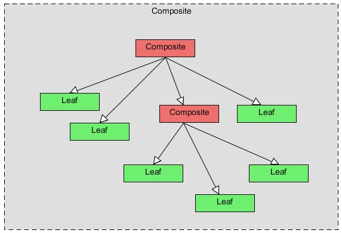
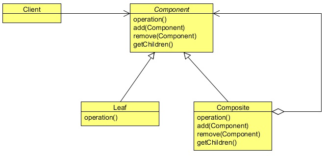

# Composite Design Pattern
## 4.1   Introduction
In this lesson, we will talk about a very interesting design pattern, the Composite Pattern. The English meaning of the word
Composite is something that is made up of complicated and related parts. The composite means “putting together” and this is
what this design pattern is all about.

There are times when you feel a need of a tree data structure in your code. There are many variations to the tree data structure,
but sometimes there is a need of a tree in which both branches as well as leafs of the tree should be treated as uniformly.

The Composite Pattern allows you to compose objects into a tree structure to represent the part-whole hierarchy which means
you can create a tree of objects that is made of different parts, but that can be treated as a whole one big thing. Composite lets
clients to treat individual objects and compositions of objects uniformly, that’s the intent of the Composite Pattern.

There can be lots of practical examples of the Composite Pattern. A file directory system, an html representation in java, an XML
parser all are well managed composites and all can easily be represented using the Composite Pattern. But before digging into
the details of an example, let’s see some more details regarding the Composite Pattern.

## 4.2   What is the Composite Pattern
The formal definition of the Composite Pattern says that it allows you to compose objects into tree structures to represent part-
whole hierarchies. Composite lets clients to treat individual objects and compositions of objects uniformly.

If you are familiar with a tree data structure, you will know a tree has parents and their children. There can be multiple children to
a parent, but only one parent per child. In Composite Pattern, elements with children are called as Nodes, and elements without
children are called as Leafs.

The Composite Pattern allows us to build structures of objects in the form of trees that contains both composition of objects and
individual objects as nodes. Using a composite structure, we can apply the same operations over both composites and individual
objects. In other words, in most cases we can ignore the differences between compositions of objects and individual objects.

The Composite Pattern has four participants:
* Component
* Leaf
* Composite
* Client

The following figure shows a typical Composite object structure. As you can see, there can be many children to a single parent
i.e. Composite, but only one parent per child.

<div align="center"></div>

The Component in the below class diagram, defines an interface for all objects in the composition both the composite and the
leaf nodes. The Component may implement a default behavior for generic methods.

The Composite’s role is to define the behavior of the components having children and to store child components. The Composite
also implements the Leaf related operations. These operations may or may not take any sense; it depends on the functionality
implements using the pattern.

<div align="center"></div>

A Leaf defines the behavior for the elements in the composition. It does this by implementing the operations the Component
supports. Leaf also inherits methods, which don’t necessarily make a lot of sense for a leaf node.

The Client manipulates objects in the composition through the Component interface.

# 4.3   Example of Composite Pattern
The Composite pattern can be implemented anywhere you have the hierarchical nature of the system or a subsystem and you
want to treat individual objects and compositions of objects uniformly. A File System, an XML, an Html, or a hierarchy of an
office (starting from the president to employees) can be implemented using the Composite Pattern.

Let’s see a simple example where we implement an html representation in Java using the Composite Pattern. An html is hierar-
chical in nature, its starts from an <html> tag which is the parent or the root tag, and it contains other tags which can be a parent
or a child tag.

The Composite Pattern in Java can be implemented using the Component class as an abstract class or an interface. In this
example, we will use an abstract class which contains all the important methods used in a composite class and a leaf class.

```java
package com.zanxus.javacodegeeks.patterns.compositepattern;

import java.util.List;

/**
 * @author zanxus
 * @description
 * @create 2016-11-29-下午4:22
 */
public abstract class HtmlTag {
    public abstract String getTagName();

    public abstract void setStartTag(String tag);

    public abstract void setEndTag(String tag);

    public void setTagBody(String tagBody) {
        throw new UnsupportedOperationException("Current operation is not support for this object");
    }

    public void addChildTag(HtmlTag htmlTag) {
        throw new UnsupportedOperationException("Current operation is not support for this object");
    }

    public void removeChildTag(HtmlTag htmlTag) {
        throw new UnsupportedOperationException("Current operation is not support for this object");
    }

    public List<HtmlTag> getChildren() {
        throw new UnsupportedOperationException("Current operation is not support for this object");
    }

    public abstract void generateHtml();

}
```

The HtmlTag class is the component class which defines all the methods used by the composite and the leaf class. There are
some methods which should be common in both the extended classes; hence these methods are kept abstract in the above class,
to enforce their implementation in the child classes.

The getTagName(), just returns the tag name and should be used by both child classes, i.e., the composite class and the leaf
class.

Every html element should have a start tag and an end tag, the methods setStartTag and setEndTag are used to set the
start and end tag of an html element and should be implemented by both the child classes, so they are kept abstract in the above
class.

There are methods which are useful only to the composite class and are useless to the leaf class. Just provide the default
implementation to these methods, throwing an exception is a good implementation of these methods to avoid any accidental call
to these methods by the object which should not support them.

The generatHtml() method is the operation which should support by both the extended classes. For the simplicity, it just
prints the tag to the console.

Now, let’s have a look at the Composite class.

```java
package com.zanxus.javacodegeeks.patterns.compositepattern;

import java.util.ArrayList;
import java.util.List;

/**
 * @author zanxus
 * @description
 * @create 2016-11-29-下午4:30
 */
public class HtmlParentElement extends HtmlTag {
    private String tagName;
    private String startTag;
    private String endTag;

    private List<HtmlTag> childrenTag;

    public HtmlParentElement(String tagName) {
        this.tagName = tagName;
        this.startTag = "";
        this.endTag = "";
        this.childrenTag = new ArrayList<>();
    }


    @Override
    public String getTagName() {
        return tagName;
    }

    @Override
    public void setStartTag(String startTag) {
        this.startTag = startTag;
    }

    @Override
    public void setEndTag(String endTag) {
        this.endTag = endTag;
    }

    @Override
    public void addChildTag(HtmlTag htmlTag) {
        childrenTag.add(htmlTag);
    }

    @Override
    public void removeChildTag(HtmlTag htmlTag) {
        childrenTag.remove(htmlTag);
    }

    @Override
    public List<HtmlTag> getChildren() {
        return childrenTag;
    }

    @Override
    public void generateHtml() {
        System.out.println(startTag);
        childrenTag.forEach(htmlTag -> htmlTag.generateHtml());
        System.out.println(endTag);

    }
}
```

The HtmlParentElement class is the composite class which implements methods like addChildTag, removeChild
Tag, getChildren which must be implemented by a class to become the composite of the structure. The operation method
here is the generateHtml, which prints the tag of the current class, and also iterates through its children and calls their
generateHtml method too.

```java
package com.zanxus.javacodegeeks.patterns.compositepattern;

/**
 * @author zanxus
 * @description
 * @create 2016-11-29-下午4:40
 */
public class HtmlElement extends HtmlTag {
    private String tagName;
    private String startTag;
    private String endTag;
    private String tagBody;

    public HtmlElement(String tagName) {
        this.tagName = tagName;
    }

    @Override
    public String getTagName() {
        return tagName;
    }

    @Override
    public void setStartTag(String startTag) {
        this.startTag = startTag;
    }

    @Override
    public void setEndTag(String endTag) {
        this.endTag = endTag;
    }

    @Override
    public void setTagBody(String tagBody) {
        this.tagBody = tagBody;
    }

    @Override
    public void generateHtml() {
        System.out.println(startTag + "" + tagBody + "" + endTag);
    }
}
```

The HtmlElement is the leaf class, and its main job is to implement the operation method, which in this example is the
generateHtml method. It prints the startTag, optionally tagBody if have, and the endTag of the child element.

Let’s test this example.

```java
package com.zanxus.javacodegeeks.patterns.compositepattern;

/**
 * @author zanxus
 * @description
 * @create 2016-11-29-下午4:42
 */
public class TestCompositePattern {

    public static void main(String[] args) {
        HtmlTag parentTag = new HtmlParentElement("<html>");
        parentTag.setStartTag("<html>");
        parentTag.setEndTag("</html>");

        HtmlTag p1 = new HtmlParentElement("<body>");
        p1.setStartTag("<body>");
        p1.setEndTag("</body>");

        parentTag.addChildTag(p1);

        HtmlTag child1 = new HtmlElement("<p>");
        child1.setStartTag("<p>");
        child1.setEndTag("</p>");
        child1.setTagBody("Testing html tag library");
        p1.addChildTag(child1);

        child1 = new HtmlElement("<p>");
        child1.setStartTag("<p>");
        child1.setEndTag("</p>");
        child1.setTagBody("Paragraph 2");
        p1.addChildTag(child1);

        parentTag.generateHtml();
    }
}
```

The above code will result to the following output:
```html
<html>
<body>
<p>Testing html tag library</p>
<p>Paragraph 2</p>
</body>
</html>
```

In the above example, first we have created a parent tag (<html>) then we add a child to it, which is another of composite type
(<body>), and this object contains two children (<P>).

Please note that, the above structure represents as a part-whole hierarchy and the call to generateHtml() method on the
parent tag allows the client to treat the compositions of objects uniformly. As it generates the html of the object and of all its
children.

## 4.4   When to use Composite Pattern
* When you want to represent part-whole hierarchies of objects.
* When you want clients to be able to ignore the difference between compositions of objects and individual objects. Clients will
 treat all objects in the composite structure uniformly.