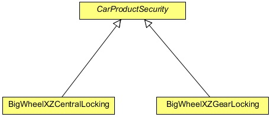
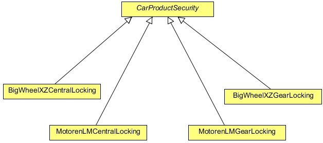
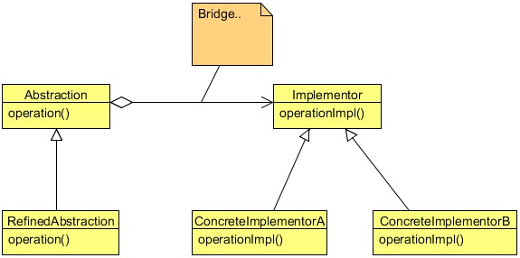
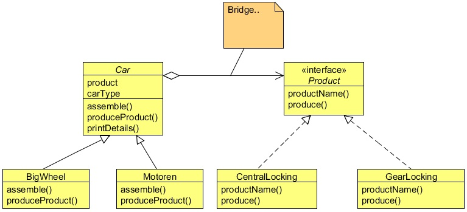

# Bridge Design Pattern
## 1   Introduction
Sec Security System is a security and electronic company which produces and assembles products for cars. It delivers any car
electronic or security system you want, from air bags to GPS tracking system, reverse parking system etc. Big car companies
use its products in their cars. The company uses a well defined object oriented approach to keep track of their products using
software which is developed and maintained by them only. They get the car, produce the system for it and assemble it into the
car.

Recently, they got new orders from BigWheel (a car company) to produce central locking and gear lock system for their new xz
model. To maintain this, they are creating a new software system. They started by creating a new abstract class CarProductSe-
curity, in which they kept some car specific methods and some of the features which they thought are common to all security
products. Then they extended the class and created two different sub classes named them BigWheelXZCentralLocking, and
BigWheelXZGearLocking. The class diagram looks like this:

<div align="center"></div>

After a while, another car company Motoren asked them to produce a new system of central locking and gear lock for their lm
model. Since, the same security system cannot be used in both models of different cars, the Sec Security System has produced
the new system for them, and also has created to new classes MotorenLMCentralLocking, and MotorenLMGearLocking which
also extend the CarProductSecurity class.

Now the new class diagram looks like this:

<div align="center"></div>

So far so good, but what happens if another car company demands another new system of central locking and gear lock? One
needs to create another two new classes for it. This design will create one class per system, or worse, if the reverse parking
system is produced for each of these two car companies, two more new classes will be created for each of them.

A design with too many subclasses is not flexible and is hard to maintain. An Inheritance also binds an implementation to the
abstraction permanently, which makes it difficult to modify, extend, and reuse the abstraction and implementation independently.

Please note that, the car and the product should vary independently in order to make the software system easy to extend and
reusable.

The Bridge design pattern can resolve this problem, but before that, let us first have some details about the Bridge Pattern.

## 2   What is Bridge Pattern
The Bridge Pattern’s intent is to decouple an abstraction from its implementation so that the two can vary independently. It puts
the abstraction and implementation into two different class hierarchies so that both can be extend independently.

<div align="center"></div>

The components of the Bridge Pattern comprise of an abstraction, refined abstraction, an implementer, and concrete implementer.

An abstraction defines the abstraction’s interface and also maintains a reference to an object of type implementer, and the link
between the abstraction and the implementer is called a Bridge.

Refined Abstraction extends the interface defined by the abstraction.

The Implementer provides the interface for implementation classes (concrete implementers).

And the Concrete Implementer implements the Implementer interface and defines its concrete implementation.

The Bridge Pattern decouples the interface and the implementation. As a result, an implementation is not bound permanently to
an interface. The implementation of an abstraction can be configured at run-time. It also eliminates compile-time dependencies
on the implementation. Changing an implementation class doesn’t required recompiling the abstraction class and its clients. The
Client only needs to know about the abstraction and you can hide the implementation from them.

## 3   Solution to the Problem
Instead of creating a subclass for each product per car model in the above discussed problem, we can separate the design into two
different hierarchies. One interface is for the product which will be used as an implementer and the other will be an abstraction
of car type. The implementer will be implemented by the concrete implementers and provides an implementation for it. On the
other side, the abstraction will be extended by more refined abstraction.

<div align="center"></div>

```java
package com.zanxus.javacodegeeks.patterns.bridgepattern;

/**
 * @author zanxus
 * @create 2016-12-01 9:51 PM
 */
public interface Product {

    public String productName();

    public void produce();
}
```

The implementer Product has a method produce() which will be used by the concrete implementers to provide concrete
functionality to it. The method will produce the base model of the product which can be used with any car model after some
modifications specific to that car model.

```java
package com.zanxus.javacodegeeks.patterns.bridgepattern;

/**
 * @author zanxus
 * @create 2016-12-01 10:07 PM
 */
public class CentralLocking implements Product{

    private final String productName;

    public CentralLocking(String productName) {
        this.productName = productName;
    }

    @Override
    public String productName() {
        return productName;
    }

    @Override
    public void produce() {
        System.out.println("Producing Central Locking System");
    }
}
```

```java
package com.zanxus.javacodegeeks.patterns.bridgepattern;

/**
 * @author zanxus
 * @create 2016-12-01 10:10 PM
 */
public class GearLocking implements Product {

    private final String productName;

    public GearLocking(String productName) {
        this.productName = productName;
    }

    @Override
    public String productName() {
        return productName;
    }

    @Override
    public void produce() {
        System.out.println("Producing Gear Locking System");
    }
}
```

The two different concrete implementers provide implementation to the Product implementer.

Now the abstraction, the Car class which holds a reference of a product type and provides two abstract methods producePro
duct() and assemble().

```java
package com.zanxus.javacodegeeks.patterns.bridgepattern;

/**
 * @author zanxus
 * @create 2016-12-01 10:12 PM
 */
public abstract class Car {

    private final Product product;
    private final String carType;

    public Car(Product product, String carType) {
        this.product = product;
        this.carType = carType;
    }

    public abstract void assemble();

    public abstract void produceProduct();

    public void printDetails(){
        System.out.println("Car: "+carType+", Product: "+product.productName());
    }
}
```

The subclasses of the Car will provide the concrete and specific implementation to the methods assemble() and produce
Product().

```java
package com.zanxus.javacodegeeks.patterns.bridgepattern;

/**
 * @author zanxus
 * @create 2016-12-01 10:15 PM
 */
public class BigWheel extends Car {

    private final Product product;
    private final String carType;

    public BigWheel(Product product, String carType) {
        super(product, carType);
        this.product = product;
        this.carType = carType;
    }

    @Override
    public void assemble() {
        System.out.println("Assmbling "+product.productName()+"for "+carType);
    }

    @Override
    public void produceProduct() {
        product.produce();
        System.out.println("Modifing product "+product.productName()+" according to "+carType);
    }
}
```

```java
package com.zanxus.javacodegeeks.patterns.bridgepattern;

/**
 * @author zanxus
 * @create 2016-12-01 10:20 PM
 */
public class Motoren extends Car {

    private final Product product;
    private final String carType;

    public Motoren(Product product, String carType) {
        super(product, carType);
        this.product = product;
        this.carType = carType;
    }

    @Override
    public void assemble() {
        System.out.println("Assembling " + product.productName() + " for " + carType);
    }

    @Override
    public void produceProduct() {
        product.produce();
        System.out.println("Modifing product " + product.productName() + " according to  " + carType);

    }
}
```

Now, let’s test the example.

```java
package com.zanxus.javacodegeeks.patterns.bridgepattern;

/**
 * @author zanxus
 * @create 2016-12-01 10:22 PM
 */
public class TestBridgePattern {

    public static void main(String[] args) {
        Product central = new CentralLocking("Central Locking System");
        Product gear = new GearLocking("Gear Locking System");

        Car car = new BigWheel(central,"BigWheel xz model");
        car.produceProduct();
        car.assemble();
        car.printDetails();

        System.out.println();

        car = new BigWheel(gear,"BigWheel xz model");
        car.produceProduct();
        car.assemble();
        car.printDetails();

        System.out.println();

        car = new Motoren(central,"Motoren lm model");
        car.produceProduct();
        car.assemble();
        car.printDetails();

        System.out.println();

        car = new Motoren(gear, "Motoren lm model");
        car.produceProduct();
        car.assemble();
        car.printDetails();

    }
}
```

The above example will produce the following output:

```java
Producing Central Locking System
Modifing product Central Locking System according to BigWheel xz model
Assmbling Central Locking Systemfor BigWheel xz model
Car: BigWheel xz model, Product: Central Locking System

Producing Gear Locking System
Modifing product Gear Locking System according to BigWheel xz model
Assmbling Gear Locking Systemfor BigWheel xz model
Car: BigWheel xz model, Product: Gear Locking System

Producing Central Locking System
Modifing product Central Locking System according to  Motoren lm model
Assembling Central Locking System for Motoren lm model
Car: Motoren lm model, Product: Central Locking System

Producing Gear Locking System
Modifing product Gear Locking System according to  Motoren lm model
Assembling Gear Locking System for Motoren lm model
Car: Motoren lm model, Product: Gear Locking System
```

## 4   Use of Bridge Pattern
You should use the Bridge Pattern when:
* You want to avoid a permanent binding between an abstraction and its implementation. This might be the case, for example,
when the implementation must be selected or switched at run-time.
* Both the abstractions and their implementations should be extensible by sub-classing. In this case, the Bridge pattern lets you
combine the different abstractions and implementations and extend them independently.
* Changes in the implementation of an abstraction should have no impact on clients; that is, their code should not have to be
recompiled.
* You want to share an implementation among multiple objects (perhaps using reference counting), and this fact should be hidden
from the client.