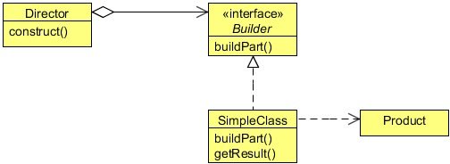

# Builder Design Pattern
## 1   Builder Pattern
In general, the details of object construction, such as instantiating and initializing the components that make up the object, are
kept within the object, often as part of its constructor. This type of design closely ties the object construction process with the
components that make up the object. This approach is suitable as long as the object under construction is simple and the object
construction process is definite and always produces the same representation of the object.

However, this design may not be effective when the object being created is complex and the series of steps constituting the
object creation process can be implemented in different ways, thus producing different representations of the object. Because the
different implementations of the construction process are all kept within the object, the object can become bulky (construction
bloat) and less modular. Subsequently, adding a new implementation or making changes to an existing implementation requires
changes to the existing code.

Using the Builder pattern, the process of constructing such an object can be designed more effectively. The Builder pattern
suggests moving the construction logic out of the object class to a separate class referred to as a builder class. There can be more
than one such builder classes, each with different implementations for the series of steps to construct the object. Each builder
implementation results in a different representation of the object.

To illustrate the use of the Builder Pattern, let’s help a Car company which shows its different cars using a graphical model to
its customers. The company has a graphical tool which displays the car on the screen. The requirement of the tool is to provide
a car object to it. The car object should contain the car’s specifications. The graphical tool uses these specifications to display
the car. The company has classified its cars into different classifications like Sedan or Sports Car. There is only one car object,
and our job is to create the car object according to the classification. For example, for a Sedan car, a car object according to the
sedan specification should be built or, if a sports car is required, then a car object according to the sports car specification should
be built. Currently, the Company wants only these two types of cars, but it may require other types of cars also in the future.

We will create two different builders, one of each classification, i.e., for sedan and sports cars. These two builders will help us in
building the car object according to its specification. But before that, let’s have discuss some details of the Builder Pattern.

## 2   What is the Builder Pattern
The intent of the Builder Pattern is to separate the construction of a complex object from its representation, so that the same
construction process can create different representations. This type of separation reduces the object size. The design turns out to
be more modular with each implementation contained in a different builder object. Adding a new implementation (i.e., adding a
new builder) becomes easier. The object construction process becomes independent of the components that make up the object.
This provides more control over the object construction process.

In terms of implementation, each of the different steps in the construction process can be declared as methods of a common
interface to be implemented by different concrete builders.

A client object can create an instance of a concrete builder and invoke the set of methods required to construct different parts of
the final object. This approach requires every client object to be aware of the construction logic. Whenever the construction logic
undergoes a change, all client objects need to be modified accordingly.

The Builder pattern introduces another level of separation that addresses this problem. Instead of having client objects invoke
different builder methods directly, the Builder pattern suggests using a dedicated object referred to as a Director, which is
responsible for invoking different builder methods required for the construction of the final object. Different client objects can
make use of the Director object to create the required object. Once the object is constructed, the client object can directly request
from the builder the fully constructed object. To facilitate this process, a new method getObject can be declared in the
common Builder interface to be implemented by different concrete builders.

The new design eliminates the need for a client object to deal with the methods constituting the object construction process and
encapsulates the details of how the object is constructed from the client.

<div align="center"></div>

**Builder**

* Specifies an abstract interface for creating parts of a Product object.

**ConcreteBuilder**

* Constructs and assembles parts of the product by implementing the Builder interface.
* Defines and keeps track of the representation it creates.
* Provides an interface for retrieving the product.

**Director**

* Constructs an object using the Builder interface.

**Product**

* Represents the complex object under construction. ConcreteBuilder builds the product’s internal representation and defines the
process by which it’s assembled.
* Includes classes that define the constituent parts, including interfaces for assembling the parts into the final result.

## 3   Implementing the Builder Pattern
Blow is the Car class (Product) which contains some of the important components of the car that are required in order to
construct the complete car object.

```java
package com.zanxus.javacodegeeks.patterns.builderpattern;

/**
 * @author zanxus
 * @description
 * @create 2016-12-15-下午7:11
 */
public class Car {

    private String bodyStyle;
    private String power;
    private String engine;
    private String breaks;
    private String seats;
    private String windows;
    private String fuelType;
    private String carType;

    public Car(String carType) {
        this.carType = carType;
    }

    public String getBodyStyle() {
        return bodyStyle;
    }

    public void setBodyStyle(String bodyStyle) {
        this.bodyStyle = bodyStyle;
    }

    public String getPower() {
        return power;
    }

    public void setPower(String power) {
        this.power = power;
    }

    public String getEngine() {
        return engine;
    }

    public void setEngine(String engine) {
        this.engine = engine;
    }

    public String getBreaks() {
        return breaks;
    }

    public void setBreaks(String breaks) {
        this.breaks = breaks;
    }

    public String getSeats() {
        return seats;
    }

    public void setSeats(String seats) {
        this.seats = seats;
    }

    public String getWindows() {
        return windows;
    }

    public void setWindows(String windows) {
        this.windows = windows;
    }

    public String getFuelType() {
        return fuelType;
    }

    public void setFuelType(String fuelType) {
        this.fuelType = fuelType;
    }

    public String getCarType() {
        return carType;
    }

    public void setCarType(String carType) {
        this.carType = carType;
    }

    @Override
    public String toString() {
        StringBuilder sb = new StringBuilder();
        sb.append("--------------" + carType + "--------------------- \\n");
        sb.append(" Body: ");
        sb.append(bodyStyle);
        sb.append("\\n Power: ");
        sb.append(power);
        sb.append("\\n Engine: ");
        sb.append(engine);
        sb.append("\\n Breaks: ");
        sb.append(breaks);
        sb.append("\\n Seats: ");
        sb.append(seats);
        sb.append("\\n Windows: ");
        sb.append(windows);
        sb.append("\\n Fuel Type: ");
        sb.append(fuelType);
        return sb.toString();
    }
}
```
The CarBuilder is the builder interface contains set of common methods used to build the car object and its components.

```java
package com.zanxus.javacodegeeks.patterns.builderpattern;

/**
 * @author zanxus
 * @create 2016-12-15-下午7:14
 */
public interface CarBuilder {

    public void buildBodyStyle();
    public void buildPower();
    public void buildEngine();
    public void buildBreaks();
    public void buildSeats();
    public void buildWindows();
    public void buildFuelType();
    public Car getCar();
}
```

The getCar method is used to return the final car object to the client after its construction.

Let’s see two implementations of the CarBuilder interface, one for each type of car, i.e., for sedan and sports car.

```java
package com.zanxus.javacodegeeks.patterns.builderpattern;

/**
 * @author zanxus
 * @description
 * @create 2016-12-15-下午7:17
 */
public class SedanCarBuilder implements CarBuilder {

    private final Car car = new Car("SEDAN");

    @Override
    public void buildBodyStyle() {
        car.setBodyStyle("External dimensions: overall length (inches): 202.9, " +
                "overall width (inches): 76.2, overall height (inches): 60.7, wheelbase (inches): 112.9," +
                " front track (inches): 65.3, rear track (inches): 65.5 and curb to curb turning circle (feet): 39.5");
    }

    @Override
    public void buildPower() {
        car.setPower("285 hp @ 6,500 rpm; 253 ft lb of torque @ 4,000 rpm");
    }

    @Override
    public void buildEngine() {
        car.setEngine("3.5L Duramax V 6 DOHC");
    }

    @Override
    public void buildBreaks() {
        car.setBreaks("Four-wheel disc brakes: two ventilated. Electronic brake distribution");
    }

    @Override
    public void buildSeats() {
        car.setSeats("Front seat center armrest.Rear seat center armrest.Split-folding rear seats");
    }

    @Override
    public void buildWindows() {
        car.setWindows("Laminated side windows.Fixed rear window with defroster");
    }

    @Override
    public void buildFuelType() {
        car.setFuelType("Gasoline 19 MPG city, 29 MPG highway, 23 MPG combined and 437 mi. range");
    }

    @Override
    public Car getCar() {
        return car;
    }
    
}
```

```java
package com.zanxus.javacodegeeks.patterns.builderpattern;

/**
 * @author zanxus
 * @description
 * @create 2016-12-15-下午7:21
 */
public class SportsCarBuilder implements CarBuilder {

    private final Car car = new Car("SPORTS");

    @Override
    public void buildBodyStyle() {
        car.setBodyStyle("External dimensions: overall length (inches): 192.3," +
                " overall width (inches): 75.5, overall height (inches): 54.2, wheelbase (inches): 112.3," +
                " front track (inches): 63.7, rear track (inches): 64.1 and curb to curb turning circle (feet): 37.7");
    }

    @Override
    public void buildPower() {
        car.setPower("323 hp @ 6,800 rpm; 278 ft lb of torque @ 4,800 rpm");
    }

    @Override
    public void buildEngine() {
        car.setEngine("3.6L V 6 DOHC and variable valve timing");
    }

    @Override
    public void buildBreaks() {
        car.setBreaks("Four-wheel disc brakes: two ventilated. Electronic brake distribution. StabiliTrak stability control");
    }

    @Override
    public void buildSeats() {
        car.setSeats("Driver sports front seat with one power adjustments manual height, front passenger seat sports front seat with one power adjustments");
    }

    @Override
    public void buildWindows() {
        car.setWindows("Front windows with one-touch on two windows");
    }

    @Override
    public void buildFuelType() {
        car.setFuelType("Gasoline 17 MPG city, 28 MPG highway, 20 MPG combined and 380 mi. range");
    }

    @Override
    public Car getCar() {
        return car;
    }
}
```

The above two builders create and construct the product, i.e. the car object according to the specification required.

Now, let’s test the Builder.

```java
package com.zanxus.javacodegeeks.patterns.builderpattern;

/**
 * @author zanxus
 * @description
 * @create 2016-12-15-下午7:43
 */
public class TestBuilderPattern {

    public static void main(String[] args) {
        CarBuilder carBuilder = new SedanCarBuilder();
        CarDirector director = new CarDirector(carBuilder);
        director.build();
        Car car = carBuilder.getCar();
        System.out.println(car);

        System.out.println();

        carBuilder = new SportsCarBuilder();
        director = new CarDirector(carBuilder);
        director.build();
        car = carBuilder.getCar();
        System.out.println(car);
    }
}
```

The above code will result to the following output.

```sh
--------------SEDAN--------------------- 
 Body: External dimensions: overall length (inches): 202.9, overall width (inches): 76.2, overall height (inches): 60.7, wheelbase (inches): 112.9, front track (inches): 65.3, rear track (inches): 65.5 and curb to curb turning circle (feet): 39.5
 Power: 285 hp @ 6,500 rpm; 253 ft lb of torque @ 4,000 rpm
 Engine: 3.5L Duramax V 6 DOHC
 Breaks: Four-wheel disc brakes: two ventilated. Electronic brake distribution
 Seats: Front seat center armrest.Rear seat center armrest.Split-folding rear seats
 Windows: Laminated side windows.Fixed rear window with defroster
 Fuel Type: Gasoline 19 MPG city, 29 MPG highway, 23 MPG combined and 437 mi. range

--------------SPORTS--------------------- 
 Body: External dimensions: overall length (inches): 192.3, overall width (inches): 75.5, overall height (inches): 54.2, wheelbase (inches): 112.3, front track (inches): 63.7, rear track (inches): 64.1 and curb to curb turning circle (feet): 37.7
 Power: 323 hp @ 6,800 rpm; 278 ft lb of torque @ 4,800 rpm
 Engine: 3.6L V 6 DOHC and variable valve timing
 Breaks: Four-wheel disc brakes: two ventilated. Electronic brake distribution. StabiliTrak stability control
 Seats: Driver sports front seat with one power adjustments manual height, front passenger seat sports front seat with one power adjustments
 Windows: Front windows with one-touch on two windows
 Fuel Type: Gasoline 17 MPG city, 28 MPG highway, 20 MPG combined and 380 mi. range
```

In the above class, we have first created a SedanCarBuilder and a CarDirector. Then we ask the CarDirector to
build the car for us according to the builder passed to it. Then finally, we directly ask the builder to provide us the created
car object.

We did the same for the SportsCarBuilder which returns the car object according to the sports car specification.

The approach to use the Builder Pattern is flexible enough to add any new type of a car in the future without changing any of the
existing code. All we need is to create a new builder according to the specification of the new car and provide it to the Director
to build.

## 4   Another form of the Builder Pattern
There is another form of the Builder Pattern other than what we have seen so far. Sometimes there is an object with a long list
of properties, and most of these properties are optional. Consider an online form which needs to be filled in order to become a
member of a site. You need to fill all the mandatory fields but you can skip the optional fields or sometimes it may look valuable
to fill some of the optional fields.

Please check the below Form class which contains long list of properties and some of the properties are optional. It is mandatory
to have firstName, lastName, userName, and password in the form but all others are optional fields.

```java
package com.zanxus.javacodegeeks.patterns.builderpattern;

import java.util.Date;

/**
 * @author zanxus
 * @description
 * @create 2016-12-15-下午7:59
 */
public class Form {

    private String firstName;
    private String lastName;
    private String userName;
    private String password;
    private String address;
    private Date dob;
    private String email;
    private String backupEmail;
    private String spouseName;
    private String city;
    private String state;
    private String country;
    private String language;
    private String passwordHint;
    private String securityQuestion;
    private String securityAnswer;
}
```
The question is, what sort of constructor should we write for such a class? Well writing a constructor with long list of parameters
is not a good choice, this could frustrate the client especially if the important fields are only a few. This could increase the scope
of error; the client may provide a value accidentally to a wrong field.

Another way is to use telescoping constructors, in which you provide a constructor with only the required parameters, another
with a single optional parameter, a third with two optional parameters, and so on, culminating in a constructor with all the
optional parameters.

Telescoping constructor might looks like this.

```java
public Form(String firstName,String lastName){
this(firstName,lastName,null,null);
}
public Form(String firstName,String lastName,String userName,String password){
this(firstName,lastName,userName,password,null,null);
}
public Form(String firstName,String lastName,String userName,String password,String address ←-
,Date dob){
this(firstName,lastName,userName,password,address,dob,null,null);
}
public Form(String firstName,String lastName,String userName,String password,String address ←-
,Date dob,String email,String backupEmail){
...
}
```

When you want to create an instance, you use the constructor with the shortest parameter list containing all the parameters you
want to set.

The telescoping constructor works, but it is hard to write client code when there are many parameters, and it is even harder to
read it. The reader is left wondering what all those values mean and must carefully count parameters to find out. Long sequences
of identically typed parameters can cause subtle bugs. If the client accidentally reverses two such parameters, the compiler won’t
complain, but the program will misbehave at runtime.

A second alternative when you are faced with many constructor parameters is the JavaBeans pattern, in which you call a parameter
less constructor to create the object and then call setter methods to set each required parameter and each optional parameter of
interest.

Unfortunately, the JavaBeans pattern has serious disadvantages of its own. Because construction is split across multiple calls,
a JavaBean may be in an inconsistent state partway through its construction. The class does not have the option of enforcing
consistency merely by checking the validity of the constructor parameters. Attempting to use an object when it’s in an inconsistent
state may cause failures that are far removed from the code containing the bug, hence difficult to debug.

There is a third alternative that combines the safety of the telescoping constructor pattern with the readability of the JavaBeans
pattern. It is a form of the Builder pattern. Instead of making the desired object directly, the client calls a constructor with all
of the required parameters and gets a builder object. Then the client calls setter-like methods on the builder object to set each
optional parameter of interest. Finally, the client calls a parameter less build method to generate the object.

```java
package com.zanxus.javacodegeeks.patterns.builderpattern;

import java.util.Date;

/**
 * @author zanxus
 * @description
 * @create 2016-12-15-下午7:59
 */
public class Form {

    private String firstName;
    private String lastName;
    private String userName;
    private String password;
    private String address;
    private Date dob;
    private String email;
    private String backupEmail;
    private String spouseName;
    private String city;
    private String state;
    private String country;
    private String language;
    private String passwordHint;
    private String securityQuestion;
    private String securityAnswer;

    private Form(FormBuilder formBuilder) {
        this.firstName = formBuilder.firstName;
        this.lastName = formBuilder.lastName;
        this.userName = formBuilder.userName;
        this.password = formBuilder.password;
        this.address = formBuilder.address;
        this.dob = formBuilder.dob;
        this.email = formBuilder.email;
        this.backupEmail = formBuilder.backupEmail;
        this.spouseName = formBuilder.spouseName;
        this.city = formBuilder.city;
        this.state = formBuilder.state;
        this.country = formBuilder.country;
        this.language = formBuilder.language;
        this.passwordHint = formBuilder.passwordHint;
        this.securityQuestion = formBuilder.securityQuestion;
        this.securityAnswer = formBuilder.securityAnswer;
    }

    public static void main(String[] args) {
        Form form = new FormBuilder("Dave", "Carter", "DavCarter", "DAvCaEr123").passwordHint("MyName").city("NY").language("English").build();
        System.out.println(form);
    }

    @Override
    public String toString() {
        StringBuilder sb = new StringBuilder();
        sb.append(" First Name: ");
        sb.append(firstName);
        sb.append("\n Last Name: ");
        sb.append(lastName);
        sb.append("\n User Name: ");
        sb.append(userName);
        sb.append("\n Password: ");
        sb.append(password);
        if (this.address != null) {
            sb.append("\n Address: ");
            sb.append(address);
        }
        if (this.dob != null) {
            sb.append("\n DOB: ");
            sb.append(dob);
        }
        if (this.email != null) {
            sb.append("\n Email: ");
            sb.append(email);
        }
        if (this.backupEmail != null) {
            sb.append("\n Backup Email: ");
            sb.append(backupEmail);
        }
        if (this.spouseName != null) {
            sb.append("\n Spouse Name: ");
            sb.append(spouseName);
        }
        if (this.city != null) {
            sb.append("\n City: ");
            sb.append(city);
        }
        if (this.state != null) {
            sb.append("\n State: ");
            sb.append(state);
        }
        if (this.country != null) {
            sb.append("\n Country: ");
            sb.append(country);
        }
        if (this.language != null) {
            sb.append("\n Language: ");
            sb.append(language);
        }
        if (this.passwordHint != null) {
            sb.append("\n Password Hint: ");
            sb.append(passwordHint);
        }
        if (this.securityQuestion != null) {
            sb.append("\n Security Question: ");
            sb.append(securityQuestion);
        }
        if (this.securityAnswer != null) {
            sb.append("\n Security Answer: ");
            sb.append(securityAnswer);
        }
        return sb.toString();
    }

    public static class FormBuilder {
        private String firstName;
        private String lastName;
        private String userName;
        private String password;
        private String address;
        private Date dob;
        private String email;
        private String backupEmail;
        private String spouseName;
        private String city;
        private String state;
        private String country;
        private String language;
        private String passwordHint;
        private String securityQuestion;
        private String securityAnswer;

        public FormBuilder(String firstName, String lastName, String userName, String password) {
            this.firstName = firstName;
            this.lastName = lastName;
            this.userName = userName;
            this.password = password;
        }

        public FormBuilder address(String address) {
            this.address = address;
            return this;
        }

        public FormBuilder dob(Date dob) {
            this.dob = dob;
            return this;
        }

        public FormBuilder email(String email) {
            this.email = email;
            return this;
        }

        public FormBuilder backupEmail(String backupEmail) {
            this.backupEmail = backupEmail;
            return this;
        }

        public FormBuilder spouseName(String spouseName) {
            this.spouseName = spouseName;
            return this;
        }

        public FormBuilder city(String city) {
            this.city = city;
            return this;
        }

        public FormBuilder state(String state) {
            this.state = state;
            return this;
        }

        public FormBuilder country(String country) {
            this.country = country;
            return this;
        }

        public FormBuilder language(String language) {
            this.language = language;
            return this;
        }

        public FormBuilder passwordHint(String passwordHint) {
            this.passwordHint = passwordHint;
            return this;
        }

        public FormBuilder securityQuestion(String securityQuestion) {
            this.securityQuestion = securityQuestion;
            return this;
        }

        public FormBuilder securityAnswer(String securityAnswer) {
            this.securityAnswer = securityAnswer;
            return this;
        }

        public Form build() {
            return new Form(this);
        }

    }
}
```

The above code will produce the following output:

```sh
First Name: Dave
 Last Name: Carter
 User Name: DavCarter
 Password: DAvCaEr123
 City: NY
 Language: English
 Password Hint: MyName
```

As you can clearly see, now a client only needs to provide the mandatory fields and the fields which are important to him. To
create the form object now, we need invoke the FormBuilder constructor which takes the mandatory fields and then we need
to call the set of required methods on it and finally the build method to get the form object.

## 5   When to use the Builder Pattern
Use the Builder pattern when

* The algorithm for creating a complex object should be independent of the parts that make up the object and how they’re
assembled.
* The construction process must allow different representations for the object that’s constructed.

## 6   Builder Pattern in JDK
* java.lang.StringBuilder#append() (unsynchronized)
* java.lang.StringBuffer#append() (synchronized)
* java.nio.ByteBuffer#put() (also on CharBuffer, ShortBuffer, IntBuffer, LongBuffer, FloatBuffer and DoubleBuffer)
* javax.swing.GroupLayout.Group#addComponent()
* All implementations of java.lang.Appendable


