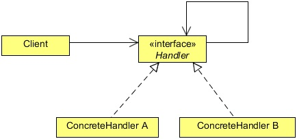

# Chain of Responsibility Design Pattern
## 1   Chain of Responsibility Pattern
The Chain of Responsibility pattern is a behavior pattern in which a group of objects is chained together in a sequence and a
responsibility (a request) is provided in order to be handled by the group. If an object in the group can process the particular
request, it does so and returns the corresponding response. Otherwise, it forwards the request to the subsequent object in the
group.

For a real life scenario, in order to understand this pattern, suppose you got a problem to solve. If you are able to handle it on
your own, you will do so, otherwise you will tell your friend to solve it. If he’ll able to solve he will do that, or he will also
forward it to some other friend. The problem would be forwarded until it gets solved by one of your friends or all your friends
have seen the problem, but no one is able to solve it, in which case the problem stays unresolved.

Let’s address a real life scenario. Your company has got a contract to provide an analytical application to a health company. The
application would tell the user about the particular health problem, its history, its treatment, medicines, interview of the person
suffering from it etc, everything that is needed to know about it. For this, your company receives a huge amount of data. The
data could be in any format, it could text files, doc files, excels, audio, images, videos, anything that you can think of would be
there.

Now, your job is to save this data in the company’s database. Users will provide the data in any format and you should provide
them a single interface to upload the data into the database. The user is not interested, not even aware, to know that how you are
saving the different unstructured data?

The problem here is that you need to develop different handlers to save the various formats of data. For example, a text file save
handler does not know how to save an mp3 file.

To solve this problem you can use the Chain of Responsibility design pattern. You can create different objects which process
different formats of data and chain them together. When a request comes to a single object, it will check whether it can process
and handle the specfic file format. If it can, it will process it; otherwise, it will forward it to the next object chained to it. This
design pattern also decouples the user from the object that is serving the request; the user is not aware which object is actually
serving its request.

Before solving the problem, let’s first know more about the Chain of Responsibility design pattern.

## 2   What is the Chain of Responsibility Pattern
The intent of this pattern is to avoid coupling the sender of a request to its receiver by giving more than one object a chance to
handle the request. We chain the receiving objects and pass the request along the chain until an object handles it.

This pattern is all about connecting objects in a chain of notification; as a notification travels down the chain, it’s handled by the
first object that is set up to deal with the particular notification.

When there is more than one objects that can handle or fulfill a client request, the pattern recommends giving each of these
objects a chance to process the request in some sequential order. Applying the pattern in such a case, each of these potential
handlers can be arranged in the form of a chain, with each object having a reference to the next object in the chain. The first
object in the chain receives the request and decides either to handle the request or to pass it on to the next object in the chain. The
request flows through all objects in the chain one after the other until the request is handled by one of the handlers in the chain
or the request reaches the end of the chain without getting processed.

<div align="center"></div>

**Handler**
* Defines an interface for handling requests.
* (Optionally) Implements the successor link.

**ConcreteHandler**
* Handles requests it is responsible for.
* Can access its successor.
* If the ConcreteHandler can handle the request, it does so; otherwise it forwards the request to its successor.

**Client**
* Initiates the request to a ConcreteHandler object on the chain.

When a client issues a request, the request propagates along the chain until a ConcreteHandler object takes responsibility for
handling it.

## 3   Implementing Chain of Responsibility
To implement the Chain of Responsibility in order to solve the above problem, we will create an interface, Handler.
```java
package com.zanxus.javacodegeeks.patterns.chainofresponsibility;

/**
 * @author zanxus
 * @create 2016-12-14-下午4:17
 */
public interface Handler {

    public void setHandler(Handler handler);

    public void process(File file);

    public String getHandlerName();
}
```

The above interface contains two main methods, the setHandler and the process methods. The setHandler is used to set
the next handler in the chain, whereas; the process method is used to process the request, only if the handler can able process the
request. Optionally, we have the getHandlerName method which is used to return the handler’s name.

The handlers are designed to process files which contain data. The concrete handler checks if it’s able to handle the file by
checking the file type, otherwise forwards to the next handler in the chain.

The File class looks like this.

```java
package com.zanxus.javacodegeeks.patterns.chainofresponsibility;

/**
 * @author zanxus
 * @description
 * @create 2016-12-14-下午4:19
 */
public class File {
    
    private final String fileName;
    private final String fileType;
    private final String filePath;

    public File(String fileName, String fileType, String filePath) {
        this.fileName = fileName;
        this.fileType = fileType;
        this.filePath = filePath;
    }

    public String getFileName() {
        return fileName;
    }

    public String getFileType() {
        return fileType;
    }

    public String getFilePath() {
        return filePath;
    }
}
```

The File class creates simple file objects which contain the file name, file type, and the file path. The file type would be used
by the handler to check if the file can be handled by them or not. If a handler can, it will process and save it, or it will forward it
to the next handler in the chain.

Let’s see some concrete handlers now.

```java
package com.zanxus.javacodegeeks.patterns.chainofresponsibility;

/**
 * @author zanxus
 * @create 2016-12-14-下午4:36
 */
public class TextFileHandler implements Handler{

    private Handler handler;
    private String handlerName;

    public TextFileHandler(String handlerName){
        this.handlerName = handlerName;
    }

    @Override
    public void setHandler(Handler handler) {
        this.handlerName = handlerName;
    }

    @Override
    public void process(File file) {
        if (file.getFileType().equals("text")) {
            System.out.println("Process and saving text file... by"+handlerName);
        } else if (handler!=null) {
            System.out.println(handlerName+" forwards request to "+handler.getHandlerName());
            handler.process(file);
        }else {
            System.out.println("File not supported");
        }
    }

    @Override
    public String getHandlerName() {
        return handlerName;
    }

}
```

The TextFileHandler is used to handle text files. It implements the Handler interface and overrides its three methods.
It holds a reference to the next handler in the chain. In the process method, it checks the file type if the file type is text, it
processes it or it forwards it to the next handler.

The other handlers are similar to the above handler.

```java
package com.zanxus.javacodegeeks.patterns.chainofresponsibility;

/**
 * @author zanxus
 * @description
 * @create 2016-12-15-上午10:16
 */
public class DocFileHandler implements Handler{

    private Handler handler;
    private String handlerName;

    public DocFileHandler(String handlerName) {
        this.handlerName = handlerName;
    }

    @Override
    public void setHandler(Handler handler) {
        this.handler = handler;
    }

    @Override
    public void process(File file) {
        if (file.getFileType().equals("doc")) {
            System.out.println("Process and saving doc file... by"+handlerName);
        } else if (handler!=null) {
            System.out.println(handlerName+" fowards request to "+handler.getHandlerName());
            handler.process(file);
        }else {
            System.out.println("File not supported");
        }
    }

    @Override
    public String getHandlerName() {
        return handlerName;
    }
}

package com.zanxus.javacodegeeks.patterns.chainofresponsibility;

/**
 * @author zanxus
 * @description
 * @create 2016-12-15-上午10:19
 */
public class AudioFileHandler implements Handler {

    private Handler handler;
    private String handlerName;

    public AudioFileHandler(String handlerName) {
        this.handlerName = handlerName;
    }

    @Override
    public void setHandler(Handler handler) {
        this.handler = handler;
    }

    @Override
    public void process(File file) {
        if (file.getFileType().equals("audio")) {
            System.out.println("Process and saving audio file ... by"+handlerName);
        } else if (handler != null) {
            System.out.println(handlerName + " fowards request to " + handler.getHandlerName());
            handler.process(file);
        } else {
            System.out.println("File not supported");
        }
    }

    @Override
    public String getHandlerName() {
        return handlerName;
    }
}

package com.zanxus.javacodegeeks.patterns.chainofresponsibility;

/**
 * @author zanxus
 * @description
 * @create 2016-12-15-上午10:22
 */
public class ExcelFileHandler implements Handler {

    private Handler handler;
    private String handlerName;

    public ExcelFileHandler(String handlerName) {
        this.handlerName = handlerName;
    }

    @Override
    public void setHandler(Handler handler) {
        this.handler = handler;
    }

    @Override
    public void process(File file) {
        if (file.getFileType().equals("excel")) {
            System.out.println("Process and saving excel file... by "+handlerName);
        } else if (handler!=null) {
            System.out.println(handlerName+"fowards request to "+handler.getHandlerName());
            handler.process(file);
        }else {
            System.out.println("File not supported");
        }
    }

    @Override
    public String getHandlerName() {
        return handlerName;
    }
}

package com.zanxus.javacodegeeks.patterns.chainofresponsibility;

/**
 * @author zanxus
 * @description
 * @create 2016-12-15-上午10:22
 */
public class ImageFileHandler implements Handler {

    private Handler handler;
    private String handlerName;

    public ImageFileHandler(String handlerName) {
        this.handlerName = handlerName;
    }

    @Override
    public void setHandler(Handler handler) {
        this.handler = handler;
    }

    @Override
    public void process(File file) {
        if (file.getFileType().equals("image")) {
            System.out.println("Process and saving  image... by "+handlerName);
        } else if (handler!=null) {
            System.out.println(handlerName+"fowards request to "+handler.getHandlerName());
            handler.process(file);
        }else {
            System.out.println("File not supported");
        }
    }

    @Override
    public String getHandlerName() {
        return handlerName;
    }
}

package com.zanxus.javacodegeeks.patterns.chainofresponsibility;

/**
 * @author zanxus
 * @description
 * @create 2016-12-15-上午10:19
 */
public class VideoFileHandler implements Handler {

    private Handler handler;
    private String handlerName;

    public VideoFileHandler(String handlerName) {
        this.handlerName = handlerName;
    }

    @Override
    public void setHandler(Handler handler) {
        this.handler = handler;
    }

    @Override
    public void process(File file) {
        if (file.getFileType().equals("video")) {
            System.out.println("Process and saving video file ... by"+handlerName);
        } else if (handler != null) {
            System.out.println(handlerName + " fowards request to " + handler.getHandlerName());
            handler.process(file);
        } else {
            System.out.println("File not supported");
        }
    }

    @Override
    public String getHandlerName() {
        return handlerName;
    }
}
```

Now, let’s test the code above.

```java
package com.zanxus.javacodegeeks.patterns.chainofresponsibility;

/**
 * @author zanxus
 * @description
 * @create 2016-12-15-下午1:49
 */
public class TestChainofResponsibility {

    public static void main(String[] args) {
        File file = null;
        Handler textHandler = new TextFileHandler("Text Handler");
        Handler docHandler = new DocFileHandler("Doc Handler");
        Handler excelHandler = new ExcelFileHandler("Excel Handler");
        Handler audioHandler = new AudioFileHandler("Audio Handler");
        Handler videoHandler = new VideoFileHandler("Video Handler");
        Handler imageHandler = new ImageFileHandler("Image Handler");

        textHandler.setHandler(docHandler);
        docHandler.setHandler(excelHandler);
        excelHandler.setHandler(audioHandler);
        audioHandler.setHandler(videoHandler);
        videoHandler.setHandler(imageHandler);

        file = new File("Abc.mp3","audio","C:");
        textHandler.process(file);
        System.out.println();

        file = new File("Abc.jpg","video","C:");
        textHandler.process(file);
        System.out.println();

        file = new File("Abc.doc","doc","C:");
        textHandler.process(file);
        System.out.println();

        file = new File("Abc.bat","bat","C:");
        textHandler.process(file);
        System.out.println();
    }
}
```

The above program will have the following output.
```sh
Text Handler forwards request to Doc Handler
Doc Handler fowards request to Excel Handler
Excel Handlerfowards request to Audio Handler
Process and saving audio file ... byAudio Handler

Text Handler forwards request to Doc Handler
Doc Handler fowards request to Excel Handler
Excel Handlerfowards request to Audio Handler
Audio Handler fowards request to Video Handler
Process and saving video file ... byVideo Handler

Text Handler forwards request to Doc Handler
Process and saving doc file... byDoc Handler

Text Handler forwards request to Doc Handler
Doc Handler fowards request to Excel Handler
Excel Handlerfowards request to Audio Handler
Audio Handler fowards request to Video Handler
Video Handler fowards request to Image Handler
File not supported
```

In the example above, first we created different handlers and chained them. The chain starts from the text handler, which is used
to process text files, to the doc handler and so on, till the last handler, the image handler.

Then we created different file objects and passed it to the text handler. If the file can be processed by the text handler it does that,
otherwise it forwards the file to the next chained handler. You can see in the output how the requested file was forwarded by the
chained objects until it reached the appropriate handler.

Also, please note down, we have not created a handler to process a bat file. So, it passes through all the handlers and results in
the output - "File not supported".

The client code is decoupled from the served object. It only sends the request, and the request gets served by any one of the
handlers in the chain or does not get processed in case there is support for it.

## 4   When to use the Chain of Responsibility Pattern
Use Chain of Responsibility when

* More than one objects may handle a request, and the handler isn’t known a priori. The handler should be ascertained automat-
   ically.
* You want to issue a request to one of several objects without specifying the receiver explicitly.
* The set of objects that can handle a request should be specified dynamically.

## 5   Chain of Responsibility in JDK
The following are the usages of the Chain of Responsibility Pattern in Java.

* java.util.logging.Logger#log()
* javax.servlet.Filter#doFilter()


