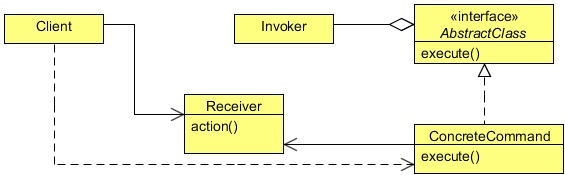

# Command Design Pattern
## 1   Introduction
The Command Design Pattern is a behavioral design pattern and helps to decouples the invoker from the receiver of a request.

To understand the Command Design Pattern let’s create an example to execute different types of jobs. A job can be anything in
a system, for example, sending emails, SMS, logging, and performing some IO functions.

The Command pattern would help to decouple the invoker from a receiver and helps to execute any type of job without knowing its
implementation. Let us make this example more interesting by creating threads which will help to execute these jobs concurrently.
As these jobs are independent of each other, so the sequence of execution of these jobs is not really important. We will create a
thread pool to limit the number of threads to execute jobs. A command object will encapsulates jobs and will hand it over to a
thread from the pool that will execute the job.

Before implementing the example, let’s know more about the Command Design Pattern.

## 2   What is the Command Design Pattern
The intent of the Command Design Pattern is to encapsulate a request as an object, thereby letting the developer to parameterize
clients with different requests, queue or log requests, and support undoable operations.

In general, an object-oriented application consists of a set of interacting objects each offering limited, focused functionality. In
response to user interaction, the application carries out some kind of processing. For this purpose, the application makes use of
the services of different objects for the processing requirement.

In terms of implementation, the application may depend on a designated object that invokes methods on these objects by passing
the required data as arguments. This designated object can be referred to as an invoker as it invokes operations on different
objects. The invoker may be treated as part of the client application. The set of objects that actually contain the implementation
to offer the services required for the request processing can be referred to as `Receiver` objects.

Using the Command pattern, the invoker that issues a request on behalf of the client and the set of service-rendering `Receiver`
objects can be decoupled. The Command pattern suggests creating an abstraction for the processing to be carried out or the action
to be taken in response to client requests. This abstraction can be designed to declare a common interface to be implemented
by different concrete implementers referred to as `Command` objects. Each `Command` object represents a different type of client
request and the corresponding processing.

A given `Command` object is responsible for offering the functionality required to process the request it represents, but it does
not contain the actual implementation of the functionality. `Command` objects make use of `Receiver` objects in offering this
functionality.

<div align="center"></div>


**Command**

* Declares an interface for executing an operation.

**ConcreteCommand**

* Defines a binding between a Receiver object and an action.
* Implements Execute by invoking the corresponding operation(s) on Receiver.

**Client**

* Creates a ConcreteCommand object and sets its receiver.

**Invoker**

* Asks the command to carry out the request.

**Receiver**

* Knows how to perform the operations associated with carrying out a request. Any class may serve as a Receiver.

## 3   Implementing the Command Design Pattern
We will implement the example using a command object. The command object will be referenced by a common interface and
will contain a method that will be used to execute the requests. The concrete command classes will override that method and will
provide their own specific implementation to execute the request.

```java
package com.zanxus.javacodegeek.patterns.commandpattern;

/**
 * @author root
 * @create 2016-12-25 10:12 PM
 */
public interface Job {

    public void run();
}
```

The `Job` interface is the command interface, contains a single method `run`, which is executed by a thread. Our command’s
`execute` method is the run method which will be used to execute by a thread in order to get the work done.
There would be a different type of jobs that can be executed. The following are the different concrete classes whose instances
will be executed by the different command objects.

```java
package com.zanxus.javacodegeek.patterns.commandpattern;

/**
 * @author root
 * @create 2016-12-25 10:13 PM
 */
public class Email {

    public void sendEmail(){
        System.out.println("Sending email...");
    }
}
```

```java
package com.zanxus.javacodegeek.patterns.commandpattern;

/**
 * @author root
 * @create 2016-12-25 10:14 PM
 */
public class FileIO {

    public void execute(){
        System.out.println("Executing File IO operations...");
    }
}
```

```java
package com.zanxus.javacodegeek.patterns.commandpattern;

/**
 * @author root
 * @create 2016-12-25 10:15 PM
 */
public class Logging {

    public void log(){
        System.out.println("Logging...");
    }
}
```

```java
package com.zanxus.javacodegeek.patterns.commandpattern;

/**
 * @author root
 * @create 2016-12-25 10:15 PM
 */
public class Sms {

    public void sendSms(){
        System.out.println("Sending SMS...");
    }
}
```

The following are the different command classes that encapsulate the above classes and implement the `Job` interface.

```java
package com.zanxus.javacodegeek.patterns.commandpattern;

/**
 * @author root
 * @create 2016-12-25 10:16 PM
 */
public class EmailJob implements Job {

    private Email email;

    public void setEmail(Email email){
        this.email = email;
    }

    @Override
    public void run() {
        System.out.println("Job ID: "+Thread.currentThread().getId()+" executing email jobs.");
        if (email!=null){
            email.sendEmail();
        }
        try {
            Thread.sleep(1000);
        } catch (InterruptedException e) {
            Thread.currentThread().interrupt();
        }
    }
}
```

```java
package com.zanxus.javacodegeek.patterns.commandpattern;

/**
 * @author root
 * @create 2016-12-25 10:19 PM
 */
public class FileIOJob implements Job{

    private FileIO fileIO;

    public void setFileIO(FileIO fileIO) {
        this.fileIO = fileIO;
    }

    @Override
    public void run() {
        System.out.println("Job ID: "+Thread.currentThread().getId()+" executing fileIO jobs");
        if (fileIO != null) {
            fileIO.execute();
        }
        try {
            Thread.sleep(1000);
        } catch (InterruptedException e) {
            Thread.currentThread().interrupt();
        }
    }
}
```

```java
package com.zanxus.javacodegeek.patterns.commandpattern;

/**
 * @author root
 * @create 2016-12-25 10:21 PM
 */
public class LoggingJob implements Job{

    private Logging logging;

    public void setLogging(Logging logging) {
        this.logging = logging;
    }

    @Override
    public void run() {
        System.out.println("Job ID: "+Thread.currentThread().getId()+" executing logging jobs");
        if (logging!=null) {
            logging.log();
        }
        try {
            Thread.sleep(1000);
        } catch (InterruptedException e) {
            Thread.currentThread().interrupt();
        }
    }
}
```

```java
package com.zanxus.javacodegeek.patterns.commandpattern;

/**
 * @author root
 * @create 2016-12-25 10:24 PM
 */
public class SmsJob implements Job{

    private Sms sms;

    public void setSms(Sms sms) {
        this.sms = sms;
    }

    @Override
    public void run() {
        System.out.println("Job ID: "+Thread.currentThread().getId()+" executing sms jobs");
        if (sms != null) {
            sms.sendSms();
        }
        try {
            Thread.sleep(1000);
        } catch (InterruptedException e) {
            Thread.currentThread().interrupt();
        }
    }
}
```

The above classes hold a reference to their respective classes that will be used to get the job done. The classes override the `run`
method and do the work requested. For example, the `SmsJob` class is used to send sms, its run method calls the `sendSms`
method of the `Sms` object in order to get the job done.
You can set different objects one by one to the same `command` object.
The below is the `ThreadPool` class used to create pool of threads and allow a thread to fetch and execute the job from the job
queue.

```java
package com.zanxus.javacodegeek.patterns.commandpattern;

import java.util.concurrent.BlockingQueue;
import java.util.concurrent.LinkedBlockingQueue;

/**
 * @author root
 * @create 2016-12-25 10:26 PM
 */
public class ThreadPool {

    private final BlockingQueue<Job> jobQueue;
    private final Thread[] jobThreads;
    private  volatile boolean shutdown;

    public ThreadPool(int n) {
        jobQueue = new LinkedBlockingQueue<>();
        jobThreads = new Thread[n];
        for (int i = 0; i < n; i++) {
            jobThreads[i] = new Worker("Pool Thread "+i);
            jobThreads[i].start();
        }

    }

    public void addJob(Job job){
        try {
            jobQueue.put(job);
        } catch (InterruptedException e) {
            Thread.currentThread().interrupt();
        }
    }

    public void shutdownPool(){
        while (!jobQueue.isEmpty()){
            try {
                Thread.sleep(1000);
            } catch (InterruptedException e) {
                e.printStackTrace();
            }
        }
        shutdown = true;
        for (Thread workerThread : jobThreads) {
            workerThread.interrupt();
        }
    }


    public class Worker extends Thread {

        public Worker(String name) {
            super(name);
        }

        public void run(){
            while (!shutdown) {
                try {
                    Job job = jobQueue.take();
                    job.run();
                } catch (InterruptedException e) {
                    e.printStackTrace();
                }
            }
        }
    }
}
```

The above class is used to create n threads (worker threads). Each worker thread will wait for a job in a queue and then execute
the job and will go back to waiting state. The class contains a job queue; when a new job will be added into the queue, a worker
thread from the pool will execute the job.

We also include a shutdownPool method which will used to shut down the pool by interrupting all the worker threads only
when the job queue is empty. The addJob method is used to add jobs to the queues.

Now, let’s test the code.

```java
package com.zanxus.javacodegeek.patterns.commandpattern;

/**
 * @author root
 * @create 2016-12-25 10:35 PM
 */
public class TestCommandPattern {

    public static void main(String[] args) {
        init();
    }

    public static void init() {
        ThreadPool pool = new ThreadPool(10);
        Email email = null;
        EmailJob emailJob = new EmailJob();

        Sms sms = null;
        SmsJob smsJob = new SmsJob();

        FileIO fileIO = null;
        FileIOJob fileIOJob = new FileIOJob();

        Logging logging = null;
        LoggingJob loggingJob = new LoggingJob();

        for (int i = 0; i < 5; i++) {
            email = new Email();
            emailJob.setEmail(email);

            sms = new Sms();
            smsJob.setSms(sms);

            fileIO = new FileIO();
            fileIOJob.setFileIO(fileIO);

            logging = new Logging();
            loggingJob.setLogging(logging);

            pool.addJob(emailJob);
            pool.addJob(smsJob);
            pool.addJob(fileIOJob);
            pool.addJob(loggingJob);
        }
        pool.shutdownPool();
    }
}
```

The above code will result to the following output:

```sh
Job ID: 10 executing email jobs.
Sending email...
Job ID: 11 executing sms jobs
Sending SMS...
Job ID: 12 executing fileIO jobs
Executing File IO operations...
Job ID: 13 executing logging jobs
Job ID: 14 executing email jobs.
Sending email...
Logging...
Job ID: 16 executing fileIO jobs
Executing File IO operations...
Job ID: 15 executing sms jobs
Sending SMS...
Job ID: 18 executing email jobs.
Sending email...
Job ID: 17 executing logging jobs
Logging...
Job ID: 19 executing sms jobs
Sending SMS...
Job ID: 10 executing fileIO jobs
Executing File IO operations...
Job ID: 11 executing logging jobs
Logging...
Job ID: 12 executing email jobs.
Sending email...
Job ID: 14 executing sms jobs
Sending SMS...
Job ID: 16 executing fileIO jobs
Executing File IO operations...
Job ID: 18 executing logging jobs
Logging...
Job ID: 19 executing email jobs.
Sending email...
Job ID: 13 executing sms jobs
Sending SMS...
Job ID: 15 executing fileIO jobs
Executing File IO operations...
Job ID: 17 executing logging jobs
Logging...
```

Please note that the output may differ on subsequent executions.

In the above class, we created a thread pool with 10 threads. Then, we set different command objects with different jobs and add
these jobs to the queue using the addJob method of the ThreadPool class. As soon as the job is inserted into the queue, a
thread executes the job and removes it from the queue.

We have set different type of jobs, but by using the Command Design Pattern, we decouple the job from the invoker thread.
The thread will execute any kind of object that implements the Job interface. The different command objects encapsulate the
different object and executed the requested operations on these objects.

The output shows the different threads executing the different job. By watching the job id in the output, you can clearly see that
a single thread is executing more than one job. This is because after executing a job the thread sends back to the pool.

The advantage of the Command Design Pattern is that you can add more different kind of jobs without changing the existing
classes. The leads to more flexibility, and maintainability and also reduce the chances of bugs in the code.

## 4   When to use the Command Design Pattern
Use the Command pattern when you want to:

*  Parameterize objects by an action to perform.
*  Specify, queue, and execute requests at different times. A Command object can have a lifetime independent of the original
    request. If the receiver of a request can be represented in an address space-independent way, then you can transfer a command
    object for the request to a different process and fulfill the request there.
* Support undo. The Command’s `Execute` operation can store state for reversing its effects in the command itself. The
   `Command` interface must have an added `Un-execute` operation that reverses the effects of a previous call to Execute.
   Executed commands are stored in a history list. Unlimited-level undo and redo is achieved by traversing this list backwards
   and forwards calling `Un-execute` and `Execute`, respectively.
* Support logging changes so that they can be reapplied in case of a system crash. By augmenting the Command interface
   with load and store operations, you can keep a persistent log of changes. Recovering from a crash involves reloading logged
   commands from disk and re-executing them with the Execute operation.
* Structure a system around high-level operations built on primitives operations. Such a structure is common in information
   systems that support transactions. A transaction encapsulates a set of changes to data. The Command pattern offers a way to
   model transactions. Commands have a common interface, letting you invoke all transactions the same way. The pattern also
   makes it easy to extend the system with new transactions.

## 5   Command Design Pattern in JDK

* `java.lang.Runnable`
* `javax.swing.Action`