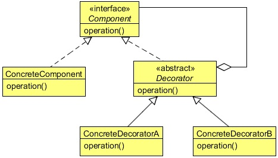

# Decorator Design Pattern
## 1   Introduction
To understand the Decorator Design Pattern, let’s help a pizza company make an extra topping calculator. A user can ask to add
extra topping to a pizza and our job is to add toppings and increase its price using the system.

This is something like adding an extra responsibility to our pizza object at runtime and the Decorator Design Pattern is suitable
for this type of requirement. But before that, let us know more about this beautiful pattern.

## 2   What is the Decorator Design Pattern
The intent of the Decorator Design Pattern is to attach additional responsibilities to an object dynamically. Decorators provide a
flexible alternative to sub-classing for extending functionality.

The Decorator Pattern is used to extend the functionality of an object dynamically without having to change the original class
source or using inheritance. This is accomplished by creating an object wrapper referred to as a `Decorator` around the actual
object.

The `Decorator` object is designed to have the same interface as the underlying object. This allows a client object to interact
with the `Decorator` object in exactly the same manner as it would with the underlying actual object. The `Decorator` object
contains a reference to the actual object. The `Decorator` object receives all requests (calls) from a client. In turn, it forwards
these calls to the underlying object. The `Decorator` object adds some additional functionality before or after forwarding
requests to the underlying object. This ensures that the additional functionality can be added to a given object externally at
runtime without modifying its structure.

Decorator prevents the proliferation of subclasses leading to less complexity and confusion. It is easy to add any combination of
capabilities. The same capability can even be added twice. It becomes possible to have different decorator objects for a given
object simultaneously. A client can choose what capabilities it wants by sending messages to an appropriate decorator.

<div align="center"></div>

**Component**

* Defines the interface for objects that can have responsibilities added to them dynamically.

**ConcreteComponent**

* Defines an object to which additional responsibilities can be attached.

**Decorator**

* Maintains a reference to a Component object and defines an interface that conforms to Component’s interface.

**ConcreteDecorator**

* Adds responsibilities to the component.

## 3   Implementing the Decorator Design Pattern

For simplicity, let’s create a simple Pizza interface which contains only two methods.

```java
package com.zanxus.javacodegeeks.patterns.decoratorpattern;

/**
 * @author root
 * @create 2016-12-27 10:18 PM
 */
public interface Pizza {

    public String getDesc();

    public double getPrice();
}
```

The `getDesc` method is used to get the pizza’s description whereas the `getPrice` is used to get the price.

Below are the two concrete `Pizza` classes:

```java
package com.zanxus.javacodegeeks.patterns.decoratorpattern;

/**
 * @author root
 * @create 2016-12-27 10:19 PM
 */
public class SimplyVegPizza implements Pizza {

    @Override
    public String getDesc() {
        return "SimpleVegPizza (230) ";
    }

    @Override
    public double getPrice() {
        return 230;
    }
}
```

```java
package com.zanxus.javacodegeeks.patterns.decoratorpattern;

/**
 * @author root
 * @create 2016-12-27 10:19 PM
 */
public class SimplyNonVegPizza implements Pizza {

    @Override
    public String getDesc() {
        return "SimplyNonVegPizza (350) ";
    }

    @Override
    public double getPrice() {
        return 350;
    }
}
```

The decorator wraps the object which functionality needs to be increased, so it needs to implement the same interface. Below is
an abstract decorator class which will be extended by all the concrete decorators.

```java
package com.zanxus.javacodegeeks.patterns.decoratorpattern;

/**
 * @author root
 * @create 2016-12-27 10:20 PM
 */
public abstract class PizzaDecorator implements Pizza {

    @Override
    public String getDesc() {
        return "Toppings";
    }
}
```

The following are the concrete decorator classes

```java
package com.zanxus.javacodegeeks.patterns.decoratorpattern;

/**
 * @author root
 * @create 2016-12-27 10:21 PM
 */
public class Broccoli extends PizzaDecorator{

    private final Pizza pizza;

    public Broccoli(Pizza pizza) {
        this.pizza = pizza;
    }

    @Override
    public double getPrice() {
        return pizza.getPrice()+9.25;
    }

    @Override
    public String getDesc() {
        return pizza.getDesc()+", Broccoli (9.25) ";
    }
}
```

```java
package com.zanxus.javacodegeeks.patterns.decoratorpattern;

/**
 * @author root
 * @create 2016-12-27 10:24 PM
 */
public class Cheese extends PizzaDecorator {

    private final Pizza pizza;

    public Cheese(Pizza pizza) {
        this.pizza = pizza;
    }

    @Override
    public String getDesc() {
        return pizza.getDesc()+", Cheese (20.72) ";
    }

    @Override
    public double getPrice() {
        return pizza.getPrice()+20.72;
    }
}
```

```java
package com.zanxus.javacodegeeks.patterns.decoratorpattern;

/**
 * @author root
 * @create 2016-12-27 10:25 PM
 */
public class Chicken extends PizzaDecorator {

    private final Pizza pizza;

    public Chicken(Pizza pizza) {
        this.pizza = pizza;
    }

    @Override
    public String getDesc() {
        return pizza.getDesc()+", Chicken (12.75) ";
    }

    @Override
    public double getPrice() {
        return pizza.getPrice()+12.75;
    }
}
```

```java
package com.zanxus.javacodegeeks.patterns.decoratorpattern;

/**
 * @author root
 * @create 2016-12-27 10:26 PM
 */
public class FetaCheese extends PizzaDecorator {

    private final Pizza pizza;

    public FetaCheese(Pizza pizza) {
        this.pizza = pizza;
    }

    @Override
    public String getDesc() {
        return pizza.getDesc()+", Feta Cheese (25.88) ";
    }

    @Override
    public double getPrice() {
        return pizza.getPrice()+25.88;
    }
}
```

```java
package com.zanxus.javacodegeeks.patterns.decoratorpattern;

/**
 * @author root
 * @create 2016-12-27 10:27 PM
 */
public class GreenOlives extends PizzaDecorator {

    private final Pizza pizza;

    public GreenOlives(Pizza pizza) {
        this.pizza = pizza;
    }

    @Override
    public String getDesc() {
        return pizza.getDesc()+", Green Olives (5.47) ";
    }

    @Override
    public double getPrice() {
        return pizza.getPrice()+5.47;
    }
}
```

```java
package com.zanxus.javacodegeeks.patterns.decoratorpattern;

/**
 * @author root
 * @create 2016-12-27 10:28 PM
 */
public class Ham extends PizzaDecorator {

    private final Pizza pizza;

    public Ham(Pizza pizza) {
        this.pizza = pizza;
    }

    @Override
    public String getDesc() {
        return pizza.getDesc()+", Ham (18.12)";
    }

    @Override
    public double getPrice() {
        return pizza.getPrice()+18.12;
    }
}
```

```java
package com.zanxus.javacodegeeks.patterns.decoratorpattern;

/**
 * @author root
 * @create 2016-12-27 10:29 PM
 */
public class Meat extends PizzaDecorator {

    private final Pizza pizza;

    public Meat(Pizza pizza) {
        this.pizza = pizza;
    }

    @Override
    public String getDesc() {
        return pizza.getDesc()+", Meat (14.25) ";
    }

    @Override
    public double getPrice() {
        return pizza.getPrice()+14.25;
    }
}
```

```java
package com.zanxus.javacodegeeks.patterns.decoratorpattern;

/**
 * @author root
 * @create 2016-12-27 10:31 PM
 */
public class RedOnions extends PizzaDecorator {

    private final Pizza pizza;

    public RedOnions(Pizza pizza) {
        this.pizza = pizza;
    }

    @Override
    public String getDesc() {
        return pizza.getDesc() + ", Red Onions (3.75)";
    }

    @Override
    public double getPrice() {
        return pizza.getPrice() + 3.75;
    }
}
```

```java
package com.zanxus.javacodegeeks.patterns.decoratorpattern;

/**
 * @author root
 * @create 2016-12-27 10:31 PM
 */
public class RomaTomatoes extends PizzaDecorator {

    private final Pizza pizza;

    public RomaTomatoes(Pizza pizza) {
        this.pizza = pizza;
    }

    @Override
    public String getDesc() {
        return pizza.getDesc() + ", Roma Tomatoes (5.20)";
    }

    @Override
    public double getPrice() {
        return pizza.getPrice() + 5.20;
    }
}
```

```java
package com.zanxus.javacodegeeks.patterns.decoratorpattern;

/**
 * @author root
 * @create 2016-12-27 10:32 PM
 */
public class Spinach extends PizzaDecorator {

    private final Pizza pizza;

    public Spinach(Pizza pizza) {
        this.pizza = pizza;
    }

    @Override
    public String getDesc() {
        return pizza.getDesc() + ", Spinach (7.92)";
    }

    @Override
    public double getPrice() {
        return pizza.getPrice() + 7.92;
    }
}
```

We need to decorate our pizza object with these toppings. The above classes contain a reference to a pizza object that needs to
be decorated. The decorator object adds its functionality to the decorator after calling the decorator’s function.

```java
package com.zanxus.javacodegeeks.patterns.decoratorpattern;

import java.text.DecimalFormat;

/**
 * @author root
 * @create 2016-12-27 10:32 PM
 */
public class TestDecoratorPattern {

    public static void main(String[] args) {

        DecimalFormat format = new DecimalFormat("#.##");
        Pizza pizza = new SimplyVegPizza();

        pizza = new RomaTomatoes(pizza);
        pizza = new GreenOlives(pizza);
        pizza = new Spinach(pizza);
        System.out.println("Desc: "+pizza.getDesc());
        System.out.println("Price: "+format.format(pizza.getPrice()));

        pizza = new SimplyNonVegPizza();
        pizza = new Meat(pizza);
        pizza = new Cheese(pizza);
        pizza = new Cheese(pizza);
        pizza = new Ham(pizza);
        System.out.println("Desc: " + pizza.getDesc());
        System.out.println("Price: " + format.format(pizza.getPrice()));
    }
}
```

The above code will results the following output:
```sh
Desc: SimpleVegPizza (230) , Roma Tomatoes (5.20), Green Olives (5.47) , Spinach (7.92)
Price: 248.59
Desc: SimplyNonVegPizza (350) , Meat (14.25) , Cheese (20.72) , Cheese (20.72) , Ham (18.12)
Price: 423.81
```

In the above class, first we have created a `SimplyVegPizza` and then decorated it with `RomaTomatoes`, `GreenOlives`,
and `Spinach`. The `desc` in the output shows the toppings added in the `SimplyVegPizza` and the price are the sum of all.
We did the same thing for the `SimplyNonVegPizza` and added different topping on it. Please note that you can decorate the
same thing more than once for an object. In the above example, we added `cheese` twice; it got added twice in the price too,
which can be seen in the output.
The Decorator Design Pattern looks good when you need to add extra functionality to an object with modifying it, at runtime.
But this results in lots of little objects. A design that uses Decorator often results in systems composed of lots of little objects
that all look alike. The objects differ only in the way they are interconnected, not in their class or in the value of their variables.
Although these systems are easy to customize by those who understand them, they can be hard to learn and debug.

## 4   When to use the Decorator Design Pattern
Use the Decorator pattern in the following cases:

* To add responsibilities to individual objects dynamically and transparently, that is, without affecting other objects.
* For responsibilities that can be withdrawn.
* When extension by sub-classing is impractical. Sometimes a large number of independent extensions are possible and would
   produce an explosion of subclasses to support every combination. Or a class definition may be hidden or otherwise unavailable
   for sub-classing.
   
## 5   Decorator Design Pattern in Java

* `java.io.BufferedInputStream(InputStream)`
* `java.io.DataInputStream(InputStream)`
* `java.io.BufferedOutputStream(OutputStream)`
* `java.util.zip.ZipOutputStream(OutputStream)`
* `java.util.Collections#checked[List|Map|Set|SortedSet|SortedMap]()`
