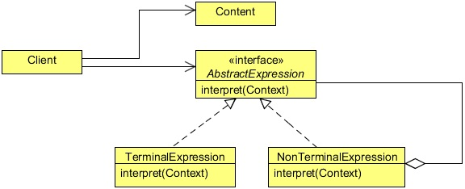

# Interpreter Design Pattern
## 1   Introduction
The Interpreter Design Pattern is a heavy-duty pattern. It’s all about putting together your own programming language, or
handling an existing one, by creating an interpreter for that language. To use this pattern, you have to know a fair bit about
formal grammars to put together a language. As you can imagine, this is one of those patterns that developers don’t really use
every day, because creating your own language is not something many people do.

For example, defining an expression in your new language might look something like the following snippet in terms of formal
grammars:

`expression ::=<command> | <repetition> | <sequence>`

Each expression in your new language, then, might be made up of commands, repetitions of commands, and sequences expres-
sions. Each item might be represented as an object with an interpret method to translate your new language into something you
can run in Java.

To illustrate the use of Interpreter Design Pattern let’s create an example to solve simple mathematical expressions, but before
that, let’s discuss some details about the Interpreter Design Pattern in the section below.

## 2   What is the Interpreter Design Pattern
Given a language, define a representation for its grammar along with an interpreter that uses the representation to interpret
sentences in the language.

In general, languages are made up of a set of grammar rules. Different sentences can be constructed by following these grammar
rules. Sometimes an application may need to process repeated occurrences of similar requests that are a combination of a set of
grammar rules. These requests are distinct but are similar in the sense that they are all composed using the same set of rules.

A simple example of this would be the set of different arithmetic expressions submitted to a calculator program. Though each
such expression is different, they are all constructed using the basic rules that make up the grammar for the language of arithmetic
expressions.

In such cases, instead of treating every distinct combination of rules as a separate case, it may be beneficial for the application
to have the ability to interpret a generic combination of rules. The Interpreter pattern can be used to design this ability in an
application so that other applications and users can specify operations using a simple language defined by a set of grammar rules.

A class hierarchy can be designed to represent the set of grammar rules with every class in the hierarchy representing a separate
grammar rule. An Interpreter module can be designed to interpret the sentences constructed using the class hierarchy designed
above and carries out the necessary operations.

Because a different class represents every grammar rule, the number of classes increases with the number of grammar rules. A
language with extensive, complex grammar rules requires a large number of classes. The Interpreter pattern works best when the
grammar is simple. Having a simple grammar avoids the need to have many classes corresponding to the complex set of rules
involved, which are hard to manage and maintain.

<div align="center"></div>


**AbstractExpression**

* Declares an abstract `Interpret` operation that is common to all nodes in the abstract syntax tree.

**TerminalExpression**

* Implements an `Interpret` operation associated with terminal symbols in the grammar.
* An instance is required for every terminal symbol in a sentence.

**NonterminalExpression**

* One such class is required for every rule `R ::=R1 R2 ...Rn` in the grammar.
* Maintains instance variables of type `AbstractExpression` for each of the symbols `R1` through `Rn`.
* Implements an `Interpret` operation for non terminal symbols in the grammar. `Interpret` typically calls itself recursively
   on the variables representing `R1` through `Rn`.

**Context**

* Contains information that’s global to the interpreter.

**Client**

* Builds (or is given) an abstract syntax tree representing a particular sentence in the language that the grammar defines. The
   abstract syntax tree is assembled from instances of the `NonterminalExpression` and `TerminalExpression` classes.
* Invokes the `Interpret` operation.

## 3   Implementing the Interpreter Design Pattern

```java
package com.zanxus.javacodegeeks.patterns.interpreterpattern;

/**
 * @author root
 * @create 2016-12-26 11:09 PM
 */
public interface Expression {

    public int interpret();
}
```

The above interface is used by all different concrete expressions and overrides the interpret method to define their specific
operation on the expression.

The following are the operation specific expression classes.

```java
package com.zanxus.javacodegeeks.patterns.interpreterpattern;

/**
 * @author root
 * @create 2016-12-26 11:10 PM
 */
public class Add implements Expression {

    private final Expression leftExpression;
    private final Expression rightExpression;

    public Add(Expression leftExpression, Expression rightExpression) {
        this.leftExpression = leftExpression;
        this.rightExpression = rightExpression;
    }

    @Override
    public int interpret() {
        return leftExpression.interpret()+rightExpression.interpret();
    }
}
```

```java
package com.zanxus.javacodegeeks.patterns.interpreterpattern;

/**
 * @author root
 * @create 2016-12-26 11:11 PM
 */
public class Product implements Expression {

    private final Expression leftExpression;
    private final Expression rightExpression;

    public Product(Expression leftExpression, Expression rightExpression) {
        this.leftExpression = leftExpression;
        this.rightExpression = rightExpression;
    }

    @Override
    public int interpret() {
        return leftExpression.interpret()*rightExpression.interpret();
    }
}
```

```java
package com.zanxus.javacodegeeks.patterns.interpreterpattern;

/**
 * @author root
 * @create 2016-12-26 11:13 PM
 */
public class Substract implements Expression {

    private final Expression leftExpression;
    private final Expression rightExpression;

    public Substract(Expression leftExpression, Expression rightExpression) {
        this.leftExpression = leftExpression;
        this.rightExpression = rightExpression;
    }

    @Override
    public int interpret() {
        return leftExpression.interpret()-rightExpression.interpret();
    }
}
```

```java
package com.zanxus.javacodegeeks.patterns.interpreterpattern;

/**
 * @author root
 * @create 2016-12-26 11:14 PM
 */
public class Number implements Expression {

    private final int n;

    public Number(int n) {
        this.n = n;
    }

    @Override
    public int interpret() {
        return n;
    }
}
```

Below is the optional utility class that contains different utility methods used to execute the expression.

```java
package com.zanxus.javacodegeeks.patterns.interpreterpattern;

/**
 * @author root
 * @create 2016-12-26 11:16 PM
 */
public class ExpressionUtils {

    public static boolean isOperator(String s) {
        if (s.equals("+") || s.equals("-") || s.equals("*"))
            return true;
        else
            return false;
    }

    public static Expression getOperator(String s,Expression left,Expression right){

        switch (s) {
            case "+":
                return new Add(left, right);
            case "-":
                return new Substract(left, right);
            case "*":
                return new Product(left, right);
        }
        return null;

    }
}
```

Now, let’s test the example.

```java
package com.zanxus.javacodegeeks.patterns.interpreterpattern;

import java.util.Stack;

/**
 * @author root
 * @create 2016-12-26 11:20 PM
 */
public class TestInterpreterPattern {

    public static void main(String[] args) {
        String tokenString = "7 3 - 2 1 + *";
        Stack<Expression> stack = new Stack<>();
        String[] tokenArray = tokenString.split(" ");
        for (String s:tokenArray){
            if (ExpressionUtils.isOperator(s)){
                Expression rightExpression = stack.pop();
                Expression leftExpression = stack.pop();
                Expression operator = ExpressionUtils.getOperator(s, leftExpression, rightExpression);
                int result = operator.interpret();
                stack.push(new Number(result));
            }else {
                Expression i = new Number(Integer.parseInt(s));
                stack.push(i);
            }
        }
        System.out.println("( "+tokenString+" ):"+stack.pop().interpret());
    }
}
```

The code above will provide the following output:

```sh
( 7 3 -2 1 + * ):12
```

Please note that we have used a postfix expression to solve it.

If you don’t know about postfix, here is a brief introduction about it. There are three notations to a mathematical expression i.e.
infix, postfix, and prefix.

* **Infix** notation is the common arithmetic and logical formula notation, in which operators are written infix-style between the
   operands they act on e.g. 3+4.
* A **postfix** a.k.a. Reverse Polish notation (RPN) is mathematical notation in which every operator follows all of its operands
   e.g. 34+.
* **Prefix** (Polish notation) is a form of notation for logic, arithmetic, and algebra in which operators to the left of their operands
   e.g. +34.
   
The Infix notation is a normally used in mathematical expression. The other two notations are used as syntax for mathematical
expressions by interpreters of programming languages.

In the above class, we declared a postfix of an expression in `tokenString` variable. Then we split the `tokenString` and
assigned it into an array, the `tokenArray`. While iterating tokens one by one, first we have checked whether the token is an
operator or an operand. If the token is an operand we pushed it into the stack, but if it is an operator we popped the first two
operands from the stack. The `getOperation` method from `ExpressionUtils` returns the appropriate expression class
according to the operator passed to it.

Then, we interpret the result and pushed it back to the stack. After iterating the complete `tokenList` we got the final result.

## 4   When to use the Interpreter Design Pattern
Use the Interpreter pattern when there is a language to interpret, and you can represent statements in the language as abstract
syntax trees. The Interpreter pattern works best when

* The grammar is simple. For complex grammars, the class hierarchy for the grammar becomes large and unmanageable. Tools
   such as parser generators are a better alternative in such cases. They can interpret expressions without building abstract syntax
   trees, which can save space and possibly time.

* Efficiency is not a critical concern. The most efficient interpreters are usually not implemented by interpreting parse trees
   directly but by first translating them into another form. For example, regular expressions are often transformed into state
   machines. But even then, the translator can be implemented by the Interpreter pattern, so the pattern is still applicable.

## 5   Interpreter Design Pattern in JDK

* `java.util.Pattern`
* `java.text.Normalizer`
* `java.text.Format`


