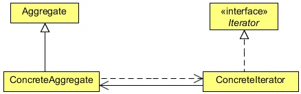

# Iterator Design Pattern

## 1   Introduction

An aggregate object, such as a list, should give you a way to access its elements without exposing its internal structure. Moreover,
you might want to traverse the list in different ways, depending on what you want to accomplish. But you probably don’t want to
bloat the List interface with operations for different traversals, even if you could anticipate the ones you will need. You might
also need to have more than one traversal pending on the same list.

The Iterator pattern lets you do all this. The key idea in this pattern is to take the responsibility for access and traversal out
of the list object and put it into an iterator object. The Iterator class defines an interface for accessing the list’s elements.
An iterator object is responsible for keeping track of the current element; that is, it knows which elements have been traversed
already.

## 2   What is the Iterator Design Pattern

The intent of the Iterator Design Pattern is to provide a way to access the elements of an aggregate object sequentially without
exposing its underlying representation.

The Iterator pattern allows a client object to access the contents of a container in a sequential manner, without having any
knowledge about the internal representation of its contents. The term container, used above, can simply be defined as a collection
of data or objects. The objects within the container could in turn be collections, making it a collection of collections.

The Iterator pattern enables a client object to traverse through this collection of objects (or the container) without having the
container to reveal how the data is stored internally. To accomplish this, the Iterator pattern suggests that a Container object
should be designed to provide a public interface in the form of an Iterator object for different client objects to access its contents.
An Iterator object contains public methods to allow a client object to navigate through the list of objects within the container.

<div align="center"></div>

**Iterator**

* Defines an interface for accessing and traversing elements.

**ConcreteIterator**

* Implements the Iterator interface.
* Keeps track of the current position in the traversal of the aggregate.

**Aggregate**

* Defines an interface for creating an Iterator object.

**ConcreteAggregate**

* Implements the Iterator creation interface to return an instance of the proper ConcreteIterator.

## 3   Implementing the Iterator Design Pattern

Let us implement the Iterator Design Pattern using a `Shape` class. We will store and iterate the `Shape` objects using an iterator.

```java
package com.zanxus.javacodegeeks.patterns.iteratorpattern;

/**
 * @author root
 * @create 2016-12-28 11:10 PM
 */
public class Shape {

    private int id;
    private String name;

    public Shape(int id, String name) {
        this.id = id;
        this.name = name;
    }

    public int getId() {
        return id;
    }

    public void setId(int id) {
        this.id = id;
    }

    public String getName() {
        return name;
    }

    public void setName(String name) {
        this.name = name;
    }

    @Override
    public String toString() {
        return "ID: "+id+" Shape: "+name;
    }
}
```

The simple `Shape` class has an `id` and `name` as its attributes

```java
package com.zanxus.javacodegeeks.patterns.iteratorpattern;

/**
 * @author root
 * @create 2016-12-28 11:13 PM
 */
public class ShapeStorage {

    private Shape[] shapes = new Shape[5];

    private int index;

    public void addShape(String name){
        int i = index++;
        shapes[i] = new Shape(i,name);
    }

    public Shape[] getShapes(){
        return shapes;
    }
}
```

The above class is used to store the `Shape` objects. The class contains an array of `Shape` type, for simplicity we have initialized
that array up to 5. The `addShape` method is used to add a `Shape` object to the array and increment the index by one. The
`getShapes` method returns the array of `Shape` type.

```java
package com.zanxus.javacodegeeks.patterns.iteratorpattern;

import java.util.Iterator;

/**
 * @author root
 * @create 2016-12-28 11:15 PM
 */
public class ShapeIterator implements Iterator<Shape> {

    private Shape[] shapes;
    int pos;

    public ShapeIterator(Shape[] shapes) {
        this.shapes = shapes;
    }

    @Override
    public boolean hasNext() {
        if (pos>=shapes.length||shapes[pos]==null) {
            return false;
        }
        return true;
    }

    @Override
    public Shape next() {
        return shapes[pos++];
    }

    @Override
    public void remove() {
        if (pos<=0) {
            throw new IllegalStateException("Illegal position");
        }
        if (shapes[pos-1]!=null) {
            for (int i=pos-1;i<(shapes.length-1);i++){
                shapes[i] = shapes[i + 1];
            }
            shapes[shapes.length - 1] = null;
        }
    }
}
```

The above class is an `Iterator` to the `Shape` class. The class implements the `Iterator` interface and defines all the methods
of the `Iterator` interface.

The `hasNext` method returns a `boolean` if there’s an item left. The next method returns the next item from the collection and
the remove method remove the current item from the collection.

```java
package com.zanxus.javacodegeeks.patterns.iteratorpattern;

/**
 * @author root
 * @create 2016-12-28 11:20 PM
 */
public class TestIteratorPattern {

    public static void main(String[] args) {
        ShapeStorage storage = new ShapeStorage();
        storage.addShape("Polygon");
        storage.addShape("Hexagon");
        storage.addShape("Circle");
        storage.addShape("Rectangle");
        storage.addShape("Square");

        ShapeIterator iterator = new ShapeIterator(storage.getShapes());
        while (iterator.hasNext()) {
            System.out.println(iterator.next());
        }
        System.out.println("Apply removing while iterating...");
        iterator = new ShapeIterator(storage.getShapes());
        while (iterator.hasNext()) {
            System.out.println(iterator.next());
            iterator.remove();
        }
    }
}
```

The above code will result to the following output:

```sh
ID: 0 Shape: Polygon
ID: 1 Shape: Hexagon
ID: 2 Shape: Circle
ID: 3 Shape: Rectangle
ID: 4 Shape: Square
Apply removing while iterating...
ID: 0 Shape: Polygon
ID: 2 Shape: Circle
ID: 4 Shape: Square
```

In the above class, we have created a `ShapeStorage` object and stores the `Shape` objects in it. Next, we created a `ShapeIterator`
object and assigned it the shapes. We iterated twice, first without calling the remove method and then with the remove
method.

The output shows you the impact of the remove method. At first iteration, the iterator prints all the shapes but when the remove
method is called, it first prints the current shape and moved to the next shape. Then, we called the remove method on it which
removes the current shape and then the iterator points to the next available shape object.

That’s why, the output after "Apply removing while iterating. . . " shows only 0, 2, and 4 shapes object.

## 4   Internal and External Iterators

An iterator can be designed either as an internal iterator or as an external iterator.

### 4.1   Internal Iterators

* The collection itself offers methods to allow a client to visit different objects within the collection. For example, the 
   `java.util.ResultSet` class contains the data and also offers methods such as next to navigate through the item list.
* There can be only one iterator on a collection at any given time.
* The collection has to maintain or save the state of iteration.

### 4.2   External Iterators

* The iteration functionality is separated from the collection and kept inside a different object referred to as an iterator. Usually,
   the collection itself returns an appropriate iterator object to the client depending on the client input. For example, the 
   `java.util.Vector` class has its iterator defined in the form of a separate object of type `Enumeration`. This object is returned
   to a client object in response to the `elements()` method call.
* There can be multiple iterators on a given collection at any given time.
* The overhead involved in storing the state of iteration is not associated with the collection. It lies with the exclusive Iterator
   object.
   
## 5   When to use the Iterator Design Pattern

Use the Iterator pattern:

* To access an aggregate object’s contents without exposing its internal representation.
* To support multiple traversals of aggregate objects.
* To provide a uniform interface for traversing different aggregate structures (that is, to support polymorphic iteration).

## 6   Iterator Pattern in JDK

* `java.util.Iterator`
* `java.util.Enumeration`