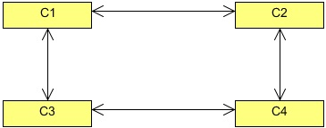
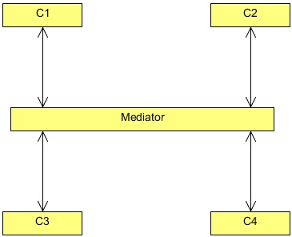
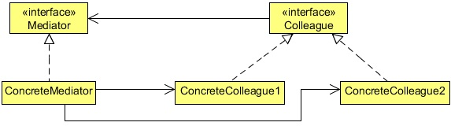

# Mediator Design Pattern
# 1   Introduction
Today’s world runs on software. Software runs in almost everything now, it is not only used in computers. Smart television,
mobile phones, wrist watches, washing machines, etc. are having embedded software which operates the machine.

A big electronic company has asked you to develop a piece of software to operate its new fully automatic washing machine.
The company has provided you with the hardware specification and the working knowledge of the machine. In the specification,
they have provided you the different washing programs the machine supports. They want to produce a fully automatic washing
machine that will require almost 0% of human interaction. The user should only need to connect the machine with a tap to
supply water, load the clothes to wash, set the type of clothes in the machine like cotton, silk, or denims etc, provide detergent
and softener to their respective trays, and press the start button.

The machine should be smart enough to fill the water in the drum, as much as required. It should adjust the wash temperature by
itself by turning the heater on, according to the type of clothes in it. It should start the motor and spin the drum as much required,
rinse according to the clothes needs, use soil removal if required, and softener too.

As an Object Oriented developer, you started analyzing and classifying objects, classes, and their relationships. Let’s check some
of the important classes and parts of the system. First of all, a Machine class, which has a drum. So a Drum class, but also a
heater, a sensor to check the temperature, a motor. Additionally, the machine also has a valve to control the water supply, a soil
removal, detergent, and a softener.

These classes have a very complex relationship with each other, and the relationship also varies. Please note that currently we are
taking only about the high level abstraction of the machine. If we try to design it without keeping much of OOP principles and
patterns in mind, then the initial design would be very tightly coupled and hard to maintain. This is because the above classes
should contact with each other to get the job done. Like for example, the Machine class should ask the Valve class to open the
valve, or the Motor should spin the Drum at certain rpm according to the wash program set (which is set by the type of clothes in
the machine). Some type of clothes require softener or soil removal while others don’t, or the temperature should be set according
to the type of clothes.

If we allow classes to contact each other directly, that is, by providing a reference, the design will become very tightly coupled
and hard to maintain. It would become very difficult to change one class without affecting the other. Even worse, the relationship
between the classes varies, according to the different wash programs, like different temperature for different type of clothes. So
these classes won’t able to be reused. Even worse, in order to support all the wash programs we need to put control statements
like if-else in the code which would make the code even more complex and difficult to maintain.

To decouple these objects from each other we need a mediator, which will contact the object on behalf of the other object, hence
providing loose coupling between them. The object only needs to know about the mediator, and perform operations on it. The
mediator will perform operations on the required underlying object in order to get the work done.

The Mediator Pattern is best suited for this, but before implementing it to solve our problem. Let’s first know more about the
Mediator Design Pattern.

## 2   What is the Mediator Pattern
The Mediator Pattern defines an object that encapsulates how a set of objects interact. Mediator promotes loose coupling by
keeping objects from referring to each other explicitly, and it lets you vary their interaction independently.

Rather than interacting directly with each other, objects ask the Mediator to interact on their behalf which results in reusability
and loose coupling. It encapsulates the interaction between the objects and makes them independent from each other. This allows
them to vary their interaction with other objects in a totally different way by implementing a different mediator. The Mediator
helps to reduce the complexity of the classes. Each object no longer has to know in detail about how to interact with the other
objects. The coupling between objects goes from tight and brittle to loose and agile.

Before Mediator the interaction between the classes might look like this, containing references of each other.

<div align="center"></div>

Now, after implementing a Mediator the interaction between the classes looks like this, only containing a reference to the
mediator.

<div align="center"></div>

The Mediator design pattern should be your first choice any time you have a set of objects that are tightly coupled. If every one
of a series of objects has to know the internal details of the other objects, and maintaining those relationships becomes a problem,
think of the Mediator. Using a Mediator means the interaction code has to reside in only one place, and that makes it easier to
maintain. Using a mediator can hide a more serious problem: If you have multiple objects that are too tightly coupled, your
encapsulation may be faulty. It might be time to rethink how you’ve broken your program into objects.

Let’s look a more formal structure of the Mediator Pattern.

<div align="center"></div>

The classess which hold reference of the mediator are called colleagues. The major participants of the Mediator Pattern are:

* Mediator: Defines an interface for communicating with Colleague objects.
* ConcreteMediator: Implements cooperative behavior by coordinating Colleague objects. It also knows and maintains its
colleagues.
* Colleague Classes: Each Colleague class knows its Mediator object. Each colleague communicates with its mediator whenever
it would have otherwise communicated with another colleague.

## 3   Implementing the Mediator Pattern
Now, we will see how the Mediator Pattern will make the washing machine design better, reusable, maintainable and loosely
coupled.

```java
package com.zanxus.javacodegeeks.patterns.mediatorpattern;

/**
 * @author root
 * @create 2016-12-04 3:48 PM
 */
public interface MachineMediator {
    public void start();

    public void wash();

    public void open();

    public void closed();

    public void on();

    public void off();

    public boolean checkTemperature(int temp);
}
```

The MachineMediator is an interface which acts as a generic mediator. The interface contains operations call by one object
to another.

```java
package com.zanxus.javacodegeeks.patterns.mediatorpattern;

/**
 * @author root
 * @create 2016-12-04 3:52 PM
 */
public interface Colleague {
    public void setMediator(MachineMediator mediator);
}
```

The Colleague interface has one method to set the mediator for the concrete colleague’s class.

```java
package com.zanxus.javacodegeeks.patterns.mediatorpattern;

/**
 * @author root
 * @create 2016-12-04 3:54 PM
 */
public class Button implements Colleague {

    private MachineMediator mediator;

    @Override
    public void setMediator(MachineMediator mediator) {
        this.mediator = mediator;
    }

    public void press(){
        System.out.println("Button pressed.");
        mediator.start();
    }
}
```

The above Button class is a colleague class which holds a reference to a mediator. The user press the button which calls the
press() method of this class which in turn, calls the start() method of the concrete mediator class. This start() method
of the mediator calls the start() method of machine class on behalf of the Button class.

Later, we will see the structure of the mediator class. But now let’s us first see the rest of the colleague classes.

```java
package com.zanxus.javacodegeeks.patterns.mediatorpattern;

/**
 * @author root
 * @create 2016-12-04 3:58 PM
 */
public class Machine implements Colleague {
    private MachineMediator mediator;

    public void start() {
        mediator.open();
    }

    public void wash() {
        mediator.wash();
    }

    @Override
    public void setMediator(MachineMediator mediator) {
        this.mediator = mediator;
    }
}
```

The above Machine class which hold a reference to the mediator has the start() method which is called on the press of the
button by the mediator class as discussed above. The method has an open() method of the mediator which in turn calls the
open() method of the Valve class in order to open the valve of the machine.

```java
package com.zanxus.javacodegeeks.patterns.mediatorpattern;

/**
 * @author root
 * @create 2016-12-04 4:01 PM
 */
public class Valve implements Colleague {

    private MachineMediator mediator;

    public void open() {
        System.out.println("Valve is opend...");
        System.out.println("Filling water...");
        mediator.closed();
    }

    public void closed() {
        System.out.println("Valve is closed");
        mediator.on();
    }
    
    @Override
    public void setMediator(MachineMediator mediator) {
        this.mediator = mediator;
    }
}
```

The Valve class has two methods, an open() method which is called to open the valve and when the water is filled it called
the closed() method. But please note that it is not calling the closed() method directly, it calls the closed() method of
the mediator which invokes the method of this class.

On closing the valve it turns the heater on but again by invoking the mediator’s method instead of directly calling the heater’s
method.

```java
package com.zanxus.javacodegeeks.patterns.mediatorpattern;

/**
 * @author root
 * @create 2016-12-04 4:04 PM
 */
public class Heater implements Colleague {

    private MachineMediator mediator;

    public void on(int temp){
        System.out.println("Heater is on...");
        if (mediator.checkTemperature(temp)){
            System.out.println("Temperature is set to "+temp);
            mediator.off();
        }
    }

    public void off(){
        System.out.println("Heater is off...");
        mediator.wash();
    }

    @Override
    public void setMediator(MachineMediator mediator) {
        this.mediator = mediator;
    }
}
```

The heater’s on() method switch on the heater and set the temperature as required. It also checks if temperature is reached as
required, it turns off() the method. The checking of the temperature and switching off the heater is done through the mediator.

After switching off, it calls the wash() method of the Machine class through the mediator to start washing.

As stated by the company, the washing machine has a set of wash programs and the software should support all these programs.
The below mediator is actually one of the washing programs for the machine. The below mediator is set as a washing program
for cottons, so parameters such as temperature, drum spinning speed, level of soil removal etc., are set accordingly. We can have
different mediators for different washing programs without changing the existing colleague classes and thus providing loose
coupling and reusability. All these colleague classes can be reused with others washing programs of the machine.

```java
package com.zanxus.javacodegeeks.patterns.mediatorpattern;

/**
 * @author root
 * @create 2016-12-04 4:08 PM
 */
public class CottonMediator implements MachineMediator {

    private final Machine machine;
    private final Heater heater;
    private final Motor motor;
    private final Sensor sensor;
    private final SoilRemoval soilRemoval;
    private final Valve valve;

    public CottonMediator(Machine machine, Heater heater, Motor motor, Sensor sensor, SoilRemoval soilRemoval, Valve valve) {
        this.machine = machine;
        this.heater = heater;
        this.motor = motor;
        this.sensor = sensor;
        this.soilRemoval = soilRemoval;
        this.valve = valve;
        System.out.println("Setting up for COTTON program");
    }

    @Override
    public void start() {
        machine.start();
    }

    @Override
    public void wash() {
        motor.startMotor();
        motor.rotateDrum(700);
        System.out.println("Adding detergent");
        soilRemoval.low();
        System.out.println("Adding softener");
    }

    @Override
    public void open() {
        valve.open();
    }

    @Override
    public void closed() {
        valve.closed();
    }

    @Override
    public void on() {
        heater.on(40);
    }

    @Override
    public void off() {
        heater.off();
    }

    @Override
    public boolean checkTemperature(int temp) {
        return sensor.chectTemperature(temp);
    }
}
```

The CottonMediator class implements the MachineMediator interface and provides the required methods. These meth-
ods are the operations that are performed by the colleague objects in order to get the work done. The above mediator class just
calls the method of a colleague object on behalf of another colleague object in order to achieve this.

There are also some other supporting classes:

```java
package com.zanxus.javacodegeeks.patterns.mediatorpattern;

/**
 * @author root
 * @create 2016-12-04 4:21 PM
 */
public class Sensor {

    public boolean chectTemperature(int temp){
        System.out.println("Temperature reached "+temp+" *C");
        return true;
    }
}
```

Sensor class is used by the Heater to check the temperature.

```java
package com.zanxus.javacodegeeks.patterns.mediatorpattern;

/**
 * @author root
 * @create 2016-12-04 4:15 PM
 */
public class SoilRemoval {

    public void low(){
        System.out.println("Setting Soil Removal to low");
    }

    public void medium(){
        System.out.println("Setting Soil Removal to medium");
    }

    public void high(){
        System.out.println("Setting Soil Removal to high");
    }
}
```

SoilRemoval class is used by the Machine class.

In order to feel the advantages and power of the Mediator Pattern, let’s take another mediator that is used as a washing program
for denims. Now we just need to create a new mediator and set the rules in it to wash denims: rules like temperature, and the speed
at which drum will spin, whether softener is required or not, the level of the soil removal, etc. We don’t need to change anything
in the existing structure. No conditional statements like "if-else" are required, something that would increase the complexity.

```java
package com.zanxus.javacodegeeks.patterns.mediatorpattern;

/**
 * @author root
 * @create 2016-12-04 4:25 PM
 */
public class DenimMediator implements MachineMediator {

    private final Machine machine;
    private final Heater heater;
    private final Motor motor;
    private final Sensor sensor;
    private final SoilRemoval soilRemoval;
    private final Valve valve;

    public DenimMediator(Machine machine, Heater heater, Motor motor, Sensor sensor, SoilRemoval soilRemoval, Valve valve) {
        this.machine = machine;
        this.heater = heater;
        this.motor = motor;
        this.sensor = sensor;
        this.soilRemoval = soilRemoval;
        this.valve = valve;
        System.out.println("Setting up for DENIM program");
    }

    @Override
    public void start() {
        machine.start();
    }

    @Override
    public void wash() {
        motor.startMotor();
        motor.rotateDrum(1400);
        System.out.println("Adding detergent");
        soilRemoval.medium();
        System.out.println("No softener is required");
    }

    @Override
    public void open() {
        valve.open();
    }

    @Override
    public void closed() {
        valve.closed();
    }

    @Override
    public void on() {
        heater.on(30);
    }

    @Override
    public void off() {
        heater.off();
    }

    @Override
    public boolean checkTemperature(int temp) {
        return sensor.chectTemperature(temp);
    }
}
```

You can clearly see the differences between the two mediator classes. There is different temperature, spinning speed is also
different and no softener is required for the denim wash.

Now test these mediators.

```java
package com.zanxus.javacodegeeks.patterns.mediatorpattern;

/**
 * @author root
 * @create 2016-12-04 4:30 PM
 */
public class TestMediator {

    public static void main(String[] args) {
        MachineMediator mediator = null;
        Sensor sensor = new Sensor();
        SoilRemoval soilRemoval = new SoilRemoval();
        Motor motor = new Motor();
        Machine machine = new Machine();
        Heater heater = new Heater();
        Valve valve = new Valve();
        Button button = new Button();

        mediator = new CottonMediator(machine, heater, motor, sensor, soilRemoval, valve);

        button.setMediator(mediator);
        machine.setMediator(mediator);
        heater.setMediator(mediator);
        valve.setMediator(mediator);
        button.press();

        System.out.println();

        mediator = new DenimMediator(machine, heater, motor, sensor, soilRemoval, valve);

        button.setMediator(mediator);
        machine.setMediator(mediator);
        heater.setMediator(mediator);
        valve.setMediator(mediator);

        button.press();
    }
}
```

The above program will have as a result the following output:

```sh
Setting up for COTTON program
Button pressed.
Valve is opend...
Filling water...
Valve is closed
Heater is on...
Temperature reached 40 *C
Temperature is set to 40
Heater is off...
Start motor...
Rotating drum at 700 rpm.
Adding detergent
Setting Soil Removal to low
Adding softener

Setting up for DENIM program
Button pressed.
Valve is opend...
Filling water...
Valve is closed
Heater is on...
Temperature reached 30 *C
Temperature is set to 30
Heater is off...
Start motor...
Rotating drum at 1400 rpm.
Adding detergent
Setting Soil Removal to medium
No softener is required
```

In the above class, we created the objects required, mediators (or we can say different wash programs), then we set the wash
programs to the colleagues and vice-versa, and the we called the start() method on the button object to start the machine.
The rest is done automatically without any human interaction.

Please note that just to work with a different wash program, a different mediator is set and the rest remains the same. You can
clearly see the differences from the output.

## 4   When to use the Mediator Pattern

* A set of objects communicate in well-defined but complex ways. The resulting interdependencies are unstructured and difficult
to understand.
* Reusing an object is difficult because it refers to and communicates with many other objects.Java Design Patterns
* A behavior that’s distributed between several classes should be customizable without a lot of sub-classing.

## 5   Mediator Pattern in JDK
Design Patterns are used almost everywhere in JDK. The following are the usages of the Mediator Pattern in JDK.

* java.util.concurrent.ScheduledExecutorService (all scheduleXXX() methods)
* java.util.concurrent.ExecutorService (the invokeXXX() and submit() methods)
* java.util.concurrent.Executor#execute()
* java.util.Timer (all scheduleXXX() methods)
* java.lang.reflect.Method#invoke()