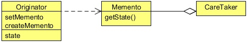

# Memento Design Pattern
## 1   Introduction
Sometimes it’s necessary to record the internal state of an object. This is required when implementing checkpoints and "undo"
mechanisms that let users back out of tentative operations or recover from errors. You must save state information somewhere,
so that you can restore objects to their previous conditions. But objects normally encapsulate some or all of their state, making
it inaccessible to other objects and impossible to save externally. Exposing this state would violate encapsulation, which can
compromise the application’s reliability and extensibility.

The Memento pattern can be used to accomplish this without exposing the object’s internal structure. The object whose state
needs to be captured is referred to as the originator.

To illustrate the use of the Memento Pattern, let’s see an example. We will create a class that will contain two double type fields
and we will run some mathematical operations on it. We will provide users with the undo operation. If the results after some
operations are not satisfied to a user, the user can call the undo operation which will restore the state of the object to the last saved
point.

The example also includes a save point mechanism which is used by the user to save the state of the object. We will also provide
a variety of undo operations. A simple undo would restore the object state to the previous save point. An undo with the specified
save point will restore that particular state of the object and undo all will delete all the saved state of the object and restore the
object in the initialized state, when the object was created.

Before implementing the pattern, let’s know more about the Memento Design Pattern.

## 2   What is the Memento Design Pattern
The Memento Pattern’s intent is, without violating encapsulation, to capture and externalize an object’s internal state so that the
object can be restored to this state later.

<div align="center"></div>

**Memento**

* Stores internal state of the Originator object. The memento may store as much or as little of the originator’s internal state as
   necessary at its originator’s discretion.
* Protects against access by objects other than the originator. Mementos have effectively two interfaces. Caretaker sees a narrow
   interface to the Memento-it can only pass the memento to other objects. Originator, in contrast, sees a wide interface, one that
   lets it access all the data necessary to restore itself to its previous state. Ideally, only the originator that produced the memento
   would be permitted to access the memento’s internal state.
   
**Originator**

* Creates a memento containing a snapshot of its current internal state.
* Uses the memento to restore its internal state.

**Caretaker**

* Is responsible for the memento’s safekeeping.
* Never operates on or examines the contents of a memento.

When a client wants to save the state of the originator, it requests the current state from the originator. The originator stores all
those attributes that are required for restoring its state in a separate object referred to as a Memento and returns it to the client.
Thus a Memento can be viewed as an object that contains the internal state of another object, at a given point of time. A Memento
object must hide the originator variable values from all objects except the originator. In other words, it should protect its internal
state against access by objects other than the originator. Towards this end, a Memento should be designed to provide restricted
access to other objects while the originator is allowed to access its internal state.

When the client wants to restore the originator back to its previous state, it simply passes the memento back to the originator.
The originator uses the state information contained in the memento and puts itself back to the state stored in the Memento object.

## 3   Implementing the Memento Design Pattern

```java
package com.zanxus.javacodegeeks.patterns.mementopattern;

/**
 * @author zanxus
 * @description
 * @create 2016-12-20-下午2:47
 */
public class Originator {

    private double x;
    private double y;
    private String lastUndoSavepoint;
    CareTaker careTaker;

    public Originator(double x, double y,CareTaker careTaker) {
        this.x = x;
        this.y = y;
        this.careTaker = careTaker;
        createSavePoint("INITIAL");
    }

    public double getX() {
        return x;
    }

    public void setX(double x) {
        this.x = x;
    }

    public double getY() {
        return y;
    }

    public void setY(double y) {
        this.y = y;
    }

    public String getLastUndoSavepoint() {
        return lastUndoSavepoint;
    }

    public void setLastUndoSavepoint(String lastUndoSavepoint) {
        this.lastUndoSavepoint = lastUndoSavepoint;
    }

    public void createSavePoint(String savepointName) {
        careTaker.saveMemento(new Memento(this.x,this.y),savepointName);
        lastUndoSavepoint = savepointName;
    }

    public void undo(){
        setOriginatorState(lastUndoSavepoint);
    }

    public void undo(String savepointName){
        setOriginatorState(savepointName);
    }

    public void undoAll(){
        setOriginatorState("INITIAL");
        careTaker.clearSavepoints();
    }

    private void setOriginatorState(String savepointName){
        Memento memento = careTaker.getMemento(savepointName);
        this.x = memento.getX();
        this.y = memento.getY();
    }

    @Override
    public String toString() {
        return "X:" + x + ",Y:" + y;
    }
}
```

The above is the `Originator` class whose object state should be saved in a memento. The class contains two double type’s
fields x and y, and also takes a reference of a `CareTaker`. The CareTaker is used to save and retrieve the memento objects
which represent the state of the `Originator` object.

In the constructor, we have saved the initial state of the object using the `createSavepoint` method. This method creates a
`memento` object and requests the caretaker to take care of the object. We have used a `lastUndoSavepoint` variable which
is used to store the key name of last saved memento in order to implement the `undo` operation.

The class provides three types of `undo` operations. The `undo` method without any parameter restores the last saved state, the
`undo` with the savepoint name as a parameter restores the state saved with that particular savepoint name. The `undoAll` method
asks the care taker to clear all the savepoints and set it to the initial state (the state at the time of the creation of the object).

```java
package com.zanxus.javacodegeeks.patterns.mementopattern;

/**
 * @author zanxus
 * @description
 * @create 2016-12-20 下午2:54
 */
public class Memento {
    private double x;
    private double y;

    public Memento(double x, double y) {
        this.x = x;
        this.y = y;
    }

    public double getX() {
        return x;
    }

    public double getY() {
        return y;
    }
}
```

The `Memento` class is used to store the state of the `Originator` and stored by the care taker. The class does not have any
setter methods, it is only used to get the state of the object.

```java
package com.zanxus.javacodegeeks.patterns.mementopattern;

import java.util.HashMap;
import java.util.Map;

/**
 * @author zanxus
 * @description
 * @create 2016-12-20 下午2:57
 */
public class CareTaker {

    private final Map<String, Memento> savepointStorate = new HashMap<>();

    public void saveMemento(Memento memento,String savepointName) {
        System.out.println("Saving state..."+savepointName);
        savepointStorate.put(savepointName,memento);
    }

    public Memento getMemento(String savepointName) {
        System.out.println("Undo at ..."+savepointName);
        return savepointStorate.get(savepointName);
    }

    public void clearSavepoints(){
        System.out.println("Clearing all save points");
        savepointStorate.clear();
    }

}
```

The above class is the care taker class used to store and provide the requested memento object. The class contains the `saveM
emento` method is used to save the memento object, the `getMemento` is used to return the request memento object and the
`clearSavepoints` method which is used to clear all the savepoints and it deletes all the saved memento objects.

Now, let us test the example.

```java
package com.zanxus.javacodegeeks.patterns.mementopattern;

/**
 * @author zanxus
 * @description
 * @create 2016-12-20 下午3:46
 */
public class TestMementoPattern {

    public static void main(String[] args) {
        CareTaker careTaker = new CareTaker();
        Originator originator = new Originator(5,10,careTaker);

        System.out.println("Default State: "+originator);

        originator.setX(originator.getY()*51);

        System.out.println("State: "+originator);
        originator.createSavePoint("SAVE1");
        originator.setY(originator.getX()/22);
        System.out.println("State: "+originator);

        originator.undo();
        System.out.println("State after undo :"+originator);

        originator.setX(Math.pow(originator.getX(),3));
        originator.createSavePoint("SAVE2");
        System.out.println("State: "+originator);
        originator.setY(originator.getX()-30);
        originator.createSavePoint("SAVE3");
        System.out.println("State: "+originator);
        originator.setY(originator.getX()/22);
        originator.createSavePoint("SAVE4");
        System.out.println("State: "+originator);
        originator.undo("SAVE2");
        System.out.println("Retrieving at: "+originator);
        originator.undoAll();
        System.out.println("State after undo all: "+originator);
    }
}
```

The above code will result to the following output.

```sh
Saving state...INITIAL
Default State: X:5.0,Y:10.0
State: X:510.0,Y:10.0
Saving state...SAVE1
State: X:510.0,Y:23.181818181818183
Undo at ...SAVE1
State after undo :X:510.0,Y:10.0
Saving state...SAVE2
State: X:1.32651E8,Y:10.0
Saving state...SAVE3
State: X:1.32651E8,Y:1.3265097E8
Saving state...SAVE4
State: X:1.32651E8,Y:6029590.909090909
Undo at ...SAVE2
Retrieving at: X:1.32651E8,Y:10.0
Undo at ...INITIAL
Clearing all save points
State after undo all: X:5.0,Y:10.0
```

In the above code, we have created a `CareTaker` object and then assigned it to an `Originator` object. Then we have set the
value of `x` and `y` to 5 and 10. Then, we applied some operation on the `x` and saved the state of the object as “SAVE1”.

After some more operations, we called the `undo` method to restore the last state of the object which is clearly shows in the
output. Then we applied some operations and again saved the states of the object as “SAVE2, SAVE3, and SAVE4”.

Then, we asked the `Originator` to restore the SAVE2 state and the call the `undoAll` method which set the initial state of the
object and deleted all the savepoints.

Please note that in above example, the `Originator` is responsible to provide its memento to the care taker. The reason is that
we don’t want to give this responsibility to the user. In our example, the user should only require to request for the savepoint and
restoration of the state of the object. In many cases, a care taker operates outside the originator by some other class (as shown in
the class diagram above).

## 4   When to use the Memento Pattern
Use the Memento Pattern in the following cases:

* A snapshot of (some portion of) an object’s state must be saved so that it can be restored to that state later, and
* A direct interface to obtaining the state would expose implementation details and break the object’s encapsulation.

## 5   Memento Pattern in JDK

* `java.util.Date`
* `java.io.Serializable`