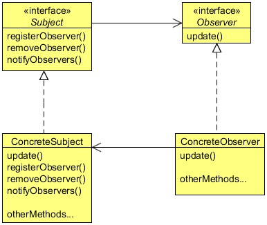
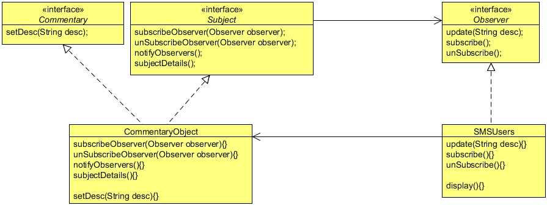

# Observer Design Pattern
## 1   Observer Pattern
Sports Lobby is a fantastic sports site for sport lovers. They cover almost all kinds of sports and provide the latest news,
information, matches scheduled dates, information about a particular player or a team. Now, they are planning to provide live
commentary or scores of matches as an SMS service, but only for their premium users. Their aim is to SMS the live score, match
situation, and important events after short intervals. As a user, you need to subscribe to the package and when there is a live
match you will get an SMS to the live commentary. The site also provides an option to unsubscribe from the package whenever
you want to.

As a developer, the Sport Lobby asked you to provide this new feature for them. The reporters of the Sport Lobby will sit in
the commentary box in the match, and they will update live commentary to a commentary object. As a developer your job is to
provide the commentary to the registered users by fetching it from the commentary object when it’s available. When there is an
update, the system should update the subscribed users by sending them the SMS.

This situation clearly shows one-to-many mapping between the match and the users, as there could be many users to subscribe to
a single match. The Observer Design Pattern is best suited to this situation, let’s see about this pattern and then create the feature
for Sport Lobby.

## 2   What is the Observer Pattern
The Observer Pattern is a kind of behavior pattern which is concerned with the assignment of responsibilities between objects.
The behavior patterns characterize complex control flows that are difficult to follow at run-time. They shift your focus away from
the flow of control to let you concentrate just on the way objects are interconnected.

The Observer Pattern defines a one-to-many dependency between objects so that when one object changes state, all its dependents
are notified and updated automatically. The Observer pattern describes these dependencies. The key objects in this pattern are
subject and observer. A subject may have any number of dependent observers. All observers are notified whenever the subject
undergoes a change in its state. In response, each observer will query the subject to synchronize its state with the subject state.

The other way to understand the Observer Pattern is the way Publisher-Subscriber relationship works. Let’s assume for example
that you subscribe to a magazine for your favorite sports or fashion magazine. Whenever a new issue is published, it gets delivered
to you. If you unsubscribe from it when you don’t want the magazine anymore, it will not get delivered to you. But the publisher
continues to work as before, since there are other people who are also subscribed to that particular magazine.

<div align="center"></div>

There are four participants in the Observer pattern:

* Subject, which is used to register observers. Objects use this interface to register as observers and also to remove themselves
from being observers.
* Observer, defines an updating interface for objects that should be notified of changes in a subject. All observers need to
implement the Observer interface. This interface has a method update(), which gets called when the Subject’s state changes.
* ConcreteSubject, stores the state of interest to ConcreteObserver objects. It sends a notification to its observers when its state
changes. A concrete subject always implements the Subject interface. The notifyObservers() method is used to update
all the current observers whenever the state changes.
* ConcreateObserver, maintains a reference to a ConcreteSubject object and implements the Observer interface. Each observer
registers with a concrete subject to receive updates.

## 3   Implementing Observer Pattern
Let’s see how to use the Observer Pattern in developing the feature for the Sport Lobby. Someone will update the concrete
subject’s object and your job is to update the state of the object registered with the concrete subject object. So, whenever there is
a change in the state of the concrete subject’s object all its dependent objects should get notified and then updated.

<div align="center"></div>

Based on this, let’s first create a Subject interface. In the Subject interface there are three key methods and optionally, if
required, you can add some more methods according to your need.

```java
package com.zanxus.javacodegeeks.patterns.observerpattern;
/**
 * @author root
 * @create 2016-12-03 10:44 PM
 */
public interface Subject {

    public void subscribeObserver(Observer observer);

    public void unsubscribeObserver(Observer observer);

    public void notifyObservers();

    public String subjectDetails();

}
```

The three key methods in the Subject interface are:

* subscribeObserver, which is used to subscribe observers or we can say register the observers so that if there is a change
in the state of the subject, all these observers should get notified.
* unSubscribeObserver, which is used to unsubscribe observers so that if there is a change in the state of the subject, this
unsubscribed observer should not get notified.
* notifyObservers, this method notifies the registered observers when there is a change in the state of the subject.

And optionally there is one more method subjectDetails(), it is a trivial method and is according to your need. Here, its
job is to return the details of the subject.

Now, let’s see the Observer interface.

```java
package com.zanxus.javacodegeeks.patterns.observerpattern;

/**
 * @author root
 * @create 2016-12-03 10:48 PM
 */
public interface Observer {

    public void update();

    public void subscribe();

    public void unSubscribe();

}
```

* update(String desc), method is called by the subject on the observer in order to notify it, when there is a change in the
   state of the subject.Java Design Patterns
* subscribe(), method is used to subscribe itself with the subject.
* unsubscribe(), method is used to unsubscribe itself with the subject.

```java
package com.zanxus.javacodegeeks.patterns.observerpattern;

/**
 * @author root
 * @create 2016-12-03 10:55 PM
 */
public interface Commentary {
    public void setDesc(String desc);
}
```

The above interface is used by the reporters to update the live commentary on the commentary object. It’s an optional interface
just to follow the **code to interface principle**, not related to the Observer pattern. You should apply oops principles along with
the design patterns wherever applicable. The interface contains only one method which is used to change the state of the concrete
subject object.

```java
package com.zanxus.javacodegeeks.patterns.observerpattern;

import java.util.List;

/**
 * @author root
 * @create 2016-12-03 10:56 PM
 */
public class CommentaryObject implements Subject,Commentary {
    private final List<Observer> observers;
    private String desc;
    private final String subjectDetails;

    public CommentaryObject(List<Observer> observers, String subjectDetails) {
        this.observers = observers;
        this.subjectDetails = subjectDetails;
    }

    @Override
    public void subscribeObserver(Observer observer) {
        observers.add(observer);
    }

    @Override
    public void setDesc(String desc) {
        this.desc = desc;
        notifyObservers();
    }

    @Override
    public void unsubscribeObserver(Observer observer) {
        int index = observers.indexOf(observer);
        observers.remove(index);
    }

    @Override
    public void notifyObservers() {
        System.out.println();
        observers.stream().forEach(observer -> observer.update(desc));

    }

    @Override
    public String subjectDetails() {
        return subjectDetails;
    }
}
```

The above class works as a concrete subject which implements the Subject interface and provides implementation of it. It also
stores the reference to the observers registered to it.

```java
package com.zanxus.javacodegeeks.patterns.observerpattern;

/**
 * @author root
 * @create 2016-12-03 11:04 PM
 */
public class SMSUsers implements Observer {

    private final Subject subject;
    private String desc;
    private String userInfo;

    public SMSUsers(Subject subject, String userInfo) {
        if (subject==null){
            throw new IllegalArgumentException("No Publisher found");
        }
        this.subject = subject;
        this.userInfo = userInfo;
    }

    private void display(){
        System.out.println("["+userInfo+"]: "+desc);
    }

    @Override
    public void update(String desc) {
        this.desc = desc;
        display();
    }

    @Override
    public void subscribe() {
        System.out.println("Subscribing "+userInfo+" to "+subject.subjectDetails()+" ...");
        this.subject.subscribeObserver(this);
        System.out.println("Subscribed successfully");
    }

    @Override
    public void unSubscribe() {
        System.out.println("Unsubscribing "+userInfo+" to "+subject.subjectDetails()+" ...");
        this.subject.unsubscribeObserver(this);
        System.out.println("Unsubscribed successfully");
    }
}
```

The above class is the concrete observer class which implements the Observer interface. It also stores the reference to the
subject it subscribed and optionally a userInfo variable which is used to display the user information.

Now, let’s test the example.

```java
package com.zanxus.javacodegeeks.patterns.observerpattern;

import java.util.ArrayList;

/**
 * @author root
 * @create 2016-12-03 11:15 PM
 */
public class TestObserver {

    public static void main(String[] args) {
        Subject subject = new CommentaryObject(new ArrayList<Observer>(), "Soccer  Match [2014AUG24]");
        Observer observer = new SMSUsers(subject, "Adam Warner [New York]");
        observer.subscribe();

        System.out.println();

        Observer observer2 = new SMSUsers(subject, "Tim Ronney [London]");
        observer2.subscribe();
        Commentary cObject = ((Commentary)subject);
        cObject.setDesc("Welcome to live Soccer match");
        cObject.setDesc("Current score 0-0");

        System.out.println();

        observer2.unSubscribe();

        System.out.println();

        cObject.setDesc("It’s a goal!!");
        cObject.setDesc("Current score 1-0");

        System.out.println();

        Observer observer3 = new SMSUsers(subject, "Marrie [Paris]");
        observer3.subscribe();

        System.out.println();
        
        cObject.setDesc("It’s another goal!!");
        cObject.setDesc("Half-time score 2-0");
    }
}
```

The above example will produce the following output:

```sh
Subscribing Adam Warner [New York] to Soccer  Match [2014AUG24] ...
Subscribed successfully

Subscribing Tim Ronney [London] to Soccer  Match [2014AUG24] ...
Subscribed successfully

[Adam Warner [New York]]: Welcome to live Soccer match
[Tim Ronney [London]]: Welcome to live Soccer match

[Adam Warner [New York]]: Current score 0-0
[Tim Ronney [London]]: Current score 0-0

Unsubscribing Tim Ronney [London] to Soccer  Match [2014AUG24] ...
Unsubscribed successfully


[Adam Warner [New York]]: It’s a goal!!

[Adam Warner [New York]]: Current score 1-0

Subscribing Marrie [Paris] to Soccer  Match [2014AUG24] ...
Subscribed successfully


[Adam Warner [New York]]: It’s another goal!!
[Marrie [Paris]]: It’s another goal!!

[Adam Warner [New York]]: Half-time score 2-0
[Marrie [Paris]]: Half-time score 2-0
```

As you can see, at first two users subscribed themselves for the soccer match and started receiving the commentary. But later
one user unsubscribed it, so the user did not receive the commentary again. Then, another user subscribed and starts getting the
commentary.

All this happens dynamically without changing the existing code and not only this, suppose if, the company wants to broadcast
the commentary on emails or any other firm wants to do collaboration with this company to broadcast the commentary. All
you need to do is to create two new classes like UserEmail and ColCompany and make them observer of the subject by
implementing the Observer interface. As far as the Subject knows it’s an observer, it will provide the update.

## 4   Java’s built-in Observer Pattern
Java has built-in support for the Observer Pattern. The most general is the Observer interface and the Observable class in the
java.util package. These are quite similar to our Subject and Observer interface, but give you a lot of functionality out of
the box.

Let’s try to implement the above example using the Java’s built-in Observer pattern.

```java
package com.zanxus.javacodegeeks.patterns.observerpattern;

import java.util.Observable;

/**
 * @author root
 * @create 2016-12-03 11:21 PM
 */
public class CommentaryObjectObservable extends Observable implements  {

    private String desc;
    private final String subjectDetails;

    public CommentaryObjectObservable(String subjectDetails) {
        this.subjectDetails = subjectDetails;
    }

    public void setDesc(String desc) {
        this.desc = desc;
        setChanged();
        notifyObservers(desc);
    }

    public String subjectDetails(){
        return subjectDetails;
    }
}
```

This time we extends the Observable class to make our class as a subject and please note that the above class does not hold
any reference to the observers, it is handled by the parent class, that’s is, the Observable class. However, we declared the
setDesc method to change the state of the object, as done in the previous example. The setChanged method is the method
from the upper class which is used to set the changed flag to true. The notifyObservers method notifies all of its observers
and then calls the clearChanged method to indicate that this object has no longer changed. Each observer has its update
method called with two arguments: an observable object and the arg argument.

```java
package com.zanxus.javacodegeeks.patterns.observerpattern;

import java.util.*;

/**
 * @author root
 * @create 2016-12-04 12:43 AM
 */
public class SMSUsersObserver implements java.util.Observer{
    private String desc;
    private final String userInfo;
    private final Observable observable;

    public SMSUsersObserver(String userInfo, Observable observable) {
        this.userInfo = userInfo;
        this.observable = observable;
    }

    public void subscribe() {
        System.out.println("Subscribing "+userInfo+" to "+((CommentaryObjectObservable)(observable)).subjectDetails()+" ...");
        this.observable.addObserver(this);
        System.out.println("Subscribed successfully.");
    }
    public void unSubscribe() {
        System.out.println("Unsubscribing "+userInfo+" to "+((CommentaryObjectObservable)(observable)).subjectDetails()+" ...");
        this.observable.deleteObserver(this);
        System.out.println("Unsubscribed successfully.");
    }
    @Override
    public void update(Observable o, Object arg) {
        desc = (String)arg;
        display();
    }
    private void display(){
        System.out.println("["+userInfo+"]: "+desc);
    }
}
```

Let’s discuss some of the key methods.

The above class implements the Observer interface which has one key method update, which is called when the subject
calls the notifyObservers method. The update method takes an Observable object and an arg as parameters.

The addObserver method is used to register a observer to the subject, and the deleteObserver method is used to remove
the observer from the subject’s list.

Let’s test this example.

```java
package com.zanxus.javacodegeeks.patterns.observerpattern;

/**
 * @author root
 * @create 2016-12-04 12:46 AM
 */
public class Test {

    public static void main(String[] args) {
        CommentaryObjectObservable obj = new CommentaryObjectObservable("Soccer Match [2014AUG24]");
        SMSUsersObserver observer = new SMSUsersObserver(obj, "Adam Warner [New York]");
        SMSUsersObserver observer2 = new SMSUsersObserver(obj,"Tim Ronney [London]");
        observer.subscribe();
        observer2.subscribe();
        obj.setDesc("Welcome to live Soccer match");
        obj.setDesc("Current score 0-0");
        observer.unSubscribe();
        obj.setDesc("It’s a goal!!");
        obj.setDesc("Current score 1-0");
    }
}
```

The above example will produce the following output:
```sh
Subscribing Adam Warner [New York] to Soccer Match [2014AUG24] ...
Subscribed successfully.
Subscribing Tim Ronney [London] to Soccer Match [2014AUG24] ...
Subscribed successfully.
[Tim Ronney [London]]: Welcome to live Soccer match
[Adam Warner [New York]]: Welcome to live Soccer match
[Tim Ronney [London]]: Current score 0-0
[Adam Warner [New York]]: Current score 0-0
Unsubscribing Adam Warner [New York] to Soccer Match [2014AUG24] ...
Unsubscribed successfully.
[Tim Ronney [London]]: It’s a goal!!
[Tim Ronney [London]]: Current score 1-0
```

The above class creates a subject and two observers. The subscribe method of the observer adds itself to the subject
observers list. Then setDesc changes the state of the subject which call the setChanged method to set the change flag to
true, and notifies the observers. As a result, observer’s update method is called which internally class the display method to
display the result. Later, one of the observers gets `unsubscribe`d, i.e. it is removed from the observer’s list. Due to which later
commentaries were not updated to it.
Java provides built-in facility for the Observer Pattern, but it comes with its own drawbacks. The Observable is a class,
you have to subclass it. That means you can’t add on the Observable behavior to an existing class that already extends another
superclass. This limits the reuse potential. You can’t even create your own implementation that plays well with Java’s built-in
Observer API. Some of the methods in the Observable API are protected. This means you can’t call the methods like setCha
nge unless you’ve subclassed Observable. And you can’t even create an instance of the Observable class and compose it
with your own objects, you have to subclass. This design violates the **“favor composition over inheritance”** design principle.

## 5   When to use the Observer Pattern
Use the Observer pattern in any of the following situations:

* When an abstraction has two aspects, one dependent on the other. Encapsulating these aspects in separate objects lets you vary
and reuse them independently.
* When a change to one object requires changing others, and you don’t know how many objects need to be changed.
* When an object should be able to notify other objects without making assumptions about who these objects are. In other words,
   you don’t want these objects tightly coupled.