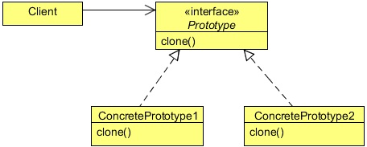

# Prototype Design Pattern
## 1   Introduction
In Object Oriented Programming, you need objects to work with; objects interact with each other to get the job done. But
sometimes, creating a heavy object could become costly, and if your application needs too many of that kind of objects (containing
almost similar properties), it might create some performance issues.

Let us consider a scenario where an application requires some access control. The features of the applications can be used by
the users according to the access rights provided to them. For example, some users have access to the reports generated by the
application, while some don’t. Some of them even can modify the reports, while some can only read it. Some users also have
administrative rights to add or even remove other users.

Every user object has an access control object, which is used to provide or restrict the controls of the application. This access
control object is a bulky, heavy object and its creation is very costly since it requires data to be fetched from some external
resources, like databases or some property files etc.

We also cannot share the same access control object with users of the same level, because the rights can be changed at runtime
by the administrator and a different user with the same level could have a different access control. One user object should have
one access control object.

We can use the Prototype Design Pattern to resolve this problem by creating the access control objects on all levels at once, and
then provide a copy of the object to the user whenever required. In this case, data fetching from the external resources happens
only once. Next time, the access control object is created by copying the existing one. The access control object is not created
from scratch every time the request is sent; this approach will certainly reduce object creation time.

Before digging into the solution, let us know more about the Prototype Design Pattern.

## 2   What is the Prototype Design Pattern
The Prototype design pattern is used to specify the kinds of objects to create using a prototypical instance, and create new objects
by copying this prototype.

The concept is to copy an existing object rather than creating a new instance from scratch, something that may include costly
operations. The existing object acts as a prototype and contains the state of the object. The newly copied object may change
same properties only if required. This approach saves costly resources and time, especially when the object creation is a heavy
process.

In Java, there are certain ways to copy an object in order to create a new one. One way to achieve this is using the Cloneable
interface. Java provides the clone method, which an object inherits from the Object class. You need to implement the
Cloneable interface and override this clone method according to your needs.

<div align="center"></div>


**Prototype**

* Declares an interface for cloning itself.

**ConcretePrototype**

* Implements an operation for cloning itself.

**Client**

* Creates a new object by asking a prototype to clone itself.

Prototypes let you incorporate a new concrete product class into a system simply by registering a prototypical instance with the
client.

## 3   Solution to the Problem
In this solution, we will use the clone method to solve the above problem.

```java
package com.zanxus.javacodegeeks.patterns.prototypepattern;

/**
 * @author root
 * @create 2016-12-19 11:15 PM
 */
public interface Prototype extends Cloneable{

    public AccessControl clone() throws CloneNotSupportedException;
    
}
```

The above interface extends the Cloneable interface and contains a method clone. This interface is implemented by classes
which want to create a prototype object.

```java
package com.zanxus.javacodegeeks.patterns.prototypepattern;

/**
 * @author root
 * @create 2016-12-19 11:16 PM
 */
public class AccessControl implements Prototype {

    private final String controlLevel;
    private String access;

    public AccessControl(String controlLevel, String access) {
        this.controlLevel = controlLevel;
        this.access = access;
    }

    @Override
    public AccessControl clone() throws CloneNotSupportedException {
        try{
            return (AccessControl) super.clone();
        }catch (CloneNotSupportedException e){
            e.printStackTrace();
        }
        return null;
    }

    public String getControlLevel() {
        return controlLevel;
    }

    public String getAccess() {
        return access;
    }

    public void setAccess(String access) {
        this.access = access;
    }
}
```

The AccessControl class implements the Prototype interface and overrides the clone method. The method calls the
clone method of the super class and returns the object after down-casting it to the AccessControl type. The clone method
throws CloneNotSupportedException which is caught within the method itself.

The class also contains two properties; the controlLevel is used to specific the level of control this object contains. The level
depends upon the type of user going to use it, for example, USER, ADMIN, MANAGER etc.

The other property is the access; it contains the access right for the user. Please note that, for simplicity, we have used access
as a String type attribute. This could be of type Map which can contain key value pairs of long access rights assigned to the
user.

```java
package com.zanxus.javacodegeeks.patterns.prototypepattern;

/**
 * @author root
 * @create 2016-12-19 11:36 PM
 */
public class User {

    private String userName;
    private String level;
    private AccessControl accessControl;

    public User(String userName, String level, AccessControl accessControl) {
        this.userName = userName;
        this.level = level;
        this.accessControl = accessControl;
    }

    public String getUserName() {
        return userName;
    }

    public void setUserName(String userName) {
        this.userName = userName;
    }

    public String getLevel() {
        return level;
    }

    public void setLevel(String level) {
        this.level = level;
    }

    public AccessControl getAccessControl() {
        return accessControl;
    }

    public void setAccessControl(AccessControl accessControl) {
        this.accessControl = accessControl;
    }

    @Override
    public String toString() {
        return "Name: " + userName + ", Level: " + level + ", Access Control Level:" +
                accessControl.getControlLevel() + ", Access: " + accessControl.getAccess();
    }
}
```

The User class has a userName, level and a reference to the AccessControl assigned to it.

We have used an AccessControlProvider class that creates and stores the possible AccessControl objects in advance.
And when the there’s a request to an AccessControl object, it returns a new object created by copying the stored prototypes.

```java
package com.zanxus.javacodegeeks.patterns.prototypepattern;

import java.util.HashMap;
import java.util.Map;

/**
 * @author root
 * @create 2016-12-19 11:38 PM
 */
public class AccessControlProvider {

    private static Map<String, AccessControl> map = new HashMap<>();

    static {
        System.out.println("Fetching data from external resources and creating access control objects...");
        map.put("USER",new AccessControl("USER","DO_WORK"));
        map.put("ADMIN", new AccessControl("ADMIN","ADD/REMOVE USERS"));
        map.put("MANAGER", new AccessControl("MANAGER","GENERATE/READ REPORTS"));
        map.put("VP", new AccessControl("VP","MODIFY REPORTS"));
    }

    public static AccessControl getAccessControlObject(String controlLevel){
        AccessControl ac = null;
        ac = map.get(controlLevel);
        if (ac != null) {
            try {
                return ac.clone();
            } catch (CloneNotSupportedException e) {
                e.printStackTrace();
            }
        }
        return null;
    }
}
```

The getAccessControlObject method fetches a stored prototype object according to the controlLevel passed to it,
from the map and returns a newly created cloned object to the client code.

Now, let’s test the code.

```java
package com.zanxus.javacodegeeks.patterns.prototypepattern;


/**
 * @author root
 * @create 2016-12-19 11:44 PM
 */
public class TestPrototypePattern {

    public static void main(String[] args) {
        AccessControl userAccessControl = AccessControlProvider.getAccessControlObject("USER");
        User user = new User("USER A", "USER Level", userAccessControl);

        System.out.println("************************************");
        System.out.println(user);
        userAccessControl = AccessControlProvider.getAccessControlObject("USER");
        user = new User("User B", "USER Level", userAccessControl);
        System.out.println("Changing access control of: "+user.getUserName());
        user.getAccessControl().setAccess("READ REPORTS");
        System.out.println(user);
        System.out.println("************************************");
        AccessControl managerAccessControl = AccessControlProvider.getAccessControlObject("MANAGER");
        user = new User("User C", "MANAGER Level", managerAccessControl);
        System.out.println(user);

    }
}
```

The above code will produce the following output:

```sh
Fetching data from external resources and creating access control objects...
************************************
Name: USER A, Level: USER Level, Access Control Level:USER, Access: DO_WORK
Changing access control of: User B
Name: User B, Level: USER Level, Access Control Level:USER, Access: READ REPORTS
************************************
Name: User C, Level: MANAGER Level, Access Control Level:MANAGER, Access: GENERATE/READ REPORTS
```

In the above code, we have created an AccessControl object at USER level and assigned it to User A. Then, again another
AccessControl object to User B, but this time we have changed the access right of User B. And in the end, MANAGER level
access control to User C.

The getAccessControlObject is used to get the new copy of the AccessControl object, and this can be clearly seen
when we change the access right for User B, the access right for User A is not changed (just print the User A object again). This
confirms that the clone method is working fine, as it returns the new copy of the object not a reference which points to the same
object.

## 4   When to use the Prototype Design Pattern
Use the Prototype pattern when a system should be independent of how its products are created, composed, and represented; and

* When the classes to instantiate are specified at run-time, for example, by dynamic loading; or
* To avoid building a class hierarchy of factories that parallels the class hierarchy of products; or
* When instances of a class can have one of only a few different combinations of state. It may be more convenient to install a
   corresponding number of prototypes and clone them rather than instantiating the class manually, each time with the appropriate
   state.

## 5   Prototype Pattern in JDK

* java.lang.Object#clone()
* java.lang.Cloneable
