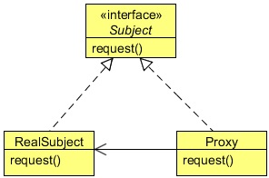

# Proxy Design Pattern
## 1   Introduction
In this lesson we will discuss about a Structural Pattern, the Proxy Pattern. The Proxy Pattern provides a surrogate or placeholder
for another object to control access to it.

The Proxy Pattern comes up with many different variations. Some of the important variations are, Remote Proxy, Virtual Proxy,
and Protection Proxy. In this lesson, we will know more about these variations and we will implement each of them in Java. But
before we do that, let’s get to know more about the Proxy Pattern in general.

## 2   What is the Proxy Pattern
The Proxy Pattern is used to create a representative object that controls access to another object, which may be remote, expensive
to create or in need of being secured.

One reason for controlling access to an object is to defer the full cost of its creation and initialization until we actually need to
use it. Another reason could be to act as a local representative for an object that lives in a different JVM. The Proxy can be very
useful in controlling the access to the original object, especially when objects should have different access rights.

In the Proxy Pattern, a client does not directly talk to the original object, it delegates it calls to the proxy object which calls the
methods of the original object. The important point is that the client does not know about the proxy, the proxy acts as an original
object for the client. But there are many variations to this approach which we will see soon.

Let us see the structure of the Proxy Pattern and its important participants.

<div align="center"></div>

* **Proxy**: 1a. Maintains a reference that lets the proxy access the real subject. Proxy may refer to a Subject if the RealSubject
   and Subject interfaces are the same. 1b. Provides an interface identical to Subject’s so that a proxy can be substituted for the
   real subject. 1c. Controls access to the real subject and may be responsible for creating and deleting it.
* **Subject**: 2a. Defines the common interface for RealSubject and Proxy so that a Proxy can be used anywhere a RealSubject is
   expected.
* **RealSubject**: 3a. Defines the real object that the proxy represents.

There are three main variations to the Proxy Pattern:

* A remote proxy provides a local representative for an object in a different address space.
* A virtual proxy creates expensive objects on demand.
* A protection proxy controls access to the original object. Protection proxies are useful when objects should have different
access rights.

We will discuss these proxies one by one in next sections.

## 3   Remote Proxy
There is a Pizza Company, which has its outlets at various locations. The owner of the company gets a daily report by the staff
members of the company from various outlets. The current application supported by the Pizza Company is a desktop application,
not a web application. So, the owner has to ask his employees to generate the report and send it to him. But now the owner wants
to generate and check the report by his own, so that he can generate it whenever he wants without anyone’s help. The owner
wants you to develop an application for him.

The problem here is that all applications are running at their respective JVMs and the Report Checker application (which we will
design soon) should run in the owner’s local system. The object required to generate the report does not exist in the owner’s
system JVM and you cannot directly call on the remote object.

Remote Proxy is used to solve this problem. We know that the report is generated by the users, so there is an object which is
required to generate the report. All we need is to contact that object which resides in a remote location in order to get the result
that we want. The Remote Proxy acts as a local representative of a remote object. A remote object is an object that lives in the
heap of different JVM. You call methods to the local object which forward that calls on to the remote object.

Your client object acts like its making remote method calls. But it is calling methods on a heap-local proxy object that handles
all the low-level details of network communication.

Java supports the communication between the two objects residing at two different locations (or two different JVMs) using RMI.
RMI is Remote Method Invocation which is used to build the client and service helper objects, right down to creating a client
helper object with the same methods as the remote service. Using RMI you don’t have to write any of the networking or I/O code
yourself. With your client, you call remote methods just like normal method calls on objects running in the client’s local JVM.

RMI also provides the running infrastructure to make it all work, including a lookup service that the client can use to find and
access the remote objects. There is one difference between RMI calls and local method calls. The client helper send the method
call across the network, so there is networking and I/O which involved in the RMI calls.

Now let’s take a look at the code. We have an interface ReportGenerator and its concrete implementation ReportGener
atorImpl already running at JVMs of different locations. First to create a remote service we need to change the codes.

The ReportGenerator interface will now looks like this:

```java
package com.zanxus.javacodegeeks.patterns.proxypattern;

import java.rmi.Remote;
import java.rmi.RemoteException;

/**
 * @author root
 * @create 2016-12-06 9:28 PM
 */
public interface ReportGenerator extends Remote {

    public String generateDailyReport() throws RemoteException;

}
```

This is a remote interface which defines the methods that a client can call remotely. It’s what the client will use as the class type
for your service. Both the Stub and actual service will implement this. The method in the interface returns a String object.
You can return any object from the method; this object is going to be shipped over the wire from the server back to the client, so
it must be Serializable. Please note that all the methods in this interface should throw RemoteException.

```java
package com.zanxus.javacodegeeks.patterns.proxypattern;

import java.io.Serializable;
import java.rmi.Naming;
import java.rmi.RemoteException;
import java.rmi.server.UnicastRemoteObject;
import java.util.Date;

/**
 * @author root
 * @create 2016-12-06 9:34 PM
 */
public class ReportGeneratorImpl extends UnicastRemoteObject implements ReportGenerator {

    protected ReportGeneratorImpl() throws RemoteException {
    }

    @Override
    public String generateDailyReport() throws RemoteException {
        StringBuilder sb = new StringBuilder();
        sb.append("********************Location X Daily Report********************");
        sb.append("\\n Location ID: 012");
        sb.append("\\n Today’s Date: "+new Date());
        sb.append("\\n Total Pizza’s Sell: 112");
        sb.append("\\n Total Price: $2534");
        sb.append("\\n Net Profit: $1985");
        sb.append("\\n***************************************************************");
        return sb.toString();
    }

    public static void main(String[] args) {
        try {
            ReportGenerator reportGenerator = new ReportGeneratorImpl();
            Naming.rebind("PizzaCoRemoteGenerator",reportGenerator);
        } catch (Exception e) {
            e.printStackTrace();
        }
    }

}
```

The above class is the remote implementation which does the real work. It’s the object that the client wants to call methods on.
The class extends UnicastRemoteObject, in order to work as a remote service object, your object needs some functionality
related to being remote. The simplest way is to extend UnicastRemoteObject from the java.rmi.server package and
let that class do the work for you.

The UnicastRemoteObject class constructor throws a RemoteException, so you need to write a no-arg constructor that
declares a RemoteException.

To make the remote service available to the clients you need to register the service with the RMI registry. You do this by
instantiating it and putting it into the RMI registry. When you register the implementation object, the RMI system actually puts
the stub in the registry, since that’s what a client needs. The Naming.rebind method is used to register the object. It has two
parameters, first a string to name the service and the other parameter takes object which will be fetched by the clients to use the
service.

Now, to create the stub you need to run rmic on the remote implementation class. The rmic tool comes with the Java software
development kid, takes a service implementation and creates a new stub. You should open your command prompt (cmd) and run
rmic from the directory where your remote implementation is located.

The next step is to run the rmiregistry, bring up a terminal and start the registry, just type the command rmiregistry. But be sure
you start it from a directory that has access to your classes.

The final step is to start the service that is, run your concrete implementation of remote class, in this case the class is ReportG
eneratorImpl.

So far, we have created and run a service. Now, let’s see how the client will use it. The report application for the owner of the pizza
company will use this service in order to generate and check the report. We need to provide the interface ReportGenerator
and the stub to the clients which will use the service. You can simply hand-deliver the stub and any other classes or interfaces
required in the service.

```java
package com.zanxus.javacodegeeks.patterns.proxypattern.remoteproxy;

import java.rmi.Naming;

/**
 * @author root
 * @create 2016-12-07 9:50 PM
 */
public class ReportGeneratorClient {

    public static void main(String[] args) {
        new ReportGeneratorClient().generateReport();
    }

    public void generateReport(){
        try {
            ReportGenerator reportGenerator = (ReportGenerator) Naming.lookup("rmi://127.0.0.1/PizzaCoRemoteGenerator");
            System.out.println(reportGenerator.generateDailyReport());
        } catch (Exception e) {
            e.printStackTrace();
        }
    }
}
```

The above program will have as a result the following output:
```sh
********************Location X Daily Report********************
Location ID: 012
Today’s Date: Sun Sep 14 00:11:23 IST 2014
Total Pizza Sell: 112
Total Sale: $2534
Net Profit: $1985
***************************************************************
```

The above class does a naming lookup and retrieves the object which is used to generate the daily report. You need to provide
the IP of the hostname and the name used to bind the service. The rest of it just looks like a regular old method call.

In conclusion, the Remote Proxy acts as a local representative for an object that lives in a different JVM. A method call on the
proxy results in the call being transferred over the wire, invoked remotely, and the result being returned back to the proxy and
then to the client.

## 4   Virtual Proxy
The Virtual Proxy pattern is a memory saving technique that recommends postponing an object creation until it is needed; it
is used when creating an object the is expensive in terms of memory usage or processing involved. In a typical application,
different objects make up different parts of the functionality. When an application is started, it may not need all of its objects
to be available immediately. In such cases, the Virtual Proxy pattern suggests deferring objects creation until it is needed by the
application. The object that is created the first time is referenced in the application and the same instance is reused from that
point onwards. The advantage of this approach is a faster application start-up time, as it is not required to created and load all of
the application objects.

Suppose there is a Company object in your application and this object contains a list of employees of the company in a Conta
ctList object. There could be thousands of employees in a company. Loading the Company object from the database along
with the list of all its employees in the ContactList object could be very time consuming. In some cases you don’t even
require the list of the employees, but you are forced to wait until the company and its list of employees loaded into the memory.

One way to save time and memory is to avoid loading of the employee objects until required, and this is done using the Virtual
Proxy. This technique is also known as Lazy Loading where you are fetching the data only when it is required.

```java
package com.zanxus.javacodegeeks.patterns.proxypattern.virtualproxy;

/**
 * @author root
 * @create 2016-12-07 10:42 PM
 */
public class Company {

    private String companyName;
    private String companyAddress;
    private String companyContactNo;
    private ContactList contactList;

    public Company(String companyName, String companyAddress, String companyContactNo, ContactList contactList) {
        this.companyName = companyName;
        this.companyAddress = companyAddress;
        this.companyContactNo = companyContactNo;
        this.contactList = contactList;
        System.out.println("Company object created...");
    }

    public String getCompanyName() {
        return companyName;
    }

    public String getCompanyAddress() {
        return companyAddress;
    }

    public String getCompanyContactNo() {
        return companyContactNo;
    }

    public ContactList getContactList() {
        return contactList;
    }
}
```

The above Company class has a reference to ContactList interface whose real object will be load only when requested to
call of getContactList() method.

```java
package com.zanxus.javacodegeeks.patterns.proxypattern.virtualproxy;

/**
 * @author root
 * @create 2016-12-07 10:45 PM
 */
public interface ContactList {

    public List<Employee> getEmployeeList() ;
    
}
```

The ContactList interface only contains one method getEmployeeList() which is used to get the employee list of the
company.

```java
package com.zanxus.javacodegeeks.patterns.proxypattern.virtualproxy;

import java.util.ArrayList;
import java.util.List;

/**
 * @author root
 * @create 2016-12-07 10:46 PM
 */
public class ContactListImpl implements ContactList {

    @Override
    public List<Employee> getEmployeeList() {
        return null;
    }

    private static List<Employee> getEmpList(){
        List<Employee> empList = new ArrayList<Employee>(5);
        empList.add(new Employee("Employee A",2565.55,"SE"));
        empList.add(new Employee("Employee B",22574,"Manager"));
        empList.add(new Employee("Employee C",3256.77,"SSE"));
        empList.add(new Employee("Employee D", 4875.54, "SSE"));
        empList.add(new Employee("Employee E", 2847.01, "SE"));
        return empList;
    }
}
```

The above class will create a real ContactList object which will return the list of employees of the company. The object will
be loaded on demand, only when required.

```java
package com.zanxus.javacodegeeks.patterns.proxypattern.virtualproxy;

import java.util.List;

/**
 * @author root
 * @create 2016-12-07 10:56 PM
 */
public class ContactListProxyImpl implements ContactList {


    private ContactList contactList;

    @Override
    public List<Employee> getEmployeeList() {
        if (contactList==null){
            System.out.println("Creating contact list and fetching list of employees...");
            contactList = new ContactListImpl();
        }
        return contactList.getEmployeeList();
    }
}
```

The ContactListProxyImpl is the proxy class which also implements ContactList and holds a reference to the real
ContactList object. On the implementation of the method getEmployeeList() it will check if the contactList
reference is null, then it will create a real ContactList object and then will invoke the getEmployeeList() method on
it to get the list of the employees.

The Employee class looks like this.

```java
package com.zanxus.javacodegeeks.patterns.proxypattern.virtualproxy;

/**
 * @author root
 * @create 2016-12-07 10:48 PM
 */
public class Employee {

    private String employeeName;
    private double employeeSalary;
    private String employeeDesignation;

    public Employee(String employeeName, double employeeSalary, String employeeDesignation) {
        this.employeeName = employeeName;
        this.employeeSalary = employeeSalary;
        this.employeeDesignation = employeeDesignation;
    }

    public String getEmployeeName() {
        return employeeName;
    }

    public double getEmployeeSalary() {
        return employeeSalary;
    }

    public String getEmployeeDesignation() {
        return employeeDesignation;
    }

    @Override
    public String toString() {
        return "Employee{" +
                "employeeName='" + employeeName + '\'' +
                ", employeeSalary=" + employeeSalary +
                ", employeeDesignation='" + employeeDesignation + '\'' +
                '}';
    }
}

package com.zanxus.javacodegeeks.patterns.proxypattern.virtualproxy;

import java.util.List;

/**
 * @author root
 * @create 2016-12-07 10:59 PM
 */
public class TestVirtualProxy {

    public static void main(String[] args) {
        ContactList contactList = new ContactListProxyImpl();
        Company company = new Company("ABC Company","China","+86-010-12345678",contactList);
        System.out.println("Company Name:"+company.getCompanyName());
        System.out.println("Company Address:"+company.getCompanyAddress());
        System.out.println("Company Contact No:"+company.getCompanyContactNo());
        System.out.println("Requesting for contact list");

        contactList = company.getContactList();

        List<Employee> employeeList = contactList.getEmployeeList();
        employeeList.forEach(employee -> System.out.println(employee));
    }
}
```

The above program will have as a result the following output:

```sh
Company object created...
Company Name:ABC Company
Company Address:China
Company Contact No:+86-010-12345678
Requesting for contact list
Creating contact list and fetching list of employees...
Employee{employeeName='Employee A', employeeSalary=2565.55, employeeDesignation='SE'}
Employee{employeeName='Employee B', employeeSalary=22574.0, employeeDesignation='Manager'}
Employee{employeeName='Employee C', employeeSalary=3256.77, employeeDesignation='SSE'}
Employee{employeeName='Employee D', employeeSalary=4875.54, employeeDesignation='SSE'}
Employee{employeeName='Employee E', employeeSalary=2847.01, employeeDesignation='SE'}
```

As you can see in the output generated by the TestVirtualProxy, first we have created a Company object with a proxy Con
tactList object. At this time, the Company object holds a proxy reference, not the real ContactList object’s reference,
so there no employee list loaded into the memory. We made some calls on the company object, and then asked for the employee
list from the contact list proxy object using the getEmployeeList() method. On call of this method, the proxy object creates
a real ContactList object and provides the list of employees.

## 5   Protection Proxy
In general, objects in an application interact with each other to implement the overall application functionality. Most application
object are generally accessible to all other objects in the application. At times, it may be necessary to restrict the accessibility of
an object only to a limited set of client objects based on their access rights. When a client object tries to access such an object,
the client is given access to the services provided by the object only if the client can furnish proper authentication credentials. In
such cases, a separate object can be designated with the responsibility of verifying the access privileges of different client objects
when they access the actual object. In other words, every client must successfully authenticate with this designated object to get
access to the actual object functionality. Such an object with which a client needs to authenticate to get access to the actual object
can be referred as an object authenticator which is implemented using the Protection Proxy.

Returning back to the ReportGenerator application that we developed for the pizza company, the owner now requires that
only he can generate the daily report. No other employee should be able to do so.

To implement this security feature, we used Protection Proxy which checks if the object which is trying to generate the report is
the owner; in this case, the report gets generated, otherwise it is not.

```java
package com.zanxus.javacodegeeks.patterns.proxypattern.protectionproxy;

/**
 * @author root
 * @create 2016-12-07 11:12 PM
 */
public interface Staff {
    public boolean isOwner();

    public void setReportGenerator(ReportGeneratorProxy reportGenerator);
}
```

The Staff interface is used by the Owner and the Employee classes and the interface has two methods: isOwner() returns
a boolean to check whether the calling object is the owner or not. The other method is used to set the ReportGeneratorP
roxy which is a protection proxy used to generate the report is isOwner() method return true.

```java
package com.zanxus.javacodegeeks.patterns.proxypattern.protectionproxy;

/**
 * @author root
 * @create 2016-12-07 11:13 PM
 */
public class Employee implements Staff {

    private ReportGeneratorProxy reportGenerator;

    @Override
    public void setReportGenerator(ReportGeneratorProxy reportGenerator) {
        this.reportGenerator = reportGenerator;
    }

    @Override
    public boolean isOwner() {
        return false;
    }

    public String generateDailyReport(){
        try {
            return reportGenerator.generateDailyReport();
        }catch (Exception e){
            e.printStackTrace();
        }
        return "";
    }
}
```

The Employee class implements the Staff interface, since it’s an employee isOwner() method return false. The gene
rateDailyReport() method ask ReportGenerator to generate the daily report.

```java
package com.zanxus.javacodegeeks.patterns.proxypattern.protectionproxy;

/**
 * @author root
 * @create 2016-12-07 11:15 PM
 */
public class Owner implements Staff{

    private boolean isOwner = true;
    private ReportGeneratorProxy reportGenerator;


    @Override
    public boolean isOwner() {
        return isOwner;
    }

    @Override
    public void setReportGenerator(ReportGeneratorProxy reportGenerator) {
        this.reportGenerator = reportGenerator;
    }


    public String generateDailyReport(){
        try {
            return reportGenerator.generateDailyReport();
        }catch (Exception e){
            e.printStackTrace();
        }
        return "";
    }
}
```

The Owner class looks almost same as the Employee class, the only difference is that the isOwner() method returns true.

```java
package com.zanxus.javacodegeeks.patterns.proxypattern.protectionproxy;

/**
 * @author root
 * @create 2016-12-07 11:16 PM
 */
public interface ReportGeneratorProxy {

    public String generateDailyReport();
}
```

The ReportGeneratorProxy acts as a Protection Proxy which has only one method generateDailyReport() that is
used to generate the report.

```java
package com.zanxus.javacodegeeks.patterns.proxypattern.protectionproxy;

import com.zanxus.javacodegeeks.patterns.proxypattern.remoteproxy.ReportGenerator;

import java.rmi.Naming;

/**
 * @author root
 * @create 2016-12-07 11:19 PM
 */
public class ReportGeneratorProtectionProxy implements ReportGeneratorProxy{
    ReportGenerator reportGenerator;
    Staff staff;

    public ReportGeneratorProtectionProxy(Staff staff) {
        this.staff = staff;
    }

    @Override
    public String generateDailyReport() {
        if (staff.isOwner()){
            try {
                ReportGenerator  reportGenerator= (ReportGenerator) Naming.lookup("rmi://127.0.0.1/PizzaCoRemoteGenerator");
                return reportGenerator.generateDailyReport();
            } catch (Exception e) {
                e.printStackTrace();
            }
            return "";
        }
        else {
            return "Not Authorized to view report.";
        }
    }
}
```

The above class is the concrete implementation of the ReportGeneratorProxy which holds a reference to the ReportGe
nerator interface which is the remote proxy. In the generateDailyReport() method, it checks if the staff is referring
to the owner, then asks the remote proxy to generate the report, otherwise it returns a string with “Not Authorized to view report”
as a message.

```java
package com.zanxus.javacodegeeks.patterns.proxypattern.protectionproxy;

/**
 * @author root
 * @create 2016-12-07 11:24 PM
 */
public class TestProtectionProxy {

    public static void main(String[] args) {
        Owner owner = new Owner();
        ReportGeneratorProxy reportGenerator = new ReportGeneratorProtectionProxy(owner);
        owner.setReportGenerator(reportGenerator);

        Employee employee = new Employee();
        reportGenerator = new ReportGeneratorProtectionProxy(employee);
        employee.setReportGenerator(reportGenerator);
        System.out.println("For owner:");
        System.out.println(owner.generateDailyReport());
        System.out.println("For employee");
        System.out.println(employee.generateDailyReport());
    }
}
```

The above program will have as a result the following output:

```sh
For owner:
********************Location X Daily Report********************
Location ID: 012
Today’s Date: Sun Sep 14 13:28:12 IST 2014
Total Pizza Sell: 112
Total Sale: $2534Java Design Patterns
65 / 173
Net Profit: $1985
***************************************************************
For employee:
Not Authorized to view report.
```

The above output clearly shows that the owner can generate the report, whereas, the employee does not. The Protection Proxy
protects the access of generating the report and only allows the authorized objects to generate the report.

## 6   When to use the Proxy Pattern
Proxy is applicable whenever there is a need for a more versatile or sophisticated reference to an object than a simple pointer.
Here are several common situations in which the Proxy pattern is applicable:

* A remote proxy provides a local representative for an object in a different address space.
* A virtual proxy creates expensive objects on demand.
* A protection proxy controls access to the original object. Protection proxies are useful when objects should have different
access rights.

## 7   Other Proxies
Besides the above discussed three main proxies, there are some other kinds of proxies.

* **Cache Proxy/Server Proxy**: To provide the functionality required to store the results of most frequently used target operations.
   The proxy object stores these results in some kind of a repository. When a client object requests the same operation, the proxy
   returns the operation results from the storage area without actually accessing the target object.
* **Firewall Proxy**: The primary use of a firewall proxy is to protect target objects from bad clients. A firewall proxy can also be
   used to provide the functionality required to prevent clients from accessing harmful targets.
* **Synchronization Proxy**: To provide the required functionality to allow safe concurrent accesses to a target object by different
   client objects.
* **Smart Reference Proxy**: To provide the functionality to prevent the accidental disposal/deletion of the target object when
   there are clients currently with references to it. To accomplish this, the proxy keeps a count of the number of references to the
   target object. The proxy deletes the target object if and when there are no references to it.
* **Counting Proxy**: To provide some kind of audit mechanism before executing a method on the target object.

## 8   Proxy Pattern in JDK
The following cases are examples of usage of the Proxy Pattern in the JDK.

* java.lang.reflect.Proxy
* java.rmi.* (whole package)
