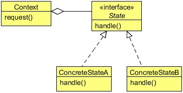

# State Design Pattern
## 1   Introduction
To illustrate the use of the State Design Pattern, let us help a company which is looking to build a robot for cooking. The company
wants a simple robot that can simply walk and cook. A user can operate a robot using a set of commands via remote control.
Currently, a robot can do three things, it can walk, cook, or can be switched off.

The company has set protocols to define the functionality of the robot. If a robot is in "on" state you can command it to walk. If
asked to cook, the state would change to "cook" or if set to "off", it will be switched off.

Similarly, when in "cook" state it can walk or cook, but cannot be switched off. And finally, when in "off" state it will automati-
cally get on and walk when the user commands it to walk but cannot cook in off state.

This might look like an easy implementation: a robot class with a set of methods like walk, cook, off, and states like on, cook,
and off. We can use if-else branches or switch to implement the protocols set by the company. But too much if-else or switch
statements will create a maintenance nightmare as complexity might increase in the future.

You might think that we can implement this without issues using if-else statements, but as a change comes the code would
become more complex. The requirement clearly shows that the behavior of an object is truly based on the state of that object. We
can use the State Design Pattern which encapsulates the states of the object into another individual class and keeps the context
class independent of any state change.

Let’s first know about the State Design Pattern and then we will implement it to solve the problem above.

## 2   What is the State Design Pattern
The State Design Pattern allows an object to alter its behavior when its internal state changes. The object will appear to change
its class.

The state of an object can be defined as its exact condition at any given point of time, depending on the values of its properties
or attributes. The set of methods implemented by a class constitutes the behavior of its instances. Whenever there is a change in
the values of its attributes, we say that the state of an object has changed.

The State pattern is useful in designing an efficient structure for a class, a typical instance of which can exist in many different
states and exhibit different behavior depending on the state it is in. In other words, in the case of an object of such a class, some
or all of its behavior is completely influenced by its current state. In the State design pattern terminology, such a class is referred
to as a `Context` class. A `Context` object can alter its behavior when there is a change in its internal state and is also referred
as a Stateful object.

The State pattern suggests moving the state-specific behavior out of the `Context` class into a set of separate classes referred to
as `State` classes. Each of the many different states that a `Context` object can exist in can be mapped into a separate `State`
class. The implementation of a State class contains the context behavior that is specific to a given state, not the overall behavior
of the context itself. The context acts as a client to the set of State objects in the sense that it makes use of different State objects
to offer the necessary state-specific behavior to an application object that uses the context in a seamless manner.

By encapsulating the state-specific behavior in separate classes, the context implementation becomes simpler to read: free of too
many conditional statements such as if-else or switch-case constructs. When a `Context` object is first created, it initializes itself
with its initial State object. This State object becomes the current State object for the context. By replacing the current State
object with a new State object, the context transitions to a new state.

The client application using the context is not responsible for specifying the current State object for the context, but instead, each
of the State classes representing specific states are expected to provide the necessary implementation to transition the context
into other states. When an application object makes a call to a `Context` method (behavior),it forwards the method call to its
current State object.

<div align="center"></div>

**Context**

* Defines the interface of interest to clients.
* Maintains an instance of a ConcreteState subclass that defines the current state.

**State**

* Defines an interface for encapsulating the behavior associated with a particular state of the Context.
* ConcreteState subclasses
* Each subclass implements a behavior associated with a state of the Context.

**ConcreteState subclasses**

* Each subclass implements a behavior associated with a state of the Context.

## 3   Implementing the State Design Pattern
The following is the `RoboticState` interface which contains the behavior of a robot.

```java
package com.zanxus.javacodegeeks.patterns.statepattern;

/**
 * @author root
 * @create 2016-12-20 9:46 PM
 */
public interface RoboticState {

    public void walk();

    public void cook();

    public void off();
    
}
```

The `Robot` class is a concrete class implements the `RoboticState` interface. The class contains the set of all possible states
a robot can be in.

```java
package com.zanxus.javacodegeeks.patterns.statepattern;

/**
 * @author root
 * @create 2016-12-20 9:48 PM
 */
public class Robot implements RoboticState {

    private RoboticState roboticOn;
    private RoboticState roboticCook;
    private RoboticState roboticOff;

    private RoboticState state;

    public Robot() {
        this.roboticOn = new RoboticOn(this);
        this.roboticCook = new RoboticCook(this);
        this.roboticOff = new RoboticOff(this);
        this.state = roboticOn;
    }

    public void setRoboticState(RoboticState state) {
        this.state = state;
    }

    @Override
    public void walk() {
        state.walk();
    }

    @Override
    public void cook() {
        state.cook();
    }

    @Override
    public void off() {
        state.off();
    }

    public RoboticState getRoboticOn() {
        return roboticOn;
    }

    public void setRoboticOn(RoboticState roboticOn) {
        this.roboticOn = roboticOn;
    }

    public RoboticState getRoboticCook() {
        return roboticCook;
    }

    public void setRoboticCook(RoboticState roboticCook) {
        this.roboticCook = roboticCook;
    }

    public RoboticState getRoboticOff() {
        return roboticOff;
    }

    public void setRoboticOff(RoboticState roboticOff) {
        this.roboticOff = roboticOff;
    }

    public RoboticState getState() {
        return state;
    }

    public void setState(RoboticState state) {
        this.state = state;
    }
}
```

The class initializes all the states and sets the current state as on.

Now, we will see all the concrete states of a robot. A robot will be in any of these states at any time.

```java
package com.zanxus.javacodegeeks.patterns.statepattern;

/**
 * @author root
 * @create 2016-12-20 9:54 PM
 */
public class RoboticOn implements RoboticState {

    private final Robot robot;

    public RoboticOn(Robot robot) {
        this.robot = robot;
    }

    @Override
    public void walk() {
        System.out.println("Walking...");
    }

    @Override
    public void cook() {
        System.out.println("Cooking...");
        robot.setRoboticState(robot.getRoboticCook());
    }

    @Override
    public void off() {
        robot.setState(robot.getRoboticOff());
        System.out.println("Robot is switched off");
    }
}
```

```java
package com.zanxus.javacodegeeks.patterns.statepattern;

/**
 * @author root
 * @create 2016-12-20 10:06 PM
 */
public class RoboticCook implements RoboticState {

    private final Robot robot;

    public RoboticCook(Robot robot) {
        this.robot = robot;
    }

    @Override
    public void walk() {
        System.out.println("Walking...");
        robot.setRoboticState(robot.getRoboticOn());
    }

    @Override
    public void cook() {
        System.out.println("Cooking...");
    }

    @Override
    public void off() {
        System.out.println("Cannot switched off while cooking...");
    }
}
```

```java
package com.zanxus.javacodegeeks.patterns.statepattern;

/**
 * @author root
 * @create 2016-12-20 10:07 PM
 */
public class RoboticOff implements RoboticState {

    private final Robot robot;

    public RoboticOff(Robot robot) {
        this.robot = robot;
    }

    @Override
    public void walk() {
        System.out.println("Walking...");
        robot.setRoboticState(robot.getRoboticOn());
    }

    @Override
    public void cook() {
        System.out.println("Cannot cook at Off state.");
    }

    @Override
    public void off() {
        System.out.println("Already switched off...");
    }
}
```

Now, let’s test the code.

```java
package com.zanxus.javacodegeeks.patterns.statepattern;

/**
 * @author root
 * @create 2016-12-20 10:09 PM
 */
public class TestStatePattern {

    public static void main(String[] args) {
        Robot robot = new Robot();
        robot.walk();
        robot.cook();
        robot.walk();
        robot.off();
        robot.walk();
        robot.off();
        robot.cook();
    }
}
```

The above code will result to the following output:

```java
Walking...
Cooking...
Walking...
Robot is switched off
Walking...
Robot is switched off
Cannot cook at Off state.
```

In the above example, we have seen that by encapsulating the states of an object into different classes makes the code manageable
and flexible.

Any change in a state will only affect that particular class and we can include a new state without changing much in the existing
code. Let’s for example, we include a stand-by state. After a walk or cook the robot goes into the stand-by mode to save power
and we again walk, cook or switch off from the stand-by mode.

To implement this all we need to introduce a new state class and include that state in the `Robot` class. The following are the
changes.

```java
package com.zanxus.javacodegeeks.patterns.statepattern;

/**
 * @author root
 * @create 2016-12-20 9:48 PM
 */
public class Robot implements RoboticState {

    private RoboticState roboticOn;
    private RoboticState roboticCook;
    private RoboticState roboticOff;
    private RoboticState roboticStandby;

    private RoboticState state;

    public Robot() {
        this.roboticOn = new RoboticOn(this);
        this.roboticCook = new RoboticCook(this);
        this.roboticOff = new RoboticOff(this);
        this.roboticStandby = new RoboticStandby(this);
        this.state = roboticOn;
    }

    public void setRoboticState(RoboticState state) {
        this.state = state;
    }

    @Override
    public void walk() {
        state.walk();
        setState(getRoboticStandby());
    }

    @Override
    public void cook() {
        state.cook();
        setState(getRoboticStandby());
    }

    @Override
    public void off() {
        state.off();
    }

    public RoboticState getRoboticOn() {
        return roboticOn;
    }

    public void setRoboticOn(RoboticState roboticOn) {
        this.roboticOn = roboticOn;
    }

    public RoboticState getRoboticCook() {
        return roboticCook;
    }

    public void setRoboticCook(RoboticState roboticCook) {
        this.roboticCook = roboticCook;
    }

    public RoboticState getRoboticOff() {
        return roboticOff;
    }

    public void setRoboticOff(RoboticState roboticOff) {
        this.roboticOff = roboticOff;
    }

    public RoboticState getState() {
        return state;
    }

    public void setState(RoboticState state) {
        this.state = state;
    }

    public RoboticState getRoboticStandby() {
        return roboticStandby;
    }

    public void setRoboticStandby(RoboticState roboticStandby) {
        this.roboticStandby = roboticStandby;
    }
}

```

```java
package com.zanxus.javacodegeeks.patterns.statepattern;

/**
 * @author root
 * @create 2016-12-20 10:19 PM
 */
public class RoboticStandby implements RoboticState {

    private final Robot robot;

    public RoboticStandby(Robot robot) {
        this.robot = robot;
    }

    @Override
    public void walk() {
        System.out.println("In standby state...");
        robot.setState(robot.getRoboticOn());
        System.out.println("Walking...");
    }

    @Override
    public void cook() {
        System.out.println("In standby state...");
        robot.setRoboticState(robot.getRoboticCook());
        System.out.println("Cooking...");
    }

    @Override
    public void off() {
        System.out.println("In standby state...");
        robot.setState(robot.getRoboticOff());
        System.out.println("Robot is switched off");
    }
}
```

Now, the above code change will result to the following output:

```java
Walking...
In standby state...
Cooking...
In standby state...
Walking...
In standby state...
Robot is switched off
Walking...
In standby state...
Robot is switched off
Cannot cook at Off state.
```

## 4   When to use the State Design Pattern
Use the State pattern in either of the following cases:

* An object’s behavior depends on its state, and it must change its behavior at run-time depending on that state.
* Operations have large, multipart conditional statements that depend on the object’s state. This state is usually represented by
   one or more enumerated constants. Often, several operations will contain this same conditional structure. The State pattern
   puts each branch of the conditional in a separate class. This lets you treat the object’s state as an object in its own right that can
   vary independently from other objects.

## 5   State Design Pattern in Java

* `javax.faces.lifecycle.LifeCycle#execute()`