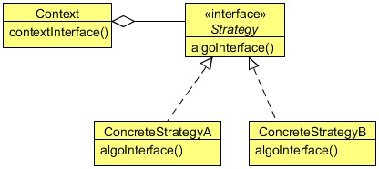

# Strategy Design Pattern
## 1   Introduction
The Strategy Design Pattern seems to be the simplest of all design patterns, yet it provides great flexibility to your code. This
pattern is used almost everywhere, even in conjunction with the other design patterns. The patterns we have discussed so far have
a relation with this pattern, either directly or indirectly. After this lesson, you will get an idea on how important this pattern is.

To understand the Strategy Design Pattern, let us create a text formatter for a text editor. Everyone should be aware of a text
editor. A text editor can have different text formatters to format text. We can create different text formatters and then pass the
required one to the text editor, so that the editor will able to format the text as required.

The text editor will hold a reference to a common interface for the text formatter and the editor’s job will be to pass the text to
the formatter in order to format the text.

Let’s implement this using the Strategy Design Pattern which will make the code very flexible and maintainable. But before that,
let us more about the Strategy Design Pattern.

## 2   What is the Strategy Pattern
The Strategy Design Pattern defines a family of algorithms, encapsulating each one, and making them interchangeable. Strategy
lets the algorithm vary independently from the clients that use it.

The Strategy pattern is useful when there is a set of related algorithms and a client object needs to be able to dynamically pick
and choose an algorithm from this set that suits its current need. The Strategy pattern suggests keeping the implementation of
each of the algorithms in a separate class. Each such algorithm encapsulated in a separate class is referred to as a `strategy`.
An object that uses a `Strategy` object is often referred to as a `context` object.

With different `Strategy` objects in place, changing the behavior of a `Context` object is simply a matter of changing its `Strategy`
object to the one that implements the required algorithm. To enable a `Context` object to access different `Strategy`
objects in a seamless manner, all `Strategy` objects must be designed to offer the same interface. In the Java programming
language, this can be accomplished by designing each `Strategy` object either as an implementer of a common interface or as
a subclass of a common abstract class that declares the required common interface.

Once the group of related algorithms is encapsulated in a set of `Strategy` classes in a class hierarchy, a client can choose from
among these algorithms by selecting and instantiating an appropriate `Strategy` class. To alter the behavior of the `context`,
a client object needs to configure the `context` with the selected `strategy` instance. This type of arrangement completely
separates the implementation of an algorithm from the `context` that uses it. As a result, when an existing algorithm implemen-
tation is changed or a new algorithm is added to the group, both the `context` and the client object (that uses the `context`)
remain unaffected.

<div align="center"></div>


**Strategy**

* Declares an interface common to all supported algorithms. `Context` uses this interface to call the algorithm defined by a
   `ConcreteStrategy`.

**ConcreteStrategy**

* Implements the algorithm using the `Strategy` interface.

**Context**

* Is configured with a `ConcreteStrategy` object.
* Maintains a reference to a `Strategy` object.
* May define an interface that lets `Strategy` access its data.

## 3   Implementing the Strategy Design Pattern

Below is the `TextFormatter` interface implement by all the concrete formatters.

```java
package com.zanxus.javacodegeeks.patterns.strategypattern;

/**
 * @author root
 * @create 2016-12-22 10:08 PM
 */
public interface TextFormatter {

    public void format(String text);
}
```

The above interface contains only one method, `format`, used to format the text.

```java
package com.zanxus.javacodegeeks.patterns.strategypattern;

/**
 * @author root
 * @create 2016-12-22 10:09 PM
 */
public class CapTextFormatter implements TextFormatter {

    @Override
    public void format(String text) {
        System.out.println("[CapTextFormatter]:"+text.toUpperCase());
    }
}
```

The above class, `CapTextFormatter`, is a concrete text formatter that implements the `TextFormatter` interface and the
class is used to change the text into capital case.

```java
package com.zanxus.javacodegeeks.patterns.strategypattern;

/**
 * @author root
 * @create 2016-12-22 10:11 PM
 */
public class LowerTextFormatter implements TextFormatter {
    @Override
    public void format(String text) {
        System.out.println("[LowerTextFormatter]: "+text.toLowerCase());
    }
}
```

The `LowerTextFormatter` is a concrete text formatter that implements the `TextFormatter` interface and the class is
used to change the text into small case.

```java
package com.zanxus.javacodegeeks.patterns.strategypattern;

/**
 * @author root
 * @create 2016-12-22 10:12 PM
 */
public class TextEditor {

    private final TextFormatter textFormatter;

    public TextEditor(TextFormatter textFormatter) {
        this.textFormatter = textFormatter;
    }

    public void publishText(String text){
        textFormatter.format(text);
    }
}
```

The above class is the `TextEditor` class which holds a reference to the `TextFormatter` interface. The class contains the
`publishText` method which forwards the text to the formatter in order to publish the text in desired format.

Now, let us test the code above.

```java
package com.zanxus.javacodegeeks.patterns.strategypattern;

/**
 * @author root
 * @create 2016-12-22 10:13 PM
 */
public class TestStrategyPattern {

    public static void main(String[] args) {
        TextFormatter formatter = new CapTextFormatter();
        TextEditor editor = new TextEditor(formatter);
        editor.publishText("Testing text in caps formatter");

        formatter = new LowerTextFormatter();
        editor = new TextEditor(formatter);
        editor.publishText("Testing text in lower formatter");

    }
}
```

The above code will result to the following output:

```sh
[CapTextFormatter]:TESTING TEXT IN CAPS FORMATTER
[LowerTextFormatter]: testing text in lower formatter
```

In the above class, we have first created a `CapTextFormatter` and assigned it to the `TextEditor` instance. Then we called
the `publishText` method and passed some input text to it.

Again, we did the same thing, but this time, the `LowerTextFormatter` is passed to the `TextEditor`.
The output clearly shows the different text format produced by the different text editors due to the different text formatter used
by it.
The main advantage of the Strategy Design Pattern is that we can enhance the code without much trouble. We can add new text
formatters without disturbing the current code. This would make our code maintainable and flexible. This design pattern also
promotes the "code to interface" design principle.

## 4   When to use the Strategy Design Pattern
Use the Strategy pattern when:

* Many related classes differ only in their behavior. Strategies provide a way to configure a class with one of many behaviors.
* You need different variants of an algorithm. For example, you might define algorithms reflecting different space/time trade-offs.
   Strategies can be used when these variants are implemented as a class hierarchy of algorithms.
* An algorithm uses data that clients shouldn’t know about. Use the Strategy pattern to avoid exposing complex, algorithm-
   specific data structures.
* A class defines many behaviors, and these appear as multiple conditional statements in its operations. Instead of many condi-
   tionals, move related conditional branches into their own `Strategy` class.
   
## 5   Strategy Pattern in JDK

* `java.util.Comparator#compare()`
* `javax.servlet.http.HttpServlet`
* `javax.servlet.Filter#doFilter()`