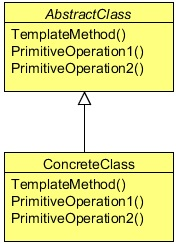

# Template Design Pattern
## 1   Introduction
The Template Design Pattern is a behavior pattern and, as the name suggests, it provides a template or a structure of an algorithm
which is used by users. A user provides its own implementation without changing the algorithm’s structure.

It is easier to understand this pattern with the help of a problem. We will understand the scenario in this section and will
implement the solution using the Template pattern in a later section.

Have you ever connected to a relation database using your Java application? Let’s recall some important steps which are required
to connect and insert data into the database. First, we need a driver according to the database we want to connect with. Then, we
pass some credentials to the database, then, we prepare a statement, set data into the insert statement and insert it using the insert
command. Later, we close all the connections, and optionally destroy all the connection objects.

You need to write all these steps regardless of any vendor’s relational database. Consider a problem where you need to insert
some data into the different databases. You need to fetch some data from a CSV file and have to insert it into a MySQL database.
Some data comes from a text file and which should be insert into an Oracle database. The only difference is the driver and the
data, the rest of the steps should be the same, as JDBC provides a common set of interfaces to communicate to any vendor’s
specific relation database.

We can create a template, which will perform some steps for the client, and we will leave some steps to let the client to implement
them in its own specific way. Optionally, a client can override the default behavior of some already defined steps.
Now, before implementing the code, let’s know more about the Template Design Pattern.

## 2   What is the Template Design Pattern
The Template Pattern defines the skeleton of an algorithm in an operation, deferring some steps to subclasses. Template Method
lets subclasses to redefine certain steps of an algorithm without changing the algorithm’s structure.

The Template Method pattern can be used in situations when there is an algorithm, some steps of which could be implemented
in multiple different ways. In such scenarios, the Template Method pattern suggests keeping the outline of the algorithm in a
separate method referred to as a template method inside a class, which may be referred to as a template class, leaving out the
specific implementations of the variant portions (steps that can be implemented in multiple different ways) of the algorithm to
different subclasses of this class.

The Template class does not necessarily have to leave the implementation to subclasses in its entirety. Instead, as part of providing
the outline of the algorithm, the Template class can also provide some amount of implementation that can be considered as
invariant across different implementations. It can even provide default implementation for the variant parts, if appropriate. Only
specific details will be implemented inside different subclasses. This type of implementation eliminates the need for duplicate
code, which means a minimum amount of code to be written.

<div align="center"></div>


**AbstractClass**

* Defines abstract primitive operations that concrete subclasses define to implement steps of an algorithm.
* Implements a template method defining the skeleton of an algorithm. The template method calls primitive operations as well
   as operations defined in `AbstractClass` or those of other objects. `ConcreteClass`
* Implements the primitive operations to carry.

## 3   Implementing the Template Design Pattern
Below we can see the connection template class used to provide a template for clients to connect and communicate with the
various databases.

```java
package com.zanxus.javacodegeeks.patterns.templatepattern;

/**
 * @author zanxus
 * @description
 * @create 2016-12-20 下午4:29
 */
public abstract class ConnectionTemplate {

    public final void run(){
        setDBDriver();
        setCredentials();
        connect();
        prepareStatement();
        setData();
        insert();
        close();
        destroy();
    }

    public abstract void setDBDriver();

    public abstract void setCredentials();

    public void connect(){
        System.out.println("Setting connection...");
    }

    public void prepareStatement(){
        System.out.println("Preparing insert statement...");
    }

    public abstract void setData();

    public void insert(){
        System.out.println("Inserting data...");
    }

    public void close(){
        System.out.println("Closing connections...");
    }

    public void destroy(){
        System.out.println("Destroying connection objects...");
    }

}
```

The abstract class provides steps to connect, communicate and later to close the connections. All these steps are required in order
to get the work done. The class provides default implementation to some common steps and leaves the specific steps as abstract
which force the client to provide an implementation to them.

The `setDBDriver` method should be implementing by the user to provide database specific drivers. The credentials could be
different for different databases; therefore, `setCredentials` is also left as abstract to let the user to implement it.

Similarly, connecting to the database using JDBC API and preparing a statement is common. But, data would be specific so user
will provide it, and rest of other steps like running an insert statement, closing connections and destroying object are similar to
any database, therefore their implementations are kept common inside the template.

The key method of the above class is the `run` method. The `run` method is used to run these steps in order. The method is set as
final because the steps should be kept safe and should not be change by any user.

The below two classes extend the template class and provide specific implementation to some methods.

```java
package com.zanxus.javacodegeeks.patterns.templatepattern;

/**
 * @author zanxus
 * @description
 * @create 2016-12-20 下午5:06
 */
public class MySqLCSVCon extends ConnectionTemplate{

    @Override
    public void setDBDriver() {
        System.out.println("Setting MySQL DB drivers...");
    }

    @Override
    public void setCredentials() {
        System.out.println("Setting credentials for MySQL DB...");
    }

    @Override
    public void setData() {
        System.out.println("Setting up data from csv file...");
    }
}
```

The above class is used to connect to a MySQL database and provides data by reading a CSV file.

```java
package com.zanxus.javacodegeeks.patterns.templatepattern;

/**
 * @author zanxus
 * @description
 * @create 2016-12-20 下午5:08
 */
public class OracleTxtCon extends ConnectionTemplate{

    @Override
    public void setDBDriver() {
        System.out.println("Setting oracle DB drivers...");
    }

    @Override
    public void setCredentials() {
        System.out.println("Setting credentials for Oracle DB...");
    }

    @Override
    public void setData() {
        System.out.println("Setting up data from txt file...");
    }
}
```

The above class is used to connect to an Oracle database and provides data by reading a text file.

Now, let’s test the code.

```java
package com.zanxus.javacodegeeks.patterns.templatepattern;

/**
 * @author zanxus
 * @description
 * @create 2016-12-20 下午5:32
 */
public class TestTemplatePattern {

    public static void main(String[] args) {
        System.out.println("For MySQL...");
        ConnectionTemplate template = new MySqLCSVCon();
        template.run();
        System.out.println();
        System.out.println("For Oracle...");
        template = new OracleTxtCon();
        template.run();
    }
}
```

The above code will result to the following output:
```sh
For MySQL...
Setting MySQL DB drivers...
Setting credentials for MySQL DB...
Setting connection...
Preparing insert statement...
Setting up data from csv file...
Inserting data...
Closing connections...
Destroying connection objects...

For Oracle...
Setting oracle DB drivers...
Setting credentials for Oracle DB...
Setting connection...
Preparing insert statement...
Setting up data from txt file...
Inserting data...
Closing connections...
Destroying connection objects...
```

The above output clearly shows how the template pattern works to connect and communicate with the different databases using
the similar way. The pattern keeps the common code under one class and promotes code reusability. It sets a framework and
controls it for the users and allows the users to extends the template in order to provide their specific implementation to some of
the steps.

Now, if we enhance the above example by adding a logging mechanism. But some of the users of the code do not want to add
this facility, to implement this we can use a hook. A hook is a simple method inside a template class with a default behavior;
this behavior can be used to alter some optional steps. A user should implement this method which can hook inside the template
class to alter the optional steps of the algorithm.

## 4   Introducing a hook inside the template
Let’s enhance the above example with a hook.

```java
package com.zanxus.javacodegeeks.patterns.templatepattern.hookway;

import java.util.Date;

/**
 * @author zanxus
 * @description
 * @create 2016-12-20 下午5:44
 */
public abstract class ConnectionTemplate {

    private boolean isLoggingEnable = true;

    public ConnectionTemplate() {
        isLoggingEnable=disableLogging();
    }

    public final void run(){
        setDBDriver();
        logging("Drivers set [" + new Date() + "]");
        setCredentials();
        logging("Credentails set [" + new Date() + "]");
        connect();
        logging("Conencted");
        prepareStatement();
        logging("Statement prepared [" + new Date() + "]");
        setData();
        logging("Data set [" + new Date() + "]");
        insert();
        logging("Inserted [" + new Date() + "]");
        close();
        logging("Conenctions closed [" + new Date() + "]");
        destroy();
        logging("Object destoryed [" + new Date() + "]");
    }

    public abstract void setDBDriver();

    public abstract void setCredentials();

    public void connect(){
        System.out.println("Setting connection...");
    }

    public void prepareStatement(){
        System.out.println("Preparing insert statement...");
    }

    public abstract void setData();

    public void insert(){
        System.out.println("Inserting data...");
    }

    public void close(){
        System.out.println("Closing connections...");
    }

    public void destroy(){
        System.out.println("Destroying connection objects...");
    }

    public boolean disableLogging(){
        return true;
    }

    private void logging(String msg){
        if (isLoggingEnable){
            System.out.println("Logging....: "+msg);
        }
    }
}
```

We introduced two new methods inside the above template class. The `disableLogging` is the hook which returns a `boolean`.
By default, the boolean `isLoggingEnable`, which enables the logging, is true. A user can override this method if logging
should be disabled for his code. The other is a private method used to log the messages.

The below class implements the hook method and returns false, something that switches off the logging mechanism for this
specific work.

```java
package com.zanxus.javacodegeeks.patterns.templatepattern.hookway;

/**
 * @author zanxus
 * @description
 * @create 2016-12-20 下午5:53
 */
public class MySqLCSVCon extends ConnectionTemplate{

    @Override
    public void setDBDriver() {
        System.out.println("Setting MySQL DB drivers...");
    }

    @Override
    public void setCredentials() {
        System.out.println("Setting credentials for MySQL DB...");
    }

    @Override
    public void setData() {
        System.out.println("Setting up data from csv file....");
    }

    @Override
    public boolean disableLogging() {
        return false;
    }
}
```

Let’s test this code.

```java
package com.zanxus.javacodegeeks.patterns.templatepattern.hookway;

/**
 * @author zanxus
 * @description
 * @create 2016-12-20 下午5:55
 */
public class TestTemplatePattern {

    public static void main(String[] args) {
        System.out.println("For MySQL...");
        ConnectionTemplate template = new MySqLCSVCon();
        template.run();
        System.out.println();
        System.out.println("For Oracle...");
        template = new OracleTxtCon();
        template.run();
    }
}
```

The above class will result to the following output:

```sh
For MySQL...
Setting MySQL DB drivers...
Setting credentials for MySQL DB...
Setting connection...
Preparing insert statement...
Setting up data from csv file....
Inserting data...
Closing connections...
Destroying connection objects...

For Oracle...
Setting oracle DB drivers...
Logging....: Drivers set [Tue Dec 20 18:30:36 CST 2016]
Setting credentials for Oracle DB...
Logging....: Credentails set [Tue Dec 20 18:30:36 CST 2016]
Setting connection...
Logging....: Conencted
Preparing insert statement...
Logging....: Statement prepared [Tue Dec 20 18:30:36 CST 2016]
Setting up data from txt file...
Logging....: Data set [Tue Dec 20 18:30:36 CST 2016]
Inserting data...
Logging....: Inserted [Tue Dec 20 18:30:36 CST 2016]
Closing connections...
Logging....: Conenctions closed [Tue Dec 20 18:30:36 CST 2016]
Destroying connection objects...
Logging....: Object destoryed [Tue Dec 20 18:30:36 CST 2016]
```

You can clearly see in the output, that logging is off for the MySQL implementation, whereas, on for the Oracle implementation.

## 5   When to use the Template Design Pattern
The Template Method pattern should be used in the following cases:

* To implement the invariant parts of an algorithm once and leave it up to subclasses to implement the behavior that can vary.
* When common behavior among subclasses should be factored and localized in a common class to avoid code duplication. You
   first identify the differences in the existing code and then separate the differences into new operations. Finally, you replace the
   differing code with a template method that calls one of these new operations.
* To control subclasses extensions. You can define a template method that calls "hook" operations (see Consequences) at specific
   points, thereby permitting extensions only at those points.
   
## 6   Template Pattern in JDK

* `java.util.Collections#sort()`
* `java.io.InputStream#skip()`
* `java.io.InputStream#read()`
* `java.util.AbstractList#indexOf()`