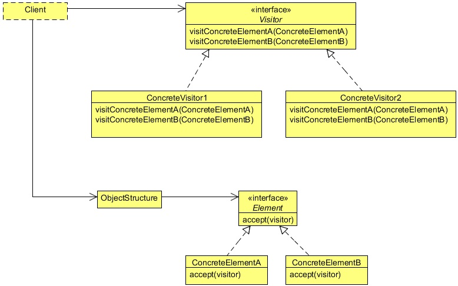

# Visitor Design Pattern
## 1   Introduction
To understand the Visitor Design Pattern, let us revisit the [Composite Design Pattern](https://github.com/ZanXusV/java-design-patterns/blob/master/composite-pattern/composite-design-pattern.md). The Composite Pattern allows you to
compose objects into tree structures to represent part-whole hierarchies.

In the Composite Pattern example, we had created an html structure composed of different types of objects. Now suppose that
we need to add a `css` class to the html tags. One way to do this is by adding the class when adding a start tag using the
`setStartTag` method. But this hard coded setting will create inflexibility to our code.

Another way of doing this is by adding a new method like `addClass` in the parent abstract `HtmlTag` class. All the child
classes will override this method and will provide the `css` class. One major drawback of this approach is that, if there are many
child classes (will be in large html page), it will become very expensive and hectic to implement this method in all the child
classes. And suppose, later we need to add another style element in the tags, we again need to do the same thing.

The Visitor Design Pattern provides you with a way to add new operations on the objects without changing the classes of the
elements, especially when the operations change quite often.

## 2   What is the Visitor Design Pattern
The intent of the Visitor Design Pattern is to represent an operation to be performed on the elements of an object structure. Visitor
lets you define a new operation without changing the classes of the elements on which it operates.

The Visitor pattern is useful when designing an operation across a heterogeneous collection of objects of a class hierarchy. The
Visitor pattern allows the operation to be defined without changing the class of any of the objects in the collection. To accomplish
this, the Visitor pattern suggests defining the operation in a separate class referred to as a visitor class. This separates the operation
from the object collection that it operates on. For every new operation to be defined, a new visitor class is created. Since the
operation is to be performed across a set of objects, the visitor needs a way of accessing the public members of these objects.
This requirement can be addressed by implementing the following two design ideas.

<div align="center"></div>

**Visitor**

* Declares a `Visit` operation for each class of `ConcreteElement` in the object structure. The operation’s name and signature
   identifies the class that sends the `Visit` request to the `visitor`. That lets the visitor determine the concrete class of the
   element being visited. Then the visitor can access the element directly through its particular interface.

**ConcreteVisitor**

* Implements each operation declared by `Visitor`. Each operation implements a fragment of the algorithm defined for the
   corresponding class of object in the structure. `ConcreteVisitor` provides the context for the algorithm and stores its local
   state. This state often accumulates results during the traversal of the structure.

**Element**

* Defines an `Accept` operation that takes a `visitor` as an argument.

**ConcreteElement**

* Implements an `Accept` operation that takes a `visitor` as an argument.

**ObjectStructure**

* Can enumerate its elements.
* May provide a high-level interface to allow the `visitor` to visit its elements.
* May either be a composite or a collection such as a list or a set.

## 3   Implement the Visitor Design Pattern
To implement the Visitor Design Pattern, we will use the same [Composite Pattern code](https://github.com/ZanXusV/java-design-patterns/blob/master/composite-pattern/composite-design-pattern.md) and will introduce some new interfaces,
classes and methods to it.

Implementing Visitor Pattern requires two important interfaces, an `Element` interface which will contain an `accept` method
with an argument of type `Visitor`. This interface will be implemented by all the classes that need to allow visitors to visit
them. In our case, the `HtmlTag` will implement the `Element` interface, as the `HtmlTag` is the parent abstract class of all the
concrete html classes, the concrete classes will inherit and will override the `accept` method of the `Element` interface.

The other important interface is the `Visitor` interface; this interface will contain visit methods with an argument of a class
that implements the `Element` interface. Please also note that we have added two new methods in our `HtmlTag` class, the
`getStartTag` and the `getEndTag` as opposed to the example shown in the Composite Design Pattern lesson.

```java
package com.zanxus.javacodegeeks.patterns.visitorpattern;

/**
 * @author root
 * @create 2016-12-31 2:29 PM
 */
public interface Element {

    public void accept(Visitor visitor);
}
```

The code below is from the Composite Pattern example with a few changes.

```java
package com.zanxus.javacodegeeks.patterns.visitorpattern;

import java.util.List;

/**
 * @author root
 * @create 2016-12-31 2:32 PM
 */
public abstract class HtmlTag implements Element {

    public abstract String getTagName();

    public abstract void setStartTag(String tag);

    public abstract String getStartTag();

    public abstract String getEndTag();

    public abstract void setEndTag(String tag);

    public void setTagBody(String tagBody){
        throw new UnsupportedOperationException("Current operation is not support for this object");
    }

    public void addChildTag(HtmlTag htmlTag){
        throw new UnsupportedOperationException("Current operation is not support for this object");
    }

    public void removeChildTag(HtmlTag htmlTag){
        throw new UnsupportedOperationException("Current operation is not support for this object");
    }

    public List<HtmlTag> getChildren(){
        throw new UnsupportedOperationException("Current operation is not support for this object");
    }

    public abstract void generateHtml();
}
```

The abstract `HtmlTag` class implements the `Element` interface. The below concrete classes will override the accept method
of the `Element` interface and will call the `visit` method, and will pass `this` operator as an argument. This will allow the
`visitor` method to get all the public members of the object, to add new operations on it.

```java
package com.zanxus.javacodegeeks.patterns.visitorpattern;

import java.util.ArrayList;
import java.util.List;

/**
 * @author root
 * @create 2016-12-31 2:41 PM
 */
public class HtmlParentElement extends HtmlTag {

    private String tagName;
    private String startTag;
    private String endTag;
    private List<HtmlTag> childrenTag;

    public HtmlParentElement(String tagName) {
        this.tagName = tagName;
        this.startTag = "";
        this.endTag = "";
        this.childrenTag = new ArrayList<>();
    }

    @Override
    public String getTagName() {
        return tagName;
    }


    @Override
    public String getStartTag() {
        return startTag;
    }

    @Override
    public void setStartTag(String startTag) {
        this.startTag = startTag;
    }

    @Override
    public String getEndTag() {
        return endTag;
    }

    @Override
    public void setEndTag(String endTag) {
        this.endTag = endTag;
    }

    @Override
    public void addChildTag(HtmlTag htmlTag) {
        childrenTag.add(htmlTag);
    }

    @Override
    public void removeChildTag(HtmlTag htmlTag) {
        childrenTag.remove(htmlTag);
    }

    @Override
    public List<HtmlTag> getChildren() {
        return childrenTag;
    }

    @Override
    public void generateHtml() {
        System.out.println(startTag);
        childrenTag.stream().forEach(htmlTag -> htmlTag.generateHtml());
        System.out.println(endTag);
    }

    @Override
    public void accept(Visitor visitor) {
        visitor.visit(this);
    }
}
```

```java
package com.zanxus.javacodegeeks.patterns.visitorpattern;

/**
 * @author root
 * @create 2016-12-31 2:32 PM
 */
public class HtmlElement extends HtmlTag {

    private String tagName;

    private String startTag;

    private String endTag;

    private String tagBody;

    public HtmlElement(String tagName) {
        this.tagName = tagName;
        this.tagBody = "";
        this.startTag = "";
        this.endTag = "";
    }

    @Override
    public String getTagName() {
        return tagName;
    }

    @Override
    public String getStartTag() {
        return startTag;
    }

    @Override
    public void setStartTag(String startTag) {
        this.startTag = startTag;
    }

    @Override
    public String getEndTag() {
        return endTag;
    }

    @Override
    public void setEndTag(String endTag) {
        this.endTag = endTag;
    }

    @Override
    public void setTagBody(String tagBody) {
        this.tagBody = tagBody;
    }

    @Override
    public void generateHtml() {
        System.out.println(startTag+""+tagBody+""+endTag);
    }

    @Override
    public void accept(Visitor visitor) {
        visitor.visit(this);
    }
}
```

Now, the concrete visitor classes: we have created two concrete classes, one will add a `css` class `visitor` to all html tags and
the other one will change the width of the tag using the style attribute of the html tag.

```java
package com.zanxus.javacodegeeks.patterns.visitorpattern;

/**
 * @author root
 * @create 2016-12-31 2:54 PM
 */
public class CssClassVisitor implements Visitor {

    @Override
    public void visit(HtmlElement element) {
        element.setStartTag(element.getStartTag().replace(">"," class='visitor'>"));
    }

    @Override
    public void visit(HtmlParentElement parentElement) {
        parentElement.setStartTag(parentElement.getStartTag().replace(">"," class='visitor'>"));
    }
}
```

```java
package com.zanxus.javacodegeeks.patterns.visitorpattern;

/**
 * @author root
 * @create 2016-12-31 2:56 PM
 */
public class StyleVisitor implements Visitor {

    @Override
    public void visit(HtmlElement element) {
        element.setStartTag(element.getStartTag().replace(">"," style='width:46px;'>"));
    }

    @Override
    public void visit(HtmlParentElement parentElement) {
        parentElement.setStartTag(parentElement.getStartTag().replace(">"," style='width:58px;'>"));
    }
}
```

Now, let"s test the above example.

```java
package com.zanxus.javacodegeeks.patterns.visitorpattern;

/**
 * @author root
 * @create 2016-12-31 2:59 PM
 */
public class TestVisitorPattern {

    public static void main(String[] args) {

        System.out.println("Before visitor...\n");

        HtmlTag parentTag = new HtmlParentElement("<html>");
        parentTag.setStartTag("<html>");
        parentTag.setEndTag("</html>");

        HtmlTag p1 = new HtmlParentElement("<body>");
        p1.setStartTag("<body>");
        p1.setEndTag("</body>");

        parentTag.addChildTag(p1);

        HtmlTag child1 = new HtmlElement("<p>");
        child1.setStartTag("<p>");
        child1.setEndTag("</p>");
        child1.setTagBody("Testing html tag library");
        p1.addChildTag(child1);

        child1 = new HtmlElement("<p>");
        child1.setStartTag("<p>");
        child1.setEndTag("<p>");
        child1.setTagBody("Paragraph 2");
        p1.addChildTag(child1);

        parentTag.generateHtml();

        System.out.println("\nAfter visitor...\n");

        Visitor cssClass = new CssClassVisitor();
        Visitor style = new StyleVisitor();

        parentTag = new HtmlParentElement("<html>");
        parentTag.setStartTag("<html>");
        parentTag.setEndTag("</html>");
        parentTag.accept(style);
        parentTag.accept(cssClass);

        p1 = new HtmlParentElement("<body>");
        p1.setStartTag("<body>");
        p1.setEndTag("</body>");
        p1.accept(style);
        p1.accept(cssClass);

        parentTag.addChildTag(p1);

        child1 = new HtmlElement("<p>");
        child1.setStartTag("<p>");
        child1.setEndTag("</p>");
        child1.setTagBody("Testing html tag library");
        child1.accept(style);
        child1.accept(cssClass);

        p1.addChildTag(child1);

        child1 = new HtmlElement("<p>");
        child1.setStartTag("<p>");
        child1.setEndTag("<p>");
        child1.setTagBody("Paragraph 2");
        child1.accept(style);
        child1.accept(cssClass);

        p1.addChildTag(child1);

        parentTag.generateHtml();

    }
}
```

The above code will result to the following output:

```sh
Before visitor...

<html>
<body>
<p>Testing html tag library</p>
<p>Paragraph 2<p>
</body>
</html>

After visitor...

<html style='width:58px;' class='visitor'>
<body style='width:58px;' class='visitor'>
<p style='width:46px;' class='visitor'>Testing html tag library</p>
<p style='width:46px;' class='visitor'>Paragraph 2<p>
</body>
</html>
```

The output after "Before Visitor. . . " is the same as it results in the Composite Pattern lesson. Later, we created two concrete
visitors and then added them to the concrete html objects using the `accept` method. The output "After visitor. . . " shows you
the result, in which `css` class and style elements are added into the html tags.

Please note that the advantage of the Visitor Pattern is that we can add new operations to the objects without changing its classes.
For example, we can add some javascript functions like `onclick` or some angularjs ng tags without modifying the classes.

## 4   When to use the Visitor Design Pattern
Use the Visitor pattern when:

* An object structure contains many classes of objects with differing interfaces, and you want to perform operations on these
   objects that depend on their concrete classes.

* Many distinct and unrelated operations need to be performed on objects in an object structure, and you want to avoid "polluting"
   their classes with these operations. Visitor lets you keep related operations together by defining them in one class. When the
   object structure is shared by many applications, use Visitor to put operations in just those applications that need them.

* The classes defining the object structure rarely change, but you often want to define new operations over the structure. Changing
   the object structure classes requires redefining the interface to all visitors, which is potentially costly. If the object structure
   classes change often, then it’s probably better to define the operations in those classes.
   
## 5   Visitor Design Pattern in JDK
* `javax.lang.model.element.Element` and `javax.lang.model.element.ElementVisitor`
* `javax.lang.model.type.TypeMirror` and `javax.lang.model.type.TypeVisitor`